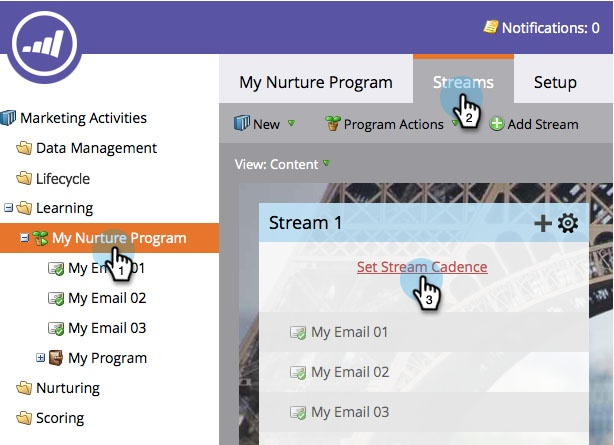
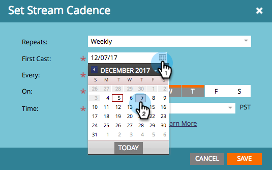
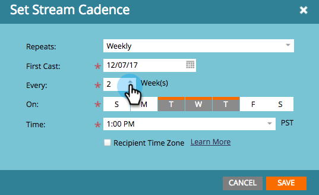
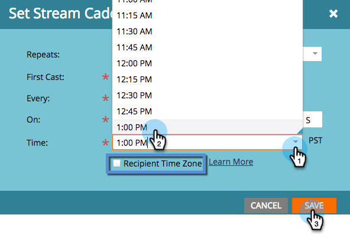
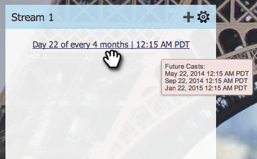

# Set Stream Cadence {#set-stream-cadence}

You can send engagement content at any interval you want. For example: once a week, or every third Tuesday of the month.

## Set Cadence {#set-cadence}

1. Go to **Marketing Activities**.

   

1. Find and select your engagement program, click the **Streams** tab, then click **Set Stream Cadence**.

   

1. Select how often you want the cadence to recur. You can choose **Weekly** or **Monthly**.

## Weekly {#weekly}

1. Select **Weekly**.

   

   >[!NOTE]
   >
   >Selecting **None** will shut off the stream.

1. Pick the date of the first cast.

   

1. Now choose if you want the cadence to happen every week or more spaced out. Let's pick every 2 weeks.

   

1. Decide which days of the week. In this case let's do Tuesday, Wednesday, and Thursday.

   

   >[!TIP]
   >
   >You can set your cadence to run every day by picking **Repeats: Weekly** / **Every: 1 Week** / **On**: all days.

   Now pick the Time. Check the box if you want to use [Recipient Time Zone](/help/marketo/product-docs/email-marketing/drip-nurturing/engagement-program-streams/set-stream-cadence/schedule-engagement-programs-with-recipient-time-zone.md)(i.e., deliver according to local time zones), then click **Save**.

   

   >[!CAUTION]
   >
   >The content will go out on the date you select for the first cast, so make sure it coincides with the day of the week you choose; otherwise it will go out twice in the first week.

1. Hover over the cadence. You'll see what days future casts will go out.

   

   >[!NOTE]
   >
   >In this example, an email will go out on Thursday. We then skip a week, and send again on Tuesday, Wednesday, and Thursday of the following week. And then we loop again.

That's it! Keep reading if you want to setup a monthly cadence. 

## Monthly {#monthly}

1. Select **Monthly** for how often it repeats.

   

1. Pick the date of the first cast.

   

1. Select if you want it to be every month or more spaced out... Let's pick every fourth month.

   

1. Pick which day of the month you specified, in this case the 22nd of every fourth month.

   

   >[!TIP]
   >
   >Alternatively, you can pick day of the week.

1. Pick a **Time** and click **Save**.

   

1. Hover over the cadence. You'll see what days future casts will go out.

   

   >[!CAUTION]
   >
   >If you decide to modify your engagement stream cadence later, make sure the first cast is set to a future date.

Now you know how to set up a stream cadence!

>[!MORELIKETHIS]
>
>* [Understanding Recipient Time Zone](/help/marketo/product-docs/email-marketing/email-programs/email-program-actions/scheduling-with-recipient-time-zone/understanding-recipient-time-zone.md)
>* [Schedule Engagement Programs with Recipient Time Zone](/help/marketo/product-docs/email-marketing/drip-nurturing/engagement-program-streams/set-stream-cadence/schedule-engagement-programs-with-recipient-time-zone.md)
