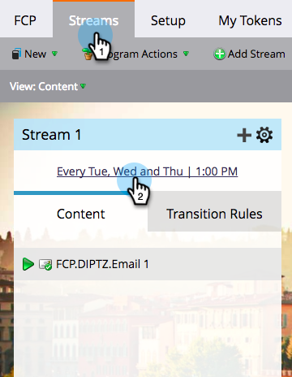
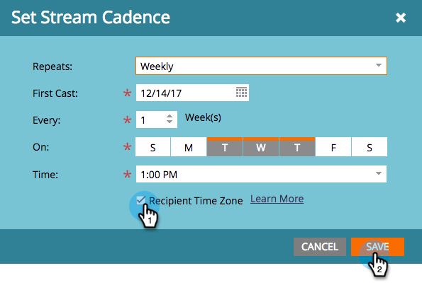
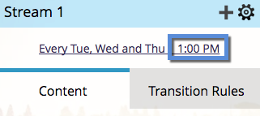

# Schedule Engagement Programs with Recipient Time Zone {#schedule-engagement-programs-with-recipient-time-zone}

When you schedule an engagement program stream and recipient time zone is active, the program cast will start running at midnight in the first time zone (UTC +14:00). We require you to schedule the first cast **at least 25 hours** in the future because there may be people who qualify for the cast in every time zone across the globe. Starting processing at this time in the first time zone guarantees that we will deliver the email at the scheduled date and time for every recipient.

1. In your engagement program, navigate to the **Streams** tab and click a stream's cadence schedule to edit it.

   

1. [Set your cadence settings](/help/marketo/product-docs/email-marketing/drip-nurturing/engagement-program-streams/set-stream-cadence.md) as you normally would, then check the **Recipient Time Zone** box. Remember that your first cast must be at least 25 hours in the future. Click **Save**.

   

1. Note that with Recipient Time Zone active, the cadence schedule will not show a specific time zone, since there could be mutiple. It will only display the hour.

   

>[!MORELIKETHIS]
>
>* [Understanding Recipient Time Zone](/help/marketo/product-docs/email-marketing/email-programs/email-program-actions/scheduling-with-recipient-time-zone/understanding-recipient-time-zone.md)
>* [Set Stream Cadence](/help/marketo/product-docs/email-marketing/drip-nurturing/engagement-program-streams/set-stream-cadence.md)
