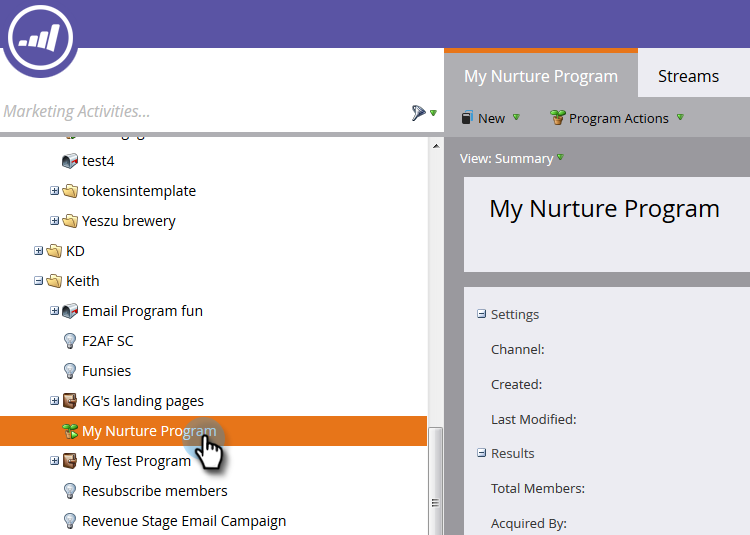
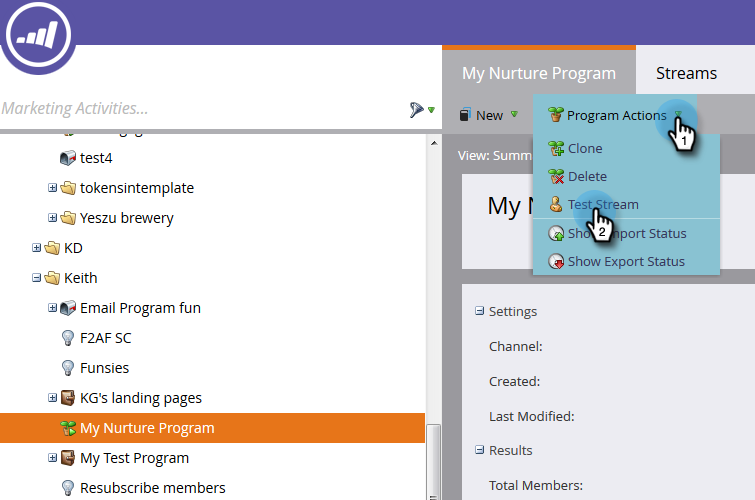
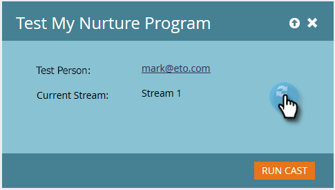
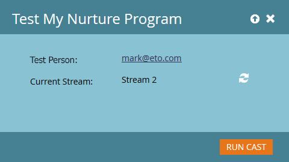

# Test an Engagement Stream {#test-an-engagement-stream}

Once you've added all your content to a stream, you can test them out one piece at a time.

1. Go to **[!UICONTROL Marketing Activities]**.

   

1. Select your engagement program.

   

1. Click **[!UICONTROL Program Actions]** and select **[!UICONTROL Test Stream]**.

   

1. Select your person from the **[!UICONTROL Test Person]** drop-down. Remember, content will actually go out, so keep that in mind when choosing.

   

   >[!CAUTION]
   >
   >Make sure that your test person is unique and doesn't have duplicates in the database.

   >[!TIP]
   >
   >If the test person you're looking for doesn't exist, use the **[!UICONTROL Create Person]** option to create one on the fly.

   Click **[!UICONTROL Initial Stream]**, select the stream you want to test and click **[!UICONTROL Run Cast]**.
   

1. After the person goes through the [transition rules](/help/marketo/product-docs/email-marketing/drip-nurturing/engagement-program-streams/transition-people-between-engagement-streams.md) you previously set up, click the Refresh icon.

   

1. The new stream will appear, indicating a successful test.

   

   Good work!

   >[!NOTE]
   >
   >No other content will be sent unless you click **[!UICONTROL Run Cast again]**.
