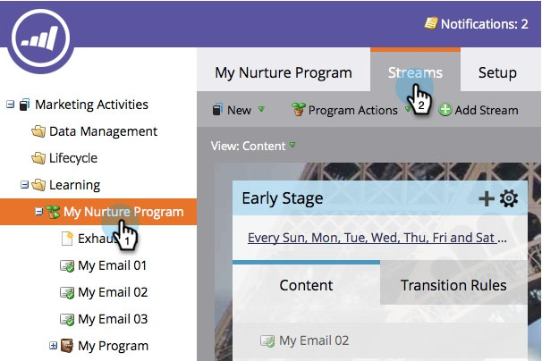
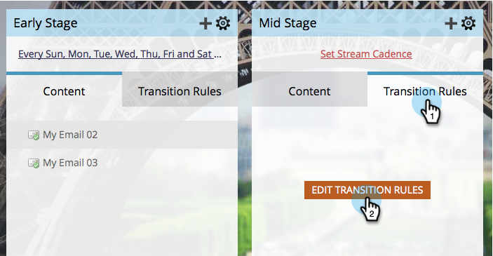
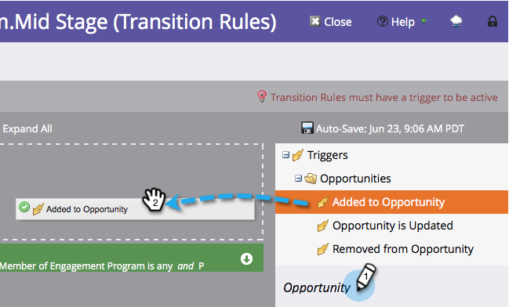
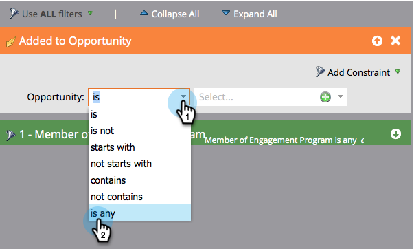
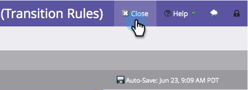
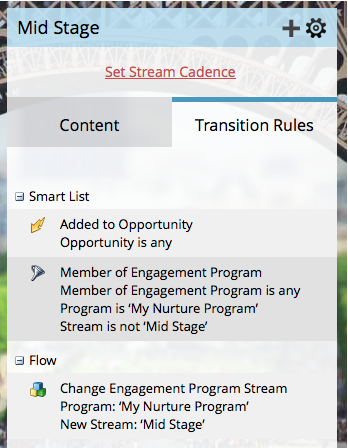

# Transition People Between Engagement Streams {#transition-people-between-engagement-streams}

Engagement programs can have more than one stream. If you [add a stream](../../../../product-docs/email-marketing/drip-nurturing/creating-an-engagement-program/add-a-stream.md), you'll want to define a way for people to move from one stream to another. These are called **transition rules.**

1. Go to **Marketing Activities**.

   

1. Select your multi-streamed engagement program and go to **Streams**.

   

1. Click **Transition Rules** for the stream you want to pull into from other streams, then click **Edit Transition Rules. **

   

   >[!NOTE]
   >
   >Transition rules pull into a stream; always define the rules on the stream that you want to pull into.

   Once the transition rule window opens, find and drag in your trigger of choice. In this case, we want to move people into Mid Stage when it is added to an opportunity.
   ` 

   `

1. Let's set the operator to** is any** so that the people move over for any added opportunity.

   ` 

   `

   >[!TIP]
   >
   >You can add multiple triggers and filters to a transition rule, but the transition rule uses all filters (using ALL filters is the only option). If you need to use OR in a transition rule, we recommend that you set up an outside smart campaign instead.

1. Click **Close**.

   

   Great! Now any person in your engagement program that is added to an opportunity will be moved into the Mid Stage stream.

   ` 

   `

   >[!NOTE]
   >
   >The steps outlined above *do* apply to people who are [on pause](http://docs.marketo.com/display/DOCS/Pause+People+in+an+Engagement+Program) as well.

