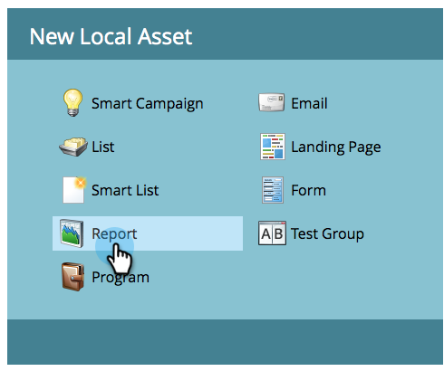

# Engagement Stream Performance Report {#engagement-stream-performance-report}

Want to know how your engagement content is performing? Try the engagement stream performance report.

## Create the Report {#create-the-report}

1. Find and select your engagement program, then under **[!UICONTROL New]** click **[!UICONTROL New Local Asset]**.

   

1. Select **[!UICONTROL Report]**.

   

   >[!TIP]
   >
   >Creating the report under the program will automatically restrict it to the content of the program.

   Select **[!UICONTROL Engagement Stream Performance]** as the report **[!UICONTROL Type]**.
   

1. Name your report and click **[!UICONTROL Create]**.

   

   Now configure the settings.

## Edit Settings {#edit-settings}

1. Find and select your report.

   

1. Under the **[!UICONTROL Setup]** tab, double-click the **[!UICONTROL Engagement Program Emails]** filter.

   

1. Select the email(s) you want to report on and click **[!UICONTROL Apply]**.

   

## Run Report {#run-report}

1. To run the report, click the **[!UICONTROL Report]** tab.

   

   >[!TIP]
   >
   >Although not illustrated, Engagement Score is a column in this report. See [Understanding the Engagement Score](/help/marketo/product-docs/email-marketing/drip-nurturing/reports-and-notifications/understanding-the-engagement-score.md) for details on what it is.

   Notice that the report is grouped by engagement program.
