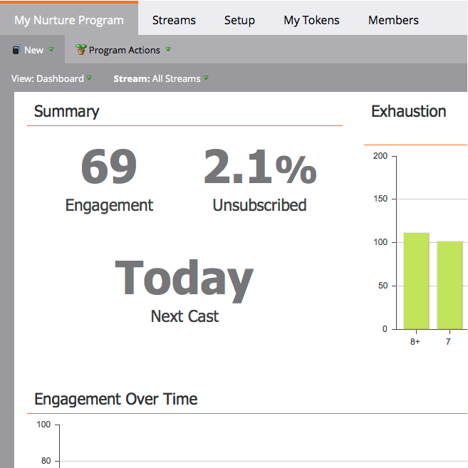
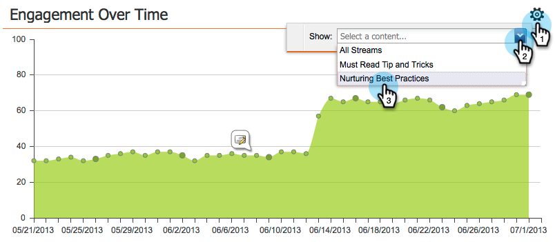
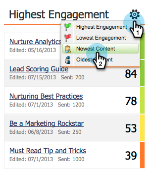

# The Engagement Dashboard {#the-engagement-dashboard}

The Engagement Dashboard is the easiest way to see how the content in your engagement program is performing.

>[!NOTE]
>
>The engagement score includes data from your last three casts. A new one is calculated 72 hours after each cast. Learn more about the [engagement score](/help/marketo/product-docs/email-marketing/drip-nurturing/reports-and-notifications/understanding-the-engagement-score.md).

## View the Engagement Dashboard {#view-the-engagement-dashboard}

Select your engagement program and click **View** > **Dashboard**.

>[!TIP]
>
>Check out the [engagement stream performance report](/help/marketo/product-docs/email-marketing/drip-nurturing/reports-and-notifications/engagement-stream-performance-report.md) for more detailed statistics.

## Understand the Exhaustion Widget {#understand-the-exhaustion-widget}

This widget helps you anticipate when leads will have exhausted all content. The exhaustion score is calculated immediately after each cast. The example below shows that in 1 cast, 195 leads will have exhausted all content.

>[!NOTE]
>
>You must go into the Setup tab and make sure Exhausted Content Notifications are **On** to see the graph above. If they are off, the graph will look different.

>[!CAUTION]
>
>People who are "exhausted" will not receive any communication in the next cast.

## Understand the Engagement Over Time Widget {#understand-the-engagement-over-time-widget}

Shows the average engagement score over time and the impact of content edits.

>[!AVAILABILITY]
>
>This feature is available as an add-on for customers who utilize Marketo's Revenue Cycle Explorer. Please contact the Adobe Account Team (your Account Manager) for additional details.

To show a single piece of content instead of an average, click the gear icon, then select the piece of content.

## Understand the Highest Engagement Widget {#understand-the-highest-engagement-widget}

A list of all content, ordered by the highest engagement score.

To change the sorting, click the gear icon, then select the sort order.

_Newest_ and _Oldest_ are based on time of last approval.

>[!NOTE]
>
>Learn more in the [Create an Engagement Program](/help/marketo/product-docs/email-marketing/drip-nurturing/creating-an-engagement-program/create-an-engagement-program.md) deep dive.
