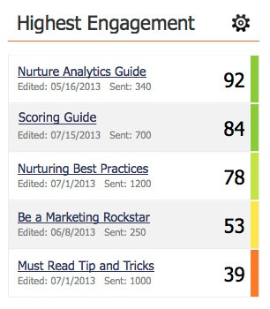

# Understanding the Engagement Score {#understanding-the-engagement-score}

The engagement score makes it easy to see how effective the content in your engagement program is. The score ranges from 0 to 100. Check out [the Engagement Dashboard](/help/marketo/product-docs/email-marketing/drip-nurturing/reports-and-notifications/the-engagement-dashboard.md) to see how you can track your content's performance.

The score is based on a proprietary algorithm that takes into account engaged behavior ([!UICONTROL Open], [!UICONTROL Click], [!UICONTROL Program Success]) and disengaged behavior ([!UICONTROL Unsubscribe]). It is benchmarked against drip and nurture style emails to give an average of 50. To give people a chance to engage with your content, the engagement score is calculated 72 hours after each cast. Also, the score only covers data from **your last three** casts.

>[!NOTE]
>
>When programs are used as content in streams, the engagement score is based on program membership and success status, **not** email interaction (clicks, opens, unsubscribes).

Engagement scores are universal for all customers. You can compare them to see who has the most engaging content.

>[!NOTE]
>
>The proprietary algorithm also applies to the engagement score in email programs.

>[!MORELIKETHIS]
>
>[Understanding Engagement Programs](/help/marketo/product-docs/email-marketing/drip-nurturing/creating-an-engagement-program/understanding-engagement-programs.md)
