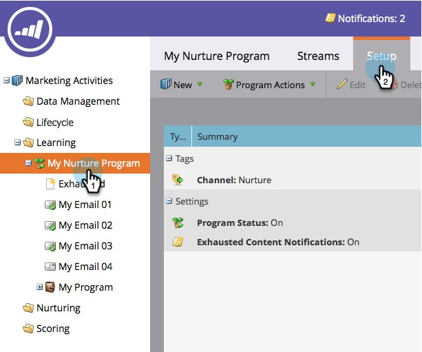
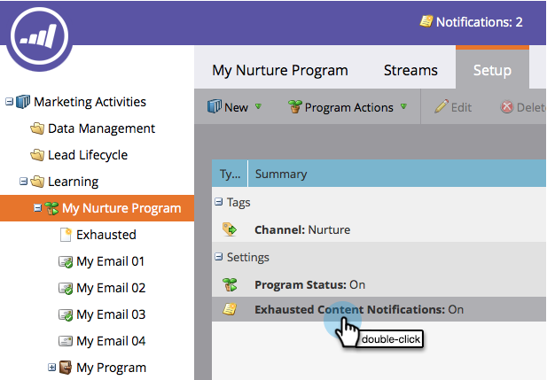

# Disable and Enable Exhausted Content Notifications {#disable-and-enable-exhausted-content-notifications}

When people exhaust all content in a stream, Marketo can send you a notification. You can disable/enable the notifications based on your needs. Here's how.

1. Go to **Marketing Activities**.

   

1. Select an engagement program and click the **Setup** tab.

   

1. Double-click **Exhausted Content Notifications**.

   

1. Select **Off** (or **On**) and click **Save**.

   

   Super! If you enable notifications, you will see something on the stream itself as well as receive an email notification.
