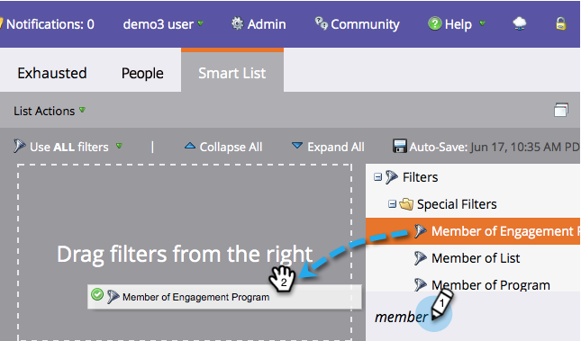
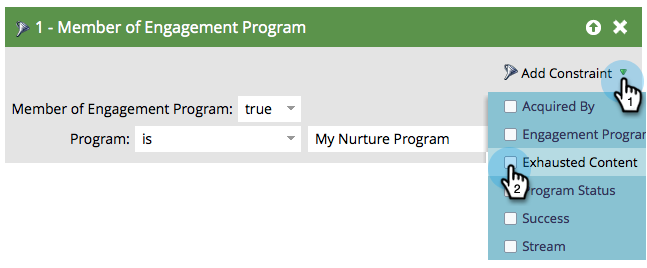
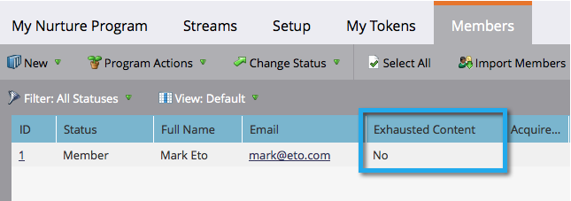
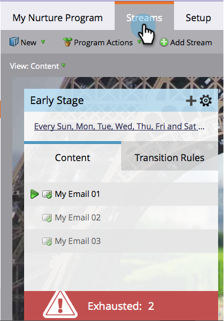

# People Who Have Exhausted Content {#people-who-have-exhausted-content}

When a person has received every piece of content in a stream, it has exhausted all possibilities and will wait idle until more is added. You can find people that are "exhausted" in several ways.

## Member of Engagement Program filter {#member-of-engagement-program-filter}

1. Create a new smart list, then find and drag in the **[!UICONTROL Member of Engagement Program]** filter.

   

1. Find and select the engagement program in which to find exhausted people.

   

1. Under **[!UICONTROL Add Constraint]**, select **[!UICONTROL Exhausted Content]**.

   

1. Set **[!UICONTROL Exhausted Content]** to **[!UICONTROL true]**.

   

   Simply run this smart list to see the list of people that have exhausted all content in the stream they are in.

## Members tab {#members-tab}

1. Go to **[!UICONTROL Marketing Activities]**.

   

1. Select your engagement program and go to the **[!UICONTROL Members]** tab.

   

1. Notice the column called **[!UICONTROL Exhausted Content]**.

   

   This shows you people that have exhausted all content and those who have not.

## Stream {#stream}

1. You can also see the total people who have exhausted content under the [!UICONTROL Streams] tab on the stream itself.

   

   >[!NOTE]
   >
   >This number will update immediately after each cast.
