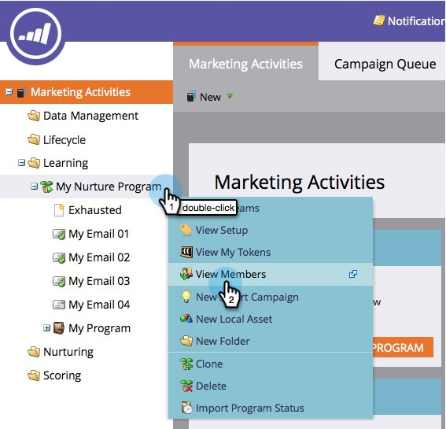

# See Members of an Engagement Program {#see-members-of-an-engagement-program}

You can quickly see members of an engagement program. Here's how.

1. From your engagement program, right-click and select **View Members**.

   

   >[!NOTE]
   >
   >The  [Exhausted Content](/help/marketo/product-docs/email-marketing/drip-nurturing/creating-an-engagement-program/understanding-engagement-programs.md) column value is updated after every cast.

1. You can now see all members of your program.

   
