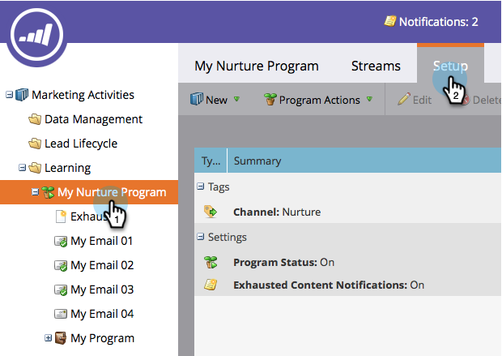

# Turn an Engagement Program On and Off {#turn-an-engagement-program-on-and-off}

You can turn off an engagement program with the flick of a switch. This will stop any content from being sent out. Here's how.

1. Go to **[!UICONTROL Marketing Activities]**.

   

1. Select the engagement program and click **[!UICONTROL Setup]**.

   >[!NOTE]
   >
   >Engagement programs are ON by default unless you are over your subscription limit.

   

1. Double-click **[!UICONTROL Program Status]**.

   

1. Select **[!UICONTROL Off]** and click **[!UICONTROL Save]**.

   

There you go! You can turn it back on using the same steps.
