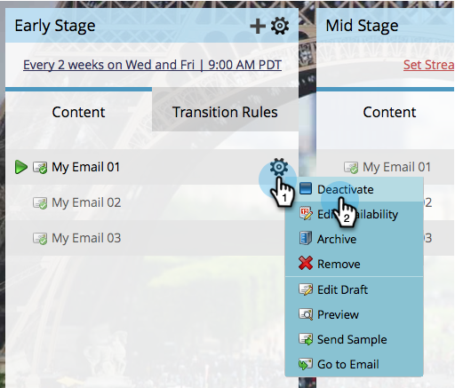

# Activate and Deactivate Stream Content {#activate-and-deactivate-stream-content}

Stream content is OFF by default. Activate content to send them out during engagement casts.

## Activate Stream Content {#activate-stream-content}

1. Go to **Marketing Activities**.

   

1. Select your engagement program and click the **Streams** tab.

   

1. Hover over the content you want to activate, click the gear icon, then click **Activate**.

   >[!NOTE]
   >
   >Emails must be approved in order to activate them.

   

   >[!TIP]
   >
   >You can also activate all content in a stream by clicking the gear icon at the top level, then clicking **Activate all content.**

   Nice work! Now you know how to activate content in your streams.

## Deactivate Stream Content {#deactivate-stream-content}

1. Select your engagement program and click the **Streams** tab.

   

1. Hover over the content you want to deactivate, click the gear icon, then click **Deactivate.**

   

