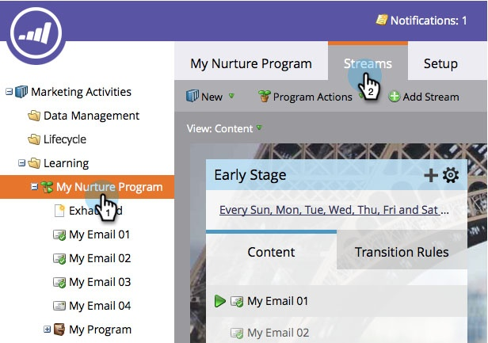

# Edit Availability of Stream Content {#edit-availability-of-stream-content}

You can set a time frame for the content to be active in your stream. Here's how.

1. Select your engagement program and go to the **Streams** tab.

   

1. Click the gear icon for the piece of content you want to schedule, then select **Edit Availability**.

   

1. Select your **Active From** date, then the **Active Through** date and click **Save**.

   

   >[!TIP]
   >
   >You can leave **Active Through** blank to make content available forever.

   Perfect! You will see the clock icon next to the scheduled content. It will become active and inactive according to the schedule you set.

   
