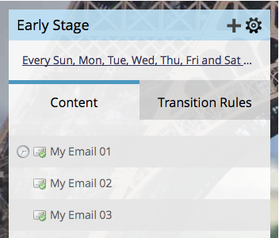

# Edit Availability of Stream Content {#edit-availability-of-stream-content}

You can set a time frame for the content to be active in your stream. Here is how.

1. Select your engagement program and go to the **[!UICONTROL Streams]** tab.

   

1. Click the gear icon for the piece of content you want to schedule, then select **[!UICONTROL Edit Availability]**.

   

1. Select your **[!UICONTROL Active From]** date, then the **[!UICONTROL Active Through]** date and click **[!UICONTROL Save]**.

   

   >[!TIP]
   >
   >You can leave **[!UICONTROL Active Through]** blank to make content available forever.

   You will see the clock icon next to the scheduled content. It will become active and inactive according to the schedule you set.

   
