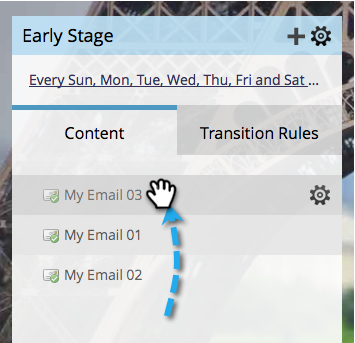

# Prioritize Stream Content {#prioritize-stream-content}

After you've added content to your stream, you may want to change the priority. The content is always delivered from the top down in each cast, and no content is sent to the same person twice.

1. Go to **[!UICONTROL Marketing Activities]**.

   

1. Select your engagement program and click the **[!UICONTROL Streams]** tab.

   

1. Now simply drag and drop the content into the order in which you want it.

   

   >[!NOTE]
   >
   >Priority will always be read from top to bottom at time of cast.

   It's that easy! Now you know how to prioritize your stream content.
