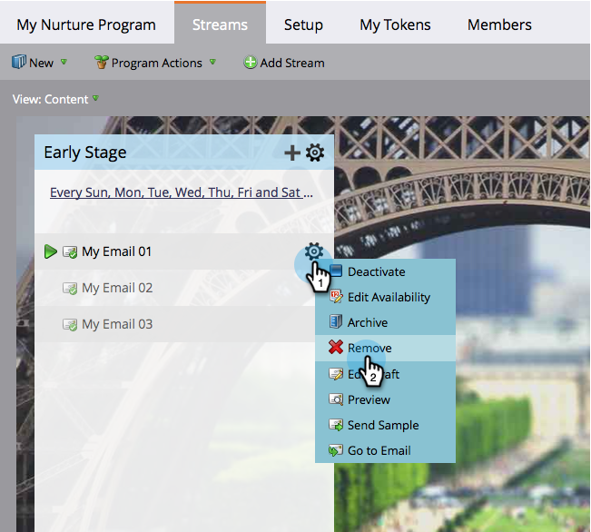

# Remove Stream Content {#remove-stream-content}

You can either remove or archive a piece of content. Unlike removing stream content, [archiving](/help/marketo/product-docs/email-marketing/drip-nurturing/using-stream-content/archive-and-unarchive-stream-content.md) preserves all the history associated to the content. If you do not mind losing the historical stats of some content and want to remove it, here is how.

1. Go to **[!UICONTROL Marketing Activities]**.

   

1. Select your engagement program, then click on the **[!UICONTROL Streams]** tab.

   

1. Hover over the content you want to remove, click on the gear icon when it appears, and click **[!UICONTROL Remove]**.

   

   >[!CAUTION]
   >
   >Remove content only if you do not care about history. If you want to preserve history, [archive](/help/marketo/product-docs/email-marketing/drip-nurturing/using-stream-content/archive-and-unarchive-stream-content.md) it instead.

   Now you know how to remove a piece of content.
