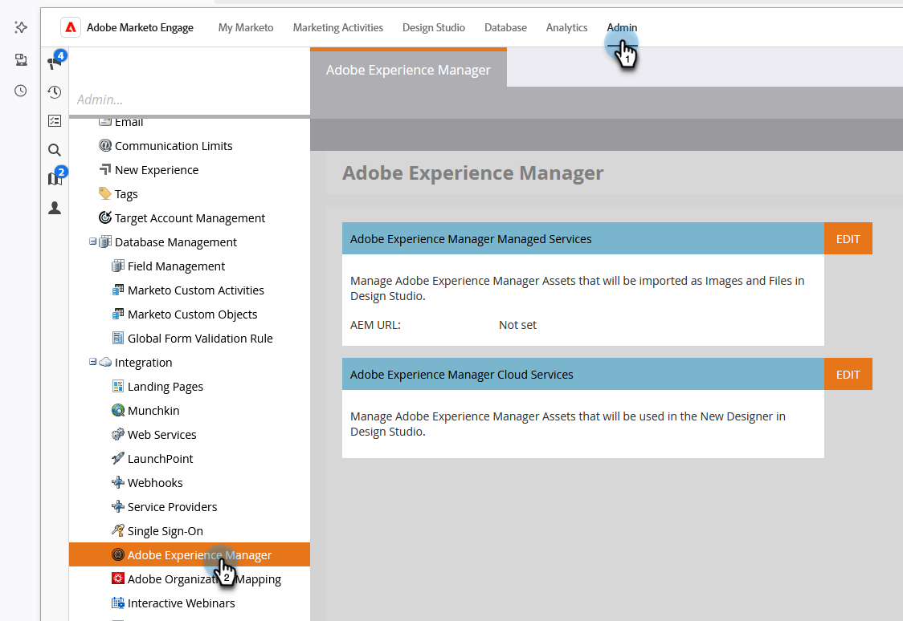
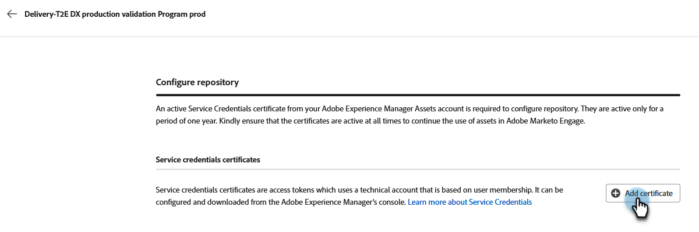

# Work with Experience Manager assets {#work-with-experience-manager-assets}

Connect your _Adobe Experience Manager Assets as a Cloud Service_ account to your Adobe Marketo Engage instance so you can leverage your AEM Asset repository in the Marketo Engage Email Designer.

>[!NOTE]
>
>Currently, only image assets from _Adobe Experience Manager Assets_ are supported in Marketo Engage. Changes to the assets must be done from the Adobe Experience Manager Assets central repository. [Learn more](https://experienceleague.adobe.com/en/docs/experience-manager-cloud-service/content/assets/manage/manage-digital-assets){target="_blank"}

## Link to Your AEM Cloud Services {#link-to-your-aem-cloud-services}

Before you can use this capability, you must first link AEM Cloud Services with Adobe Marketo Engage.

+++Link AEM Cloud Services and Marketo Engage

>[!NOTE]
>
>**Admin Permissions Required**

1. In Marketo Engage, go to the **Admin** area and select **Adobe Experience Manager** in the left navigation tree.

   {width="800" zoomable="yes"}

1. Click **Edit** next to _Adobe Experience Manager Cloud Services_.

   {width="400" zoomable="yes"}

1. Select one or more repositories.

   {width="800" zoomable="yes"}

   >[!NOTE]
   >
   >Only repositories that have been associated in the same IMS org as your Marketo Engage subscription are listed.

1. You must add a [service credential certificate](https://experienceleague.adobe.com/en/docs/experience-manager-learn/getting-started-with-aem-headless/authentication/service-credentials) to configure the repository. Click the **+ Add certificate** button.

   {width="800" zoomable="yes"}           

1. Drag and drop your certificate (JSON file only), or select it from your computer. Click **Add** when done.

   {width="600" zoomable="yes"}

1. The configured repository is displayed below along with status and expiration. Click the ellipsis button (**...**) to view the certificate. Otherwise, you're done. 

   {width="700" zoomable="yes"}

Now all the images from the digital asset management library in that repository can be accessed from the Marketo Engage Email Designer.

+++

## Working with AEM assets {#working-with-aem-assets}

When you use these digital assets, the latest changes in _Assets as a Cloud Service_ automatically propagate to live email campaigns through linked references. If images are deleted in _Adobe Experience Manager Assets as a Cloud Service_, the images appear with a broken reference in your emails. When assets that are currently being used in Marketo Engage are modified or deleted, the email authors are notified about the image changes. All changes to the assets must be done in the Adobe Experience Manager Assets central repository.

### Use AEM Assets as the image source {#use-aem-assets-as-the-image-source}

If your environment has one or more assets repository connections, you can designate AEM Assets as the source for assets when you create or view details for an email, email template, or visual fragment.

* When creating new content, choose `AEM Assets` as the **[!UICONTROL Image Source]** item in the dialog.

{width="400" zoomable="yes"}

* When opening an existing content resource, choose `AEM Assets` in the _[!UICONTROL Body]_ section on the right.

{width="700" zoomable="yes"}

### Access assets for authoring {#access-assets-for-authoring}

>[!IMPORTANT]
>
>An administrator must add users who need access to assets to the Assets Consumer Users and/or Assets Users Product profiles. [Learn more](https://experienceleague.adobe.com/en/docs/experience-manager-cloud-service/content/security/ims-support#managing-products-and-user-access-in-admin-console)

In the visual content editor, click the _Experience Manager Asset selector_ icon in the left sidebar. This changes the tools panel to a list of available assets in the selected repository.

{width="700" zoomable="yes"}

If you have more than one connected AEM repository, click the **[!UICONTROL Manage as]** button to choose the repository you want to use.

{width="700" zoomable="yes"}

Choose the desired repository.

{width="500" zoomable="yes"}

There are multiple methods for adding an image asset to the visual canvas:

* Drag and drop an image thumbnail from the left navigation.

{width="700" zoomable="yes"}

* Add an image component to the canvas and click **[!UICONTROL Browse]** to open the _[!UICONTROL Select Assets]_ dialog. 

   From the dialog, you can choose an image from the selected repository. 
   
   There are multiple tools available to help you locate the asset that you need.

{width="700" zoomable="yes"}
   
* Change the **[!UICONTROL Repository]** at the top right.

* Click **[!UICONTROL Manage assets]** at the top right to open the Assets repository in another browser tab and use AEM Assets management tools.

* Click the _View type_ selector at the top right to change the display to **[!UICONTROL List View]**, **[!UICONTROL Grid View]**, **[!UICONTROL Gallery View]**, or **[!UICONTROL Waterfall View]**.

* Click the _Sort order_ icon to change the sort order between ascending and descending.

* Click the **[!UICONTROL Sort by]** menu arrow to change the sort criteria to **[!UICONTROL Name]**, **[!UICONTROL Size]**, or **[!UICONTROL Modified]**.

* Click the _Filter_ icon on the top left to filter the displayed items according to your criteria.

* Enter text in the Search field to filter the displayed items for a match of the asset name.

{width="700" zoomable="yes"}
