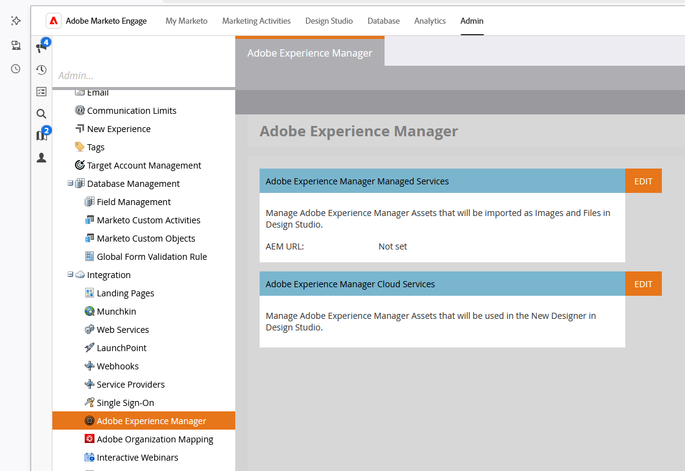

# Connect Adobe Experience Manager Cloud Services {#connect-adobe-experience-manager-cloud-services}

Learn how to connect your AEM Assets Cloud Services account to your Adobe Marketo Engage instance so you can leverage your AEM Asset repository in the Marketo Engage Email Designer.

>[!NOTE]
>
>**Admin Permissions Required**

1. In Marketo Engage, go to the **Admin** area and select **Adobe Experience Manager** in the left navigation tree.

   {width="800"}

1. Click **Edit** next to _Adobe Experience Manager Cloud Services_.

   {width="400"}

1. Select one or more repositories.

   {width="800"}

   >[!NOTE]
   >
   >Only repositories that have been associated in the same IMS org as your Marketo Engage subscription are listed.

1. You must add a [service credential certificate](https://experienceleague.adobe.com/en/docs/experience-manager-learn/getting-started-with-aem-headless/authentication/service-credentials) to configure the repository. Click the **+ Add certificate** button.

   {width="800"}           

1. Drag and drop your certificate (JSON file only), or select it from your computer. Click **Add** when done.

   {width="600"}

1. The configured repository is displayed below along with status and expiration. Click the ellipsis button (**...**) to view the certificate. Otherwise, you're done. 

   {width="600"}

Now all the images from the digital asset management library in that repository can be accessed from the Marketo Engage Email Designer.

>[!MORELIKETHIS]
>
>[Work with Experience Manager assets](/help/marketo/product-docs/email-marketing/email-designer/aem-assets.md)
