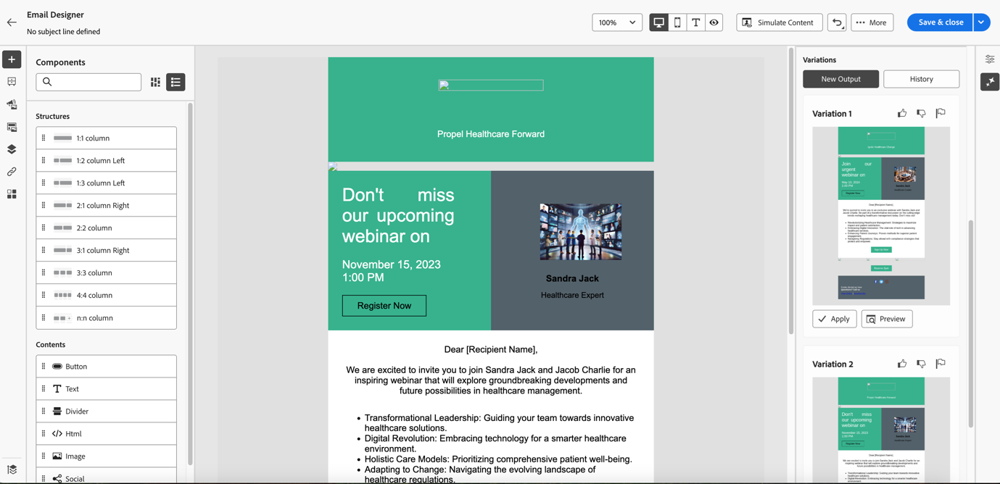

# Use the AI Assistant {#use-the-ai-assistant}

The AI Assistant in the Marketo Engage Email Designer helps you create contemporary, performant, and intuitive emails. This is achieved through Adobe's generative AI technology and prompt library along with Firefly for image generation that aids in creating suitable content for a particular persona/buying group, marketing journey stage, communication strategy, tone, etc. Specific brand assets can be also utilized to create content.

>[!PREREQUISITES]
>
>The AI Assistant is not enabled by default. You must first agree to the Core Gen-AI terms and the supplemental terms for using the Gen-AI functionality in the Email Designer. Contact the Adobe Account Team (your account manager) for details.

There are three primary use-cases for the AI Assistant:

* [Create a subject line](#create-a-subject-line) for your email
* [Create content for a specific section](#create-content-for-a-specific-section) of your email
* [Create an entire email](#create-an-entire-email) from a selected template

## Create a subject line {#create-a-subject-line}

When an email is created using the New Email Designer, enter a temporary subject line.

   

After the email has been created, the subject line is in the _Details_ column on the right. Click the AI assistant button (  ) next to it to get assistance creating a new subject line using the Gen AI functionality.

   

Enable the **Use reference content** option for the AI Assistant to personalize new content based on the selected content.

Enter the prompt to customize the subject line. Enter relevant text settings and upload any brand assets that you want to use as a reference to create an appropriate subject line.

   

The text settings include:

<table><tbody>
  <tr>
    <td style="width:25%"><b>Buying Group</b></td>
    <td>Specific buying group you are targeting (e.g., Practitioner, Influencer, Decision maker).</td>
  </tr>
  <tr>
    <td style="width:25%"><b>Marketing Journey Stage</b></td>
    <td>Recipients in a particular marketing journey stage (e.g., Discover, Evaluate, Commit).</td>
  </tr>
  <tr>
    <td style="width:25%"><b>Communication Strategy</b></td>
    <td>The objective of the communication (e.g., Urgent, Social Proof, Informative).</td>
  </tr>
  <tr>
    <td style="width:25%"><b>Language</b></td>
    <td>Language in which you want the subject line to be generated.</td>
  </tr>
  <tr>
    <td style="width:25%"><b>Tone</b></td>
    <td>Tone in which you want the content to be generated (e.g., Inspirational, Exciting, Humorous).</td>
  </tr>
  <tr>
    <td style="width:25%"><b>Emojis</b></td>
    <td>Allows for emojis to be included in the generated content.</td>
  </tr>
</tbody>
</table>

Upon clicking **Generate**, samples appear for you to choose from:

   

You can also upload a brand asset to use content inside the asset as a reference to create the subject line.

   

To choose a variation, select its checkbox and click **Select**. You can also tweak it by clicking **Refine**. Additionaly, you can provide feedback by clicking the thumbs up or thumbs down icon so the Gen-AI technology learns your preferences.

After making your selection, the Subject Line is populated in your Email Details.

   

## Create content for a specific section of your email {#create-content-for-a-specific-section}

After the email is created, you have the option of modifying certain sections, images or text.

   

In this example, we're using a healthcare template. If the existing image of the healthcare expert doesn't meet your needs, you can instruct the AI assistant to create its own image of a healthcare expert. Just select the image content and then click the AI assistant.

   

Enter the relevant details in the prompt, such as, "generate an image for a healthcare expert," and add any desired customization. You can also use the prompt library (to the right of the prompt) if you are not sure what to enter.

After clicking **Generate**, multiple variants are created for you to choose from.

   

Similar to image, text portions of the email can be modified as well.

   

## Create an entire email from a selected template {#create-an-entire-email}

This option is only available if the email is created using an existing template. It can be a standard template provided by the Email Designer, a saved template you already created, or an imported template using the Import HTML option. This option is not available if you choose [Design from Scratch](/help/marketo/product-docs/email-marketing/email-designer/email-authoring.md#design-from-scratch) for your email.

Select a template, without selecting any component within the template, and click the AI assistant button in the Email Designer.

   

Enter the relevant prompt and choose the text settings, brand assets, and any image settings you want for your email.

   

If you would like to generate images using Firefly, select the Image Settings and select the toggle for **Generate Images using AI**.

   

Select the desired _Content Type_, _Color and Tone_, _Lighting_, and _Composition_ to create Gen-AI images for your email. Click **Generate** when done.

   

See how a variation will look in your email by clicking **Preview**. Choose a variation by clicking **Apply**.
