# Brand themes {#brand-themes}

With brand themes, easily create reusable content that fits a specific brand and design language by adding custom styling to your email templates.

This feature empowers marketers to leverage visually appealing, brand-consistent emails faster and with less effort, while providing advanced customization options for unique design needs.

## Things to note {#things-to-note}

* When creating an email from scratch, you can choose to start building your content using a theme to quickly apply a specific styling that fits your brand and design. If you choose the Classic mode, you won't be able to apply any themes unless you reset your email.

* Fragments are not cross-compatible between the Theme and Classic modes. To be able to use a fragment in a content where a theme is applied, it must be created in Theme mode.

* Updating a theme will not automatically cascade to all assets using them. You would need to edit individual objects to refresh the theme.

* When themes are deleted, it does not affect the assets using them.

## Create a Brand Theme {#create-a-brand-theme}

1. Follow the steps to [create an email template](/help/marketo/product-docs/email-marketing/email-designer/email-template-authoring.md#create-an-email-template).

1. In the _Design your template_ screen, select **Create or edit themes**.

   

1. Select the Default theme as the basis to create from the ground up and click **Create**.

   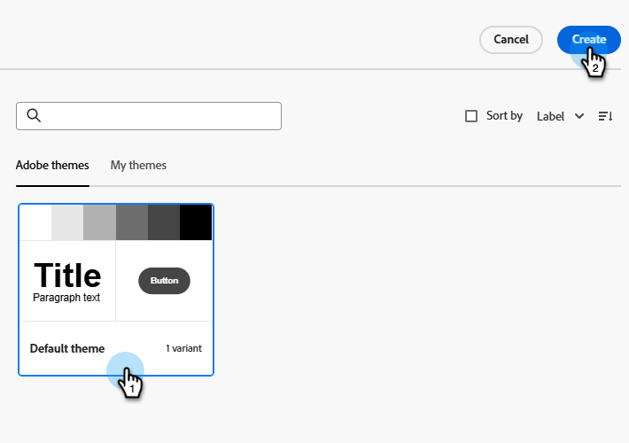

1. The canvas opens for you to edit different parts of the theme.

   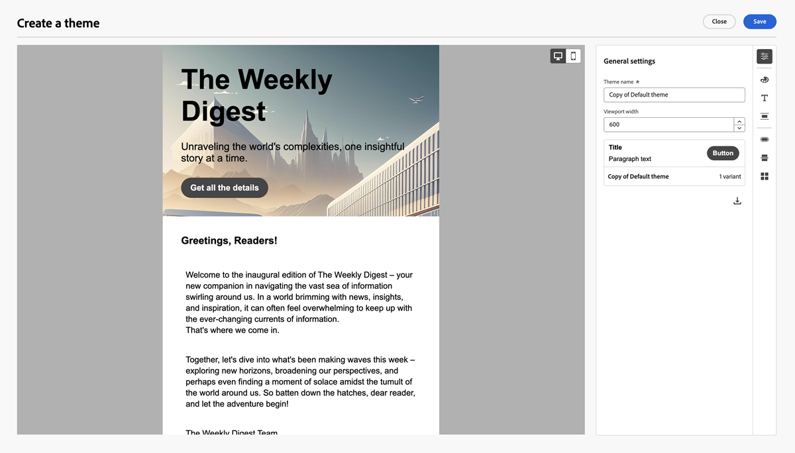

## Settings

All settings options can be accessed via the icons on the right. Let's review each one.

   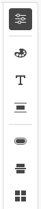

### General settings {#general-settings}

Name the theme and adjust viewport size.

   

### Colors {#colors}

As you make color tweaks, observe the changes taking effect on the main panel.

   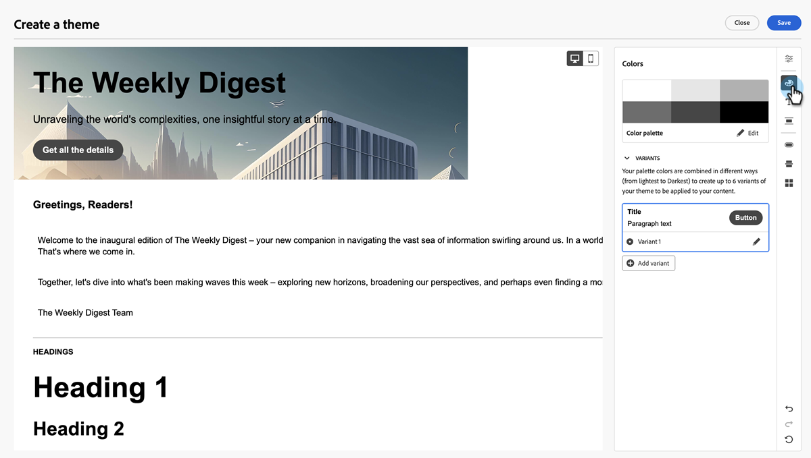

>[!NOTE]
>
>A set of swatches is already configured for you based on the default theme.

Click **Edit**.

   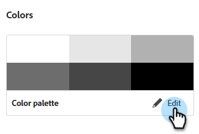

You can choose from a presets or individually configure each color in the set. Choosing the palette makes these colors accessible under the different color settings later on.

   

When you're done editing, click the back arrow () to return.

To edit a variant, click its pencil icon.

   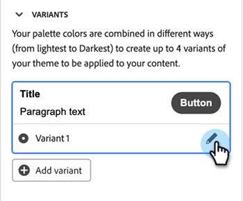

>[!NOTE]
>
>You can create up to six variants.

Multiple elements are available to customize. Variant settings are grouped in the following categories:

* General
* Headings
* Paragraphs
* Buttons

**General**

These settings allow you to set colors for body, structures, backgrounds, containers, images, and more.

   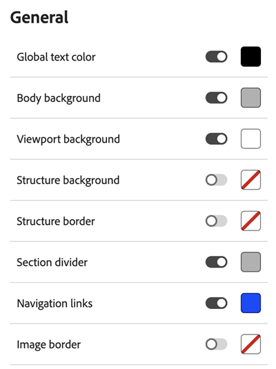

**Heading**

Set text and border colors of each heading type, from Heading 1 to Heading 6.

   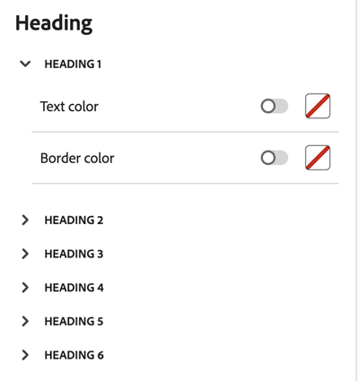

**Paragraph**

Set text and border colors of up to three paragraph types.

   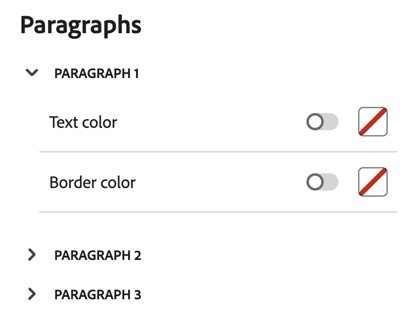

**Buttons**

Set fill, border, and text color for three different button types: Primary, Secondary, and Tertiary.

   

### Text settings {#text-settings}

Set font types and sizes for global, headings, and paragraphs.

   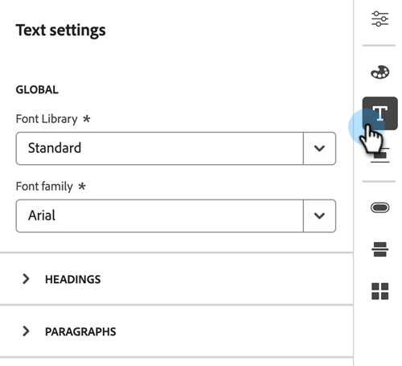

**Global**

Choose between Standard or Google font libraries and their respective font families.

   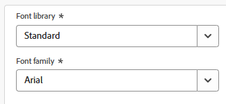

**Headings**

Set font library, family, size, text style, and text alignments for different heading types.

   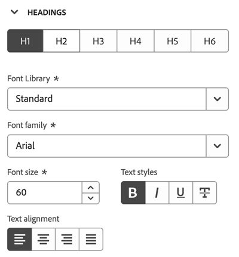

**Paragraphs**

Set font library, family, size, text style, and text alignments for different paragraph presets.

   

### Spacing and border {#spacing-and-border}

Under this, you can set the padding and margin for different types of structure or button.  Choose the type in the first drop down and then continue to set Padding and/or Margin for that element. Repeat this one by one as applicable.

SCREENSHOT

Types of structures are as follows:

SCREENSHOT

Settings for an example element, say Container.

Margins

SCREENSHOT

Padding

SCREENSHOT

Corners

SCREENSHOT

Borders

Toggle the border to ON to reveal options to set size, style and position.

SCREENSHOT

The options for styles

SCREENSHOT

Some examples for the effect of styles on the box

```
TABLE

Type

Size and Style setting

Effect

Dashed

Dotted

Solid
```

Adjust if the border show or be hidden using border position

Example: Top is hidden in the below example.

```
TABLE

Position setting

Effect
```

Repeat the settings for setting margin, paddings, corner and border types for different types of structures.

### Button settings {#button-settings}

Under this, you can set different elements about buttons (other than color), like button shape, button radius, button text and button sizes. You can set these for 3 presets - Primary, Secondary and Tertiary.

SCREENSHOT

```
TABLE

Primary/Secondary/Tertiary    Allows settings for 3 presets of button configurations
Text > Font Library    Font library choice for button text
Text > Font family    Font family choice for button text
Text > Font size    Font size for button text
Text > Text styles    Text style (bold, italicized, underlined, strikethrough) for button text
Text > Text alignment    Alignment for button text
Border> Border size     Button border thickness
Border> Border style    Button border style (dashed, solid, dotted, etc.)
Border> Border radius    Button border corner curvature
SIZE > Height    Height setting for the button
SIZE > Width    Width setting for the button
```

### Divider settings {#divider-settings}

Under this, you can set the type of line and container settings for divider.

SCREENSHOT

### Grid settings {#grid-settings}

Use Columns gap to control spacing in the grids.

```
TABLE
```

Click Save when done.

SCREENSHOT

## Editing Brand Themes {#editing-brand-themes}

Creation of brand themes is available in the template selection panel within the editor. You can reach this panel as you are creating a new template, or within Change Design from inside the editor.

SCREENSHOT

Click Change your design.

SCREENSHOT

Click Create or edit themes

SCREENSHOT

Select Custom Themes to show the list of custom themes created in your organization. Choose a theme and click on Edit.

SCREENSHOT

Now, the canvas is open for editing.

SCREENSHOT

Modify any of the settings under the sections on the right pane.

SCREENSHOT

Click Save when complete.

SCREENSHOT

## Using Brand Themes {#using-brand-themes}

The brand themes thus created/ edited are ready to be leveraged across email, email template & fragment assets.

Adobe Marketo Engage: The brand themes this created/ edited are ready to be leveraged across email, email template & fragment assets created using the new email editor.

You can create structures & components in the editor & apply any of the brand themes and any of their variants.

### In your emails {#in-your-emails}

Create emails/ email templates from scratch

* Start with 'Create Email'/ 'Create email template', select the option of 'Design from scratch'

* In the modal that appears, select 'Use Themes'

SCREENSHOT

Note: Only the email created by this option will be able to leverage the brand themes defined in the previous section

* This new option appears on the right side bar, that enables you to use brand themes in your email

SCREENSHOT

* You can select from Adobe themes or Custom themes created for your brands

SCREENSHOT

* Design email content in the canvas and select a theme to apply to the content

* One email shall only contain one brand theme

* For any component created in this asset, you can apply any of the styling options available within the theme, from the 'Styles' tab on the right pane

* e.g. a CTA can be configured as primary/ secondary / tertiary

SCREENSHOT

* E.g. A text component can be selected to apply any of the headings/ paragraph styling as defined in the theme

SCREENSHOT

* Note that now the 'Style' tab looks different from a traditional manual styling email where there is more creative liberty to style a component

### Create emails/email templates from a template

* You can leverage themes when you create an email or email template from a pre-existing email template, that was also created using themes

* Start with 'Create Email'/'Create email template', select one of the email templates created using themes, from the 'Saved Templates' section

* Now the theme used in the saved email template is automatically applied

SCREENSHOT

* You can also change the theme in this email/ email template via the 'Themes' option in the right side bar

SCREENSHOT

* You can also apply any variant of a theme to the content

SCREENSHOT

SCREENSHOT

### In your fragments {#in-your-fragments}

Start with 'Create New Fragment'

From the 'Themes' option in the right side bar, select the desired theme & apply the same

SCREENSHOT

All fragment content created in the canvas thereafter will adopt the selected theme

You can also apply any variant of a theme to the content

Once this Fragment is Published, this fragment can be used in any email/email template that is created using Themes
