# Brand themes {#brand-themes}

With brand themes, easily create reusable content that fits a specific brand and design language by adding custom styling to your email templates.

This feature empowers marketers to leverage visually appealing, brand-consistent emails faster and with less effort, while providing advanced customization options for unique design needs.

## Create a theme {#create-a-theme}

1. Follow the steps to [create an email template](/help/marketo/product-docs/email-marketing/email-designer/email-template-authoring.md#create-an-email-template).

1. In the _Design your template_ screen, select **Create or edit themes**.

   

1. Select the Default theme as the basis to create from the ground up and click **Create**.

   

1. The canvas opens for you to edit different parts of the theme.

   

## Settings {#settings}

All settings options can be accessed via the icons on the right. Let's review each one.

   

### General settings {#general-settings}

Name the theme and adjust viewport size.

   

### Colors {#colors}

As you make color tweaks, observe the changes taking effect on the main panel.

   

>[!NOTE]
>
>A set of swatches is already configured for you based on the default theme.

Click **Edit**.

   

You can choose from a presets or individually configure each color in the set. Choosing the palette makes these colors accessible under the different color settings later on.

   

When you're done editing, click the back arrow () to return.

To edit a variant, click its pencil icon.

   

>[!NOTE]
>
>You can create up to six variants.

Multiple elements are available to customize. Variant settings are grouped in the following categories:

* General
* Headings
* Paragraphs
* Buttons

**General**

These settings allow you to set colors for body, structures, backgrounds, containers, images, and more.

   

**Heading**

Set text and border colors of each heading type, from Heading 1 to Heading 6.

   

**Paragraph**

Set text and border colors of up to three paragraph types.

   

**Buttons**

Set fill, border, and text color for three different button types: Primary, Secondary, and Tertiary.

   

### Text settings {#text-settings}

Set font types and sizes for global, headings, and paragraphs.

   

**Global**

Choose between Standard or Google font libraries and their respective font families.

   

**Headings**

Set font library, family, size, text style, and text alignments for different heading types.

   

**Paragraphs**

Set font library, family, size, text style, and text alignments for different paragraph presets.

   

### Spacing and border {#spacing-and-border}

Choose from multiple different structures and customize their margin, padding, or border.

   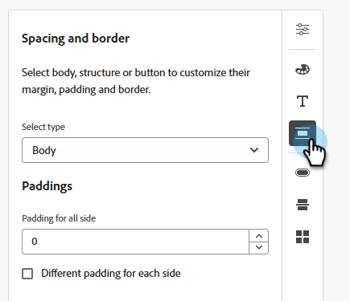

In the example below, we're customizing a Container.

**Margins**

   

**Padding**

   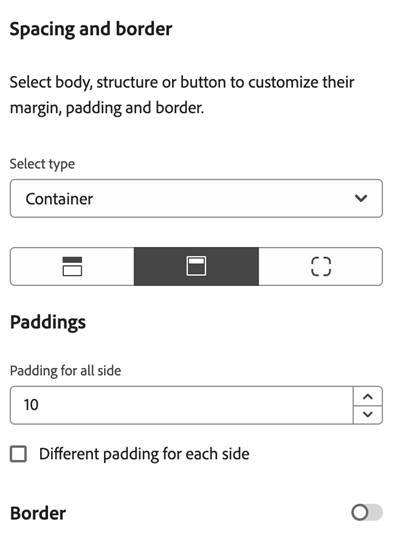

**Corners**

   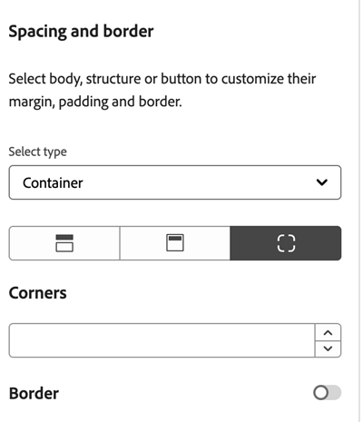

**Borders**

Toggle the border to ON to reveal options to set size, style and position.

   

Below are some visual examples of changing the border style.

<table><thead>
  <tr>
    <th>Type</th>
    <th>Size and Style setting</th>
    <th>Effect</th>
  </tr></thead>
<tbody>
  <tr>
    <td>Dashed</td>
    <td>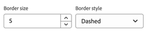</td>
    <td>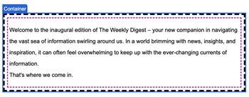</td>
  </tr>
  <tr>
    <td>Dotted</td>
    <td>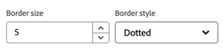</td>
    <td>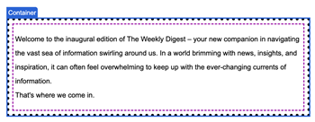</td>
  </tr>
  <tr>
    <td>Solid</td>
    <td></td>
    <td>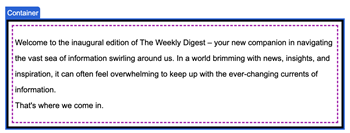</td>
  </tr>
</tbody></table>

Adjust what sides of the border are to show or be hidden. In the example below, the top border is hidden.

<table><thead>
  <tr>
    <th>Position setting</th>
    <th>Effect</th>
  </tr></thead>
<tbody>
  <tr>
    <td></td>
    <td>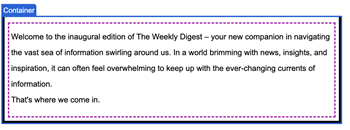</td>
  </tr>
</tbody></table>

### Button settings {#button-settings}

Set non-color elements for buttons, like shape, radius, text, and size. The three presets are: Primary, Secondary, and Tertiary.

   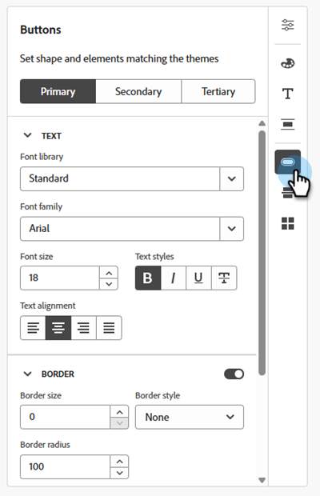

<table><thead>
  <tr>
    <th>Setting</th>
    <th>Description</th>
  </tr></thead>
<tbody>
  <tr>
    <td>Border &gt; Border radius</td>
    <td>Button border corner curvature</td>
  </tr>
  <tr>
    <td>Border &gt; Border size </td>
    <td>Button border thickness</td>
  </tr>
  <tr>
    <td>Border &gt; Border style</td>
    <td>Button border style (dashed, solid, dotted, etc.)</td>
  </tr>
  <tr>
    <td>Primary/Secondary/Tertiary</td>
    <td>Allows settings for three presets of button configurations</td>
  </tr>
  <tr>
    <td>SIZE &gt; Height</td>
    <td>Height setting for the button</td>
  </tr>
  <tr>
    <td>SIZE &gt; Width</td>
    <td>Width setting for the button</td>
  </tr>
  <tr>
    <td>Text &gt; Font family</td>
    <td>Font family choice for button text</td>
  </tr>
  <tr>
    <td>Text &gt; Font Library</td>
    <td>Font library choice for button text</td>
  </tr>
  <tr>
    <td>Text &gt; Font size</td>
    <td>Font size for button text</td>
  </tr>
  <tr>
    <td>Text &gt; Text alignment</td>
    <td>Alignment for button text</td>
  </tr>
  <tr>
    <td>Text &gt; Text styles</td>
    <td>Text style (bold, italicized, underlined, strikethrough) for button text</td>
  </tr>
</tbody></table>

### Divider {#divider}

Set the type of line and container settings for the divider.

   

### Grid settings {#grid-settings}

Use _Columns gap_ to control spacing in the grids.

   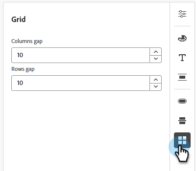

<table><tbody>
  <tr>
    <td>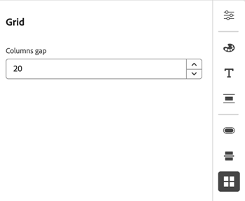</td>
    <td></td>
  </tr>
 <tr>
    <td>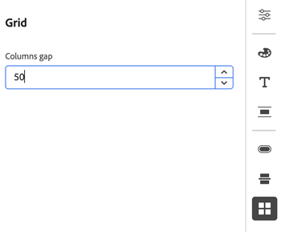</td>
    <td></td>
  </tr>
</tbody></table>

Click **Save** when done.

   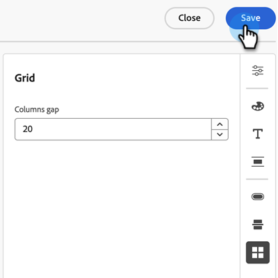

## Edit an existing theme {#edit-a-brand-theme}

1. Follow the steps to [create an email template](/help/marketo/product-docs/email-marketing/email-designer/email-template-authoring.md#create-an-email-template).

1. In the _Design your template_ screen, select **Create or edit themes**.

   

1. Click the **My themes** tab.

   

1. Select the desired theme. The _Create_ button becomes an _Edit_ button. Click **Edit**.

   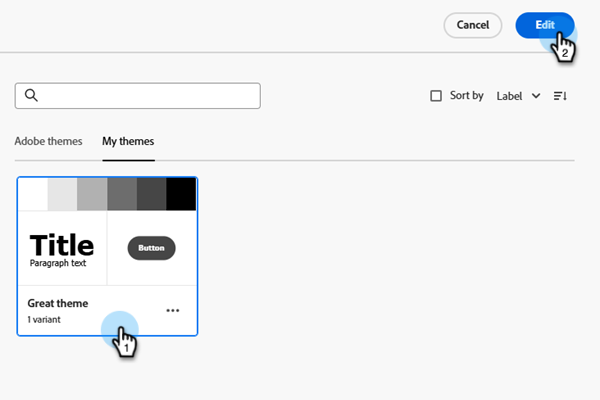

1. The canvas opens for editing. Make your desired changes in any of the options found in **[Settings](#settings)**.

>[!TIP]
>
>Remember to save your work!

## Using Brand Themes {#using-brand-themes}

Leverage themes across email, email templates, and fragments.

You can create structures and components in the editor and apply any of the brand themes and their variants.

### In your emails {#in-your-emails}

1. Follow the steps to [create an email](/help/marketo/product-docs/email-marketing/email-designer/email-authoring.md#create-an-email).

1. After creation, click **Edit email content**.

   

1. Select **Design from scratch**.

   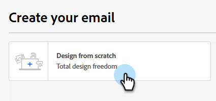

1. Select **Use Themes** (it should be selected by default) and click **Confirm**.

   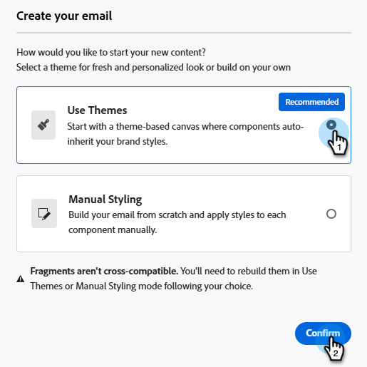

>[!NOTE]
>
>Only emails created by this option will be able to leverage the brand themes you defined.

1. Click the _Themes_ icon in the right side bar.

   

1. Select from Adobe themes or themes you already created.

   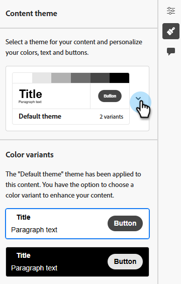

   >[!NOTE]
   >
   >* Design email content in the canvas and select a theme to apply to the content.
   >* An email can contain only one brand theme.
   >* For any component created in this asset, you can apply any of the styling options available within the theme from the 'Styles' tab on the right pane (e.g., a call-to-action can be configured as primary/secondary/tertiary).

1. Implement your desired designs. For example, a text component can be selected to apply any of the headings/paragraph styling as defined in the theme.

   

   >[!NOTE]
   >
   >The Style tab looks different from a traditional manual styling email where there is more creative liberty to style a component.

### Make a template compatible with themes {#make-a-template-compatible}

1. Find and select the desired template.

1. Click **Edit email template**.

   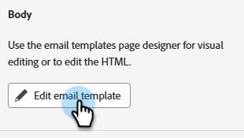

1. Click the _Themes_ icon and click **Generate theme from content**.

   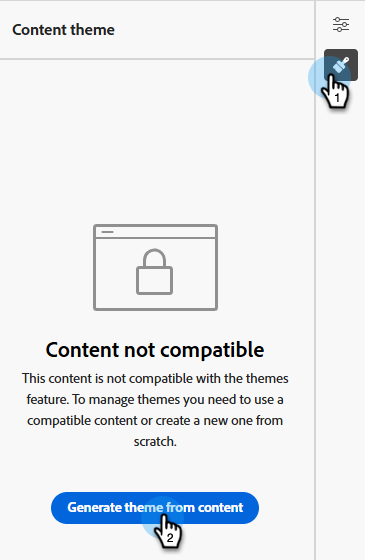

1. The _Create a theme_ window opens. Marketo Engage automatically detects the styling elements and consolidates them into a new theme.

   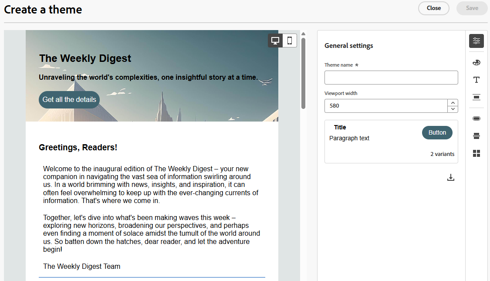

1. Name your theme.

1. Make your desired changes (just like you do when creating a theme from scratch). Click **Save** when done.

   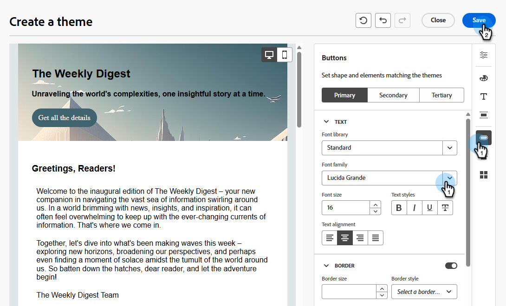

### In your fragments {#in-your-fragments}

1. Follow the steps to [create a fragment](/help/marketo/product-docs/email-marketing/email-designer/fragments.md#create-a-fragment).

1. Design your content theme using the options found in **[Settings](#settings)**.

All fragment content created in the canvas thereafter will adopt the selected theme. You can also apply any variant of a theme to the content.

After your fragment is published, it can be used in any email/email template that is created using themes.

## Things to note {#things-to-note}

* When creating an email from scratch, you can choose to start building your content using a theme to quickly apply a specific styling that fits your brand and design. If you choose the Classic mode, you won't be able to apply any themes unless you reset your email.

* Fragments are not cross-compatible between the Theme and Classic modes. To be able to use a fragment in a content where a theme is applied, it must be created in Theme mode.

* Updating a theme will not automatically cascade to all assets using them. You would need to edit individual objects to refresh the theme.

* When themes are deleted, it does not affect the assets using them.
