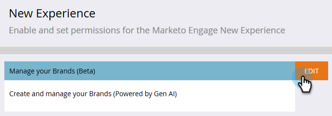

# Create and manage your brands {#create-and-manage-brands}

Brand guidelines are a detailed set of rules and standards that establish a brand's visual and verbal identity. They act as a reference to maintain consistent brand representation across all marketing and communication platforms.

Manually input and organize your brand details or upload brand guideline documents for automatic information extraction.

>[!AVAILABILITY]
>
>You must agree to the [user agreement](https://www.adobe.com/legal/licenses-terms/adobe-dx-gen-ai-user-guidelines.html){target="_blank"} before you can use the AI Assistant in Adobe Marketo Engage. For more information, contact your Adobe Account manager.

## Access brands {#access}

To access the **[!UICONTROL brands]** menu in [!DNL Adobe Marketo Engage], users need to be granted the relevant permission.

+++  Learn how to assign brand-related permission

### Users & Roles {#users-and-roles}

1. In _Admin_, select **Users & Roles**.

1. Select the desired role.

1. Click to expand the **Access Design Studio** menu.

1. Select **Access AI Assistant** and click **Save**.

+++

## Create and manage your Brand {#create-brand-kit}

To create and manage your brand guideline, you can either enter the details yourself, or upload your brand guidelines document to have the information extracted automatically.

1. In _Admin_, select **New Experience**.

   

1. Next to _Manage your Brands_, click **Edit**.

   

1. Click **[!UICONTROL Create brand]**.

1. Enter a **[!UICONTROL Name]** for your brand.

1. Drag and drop or select your PDF to upload your brand guidelines and extract automatically relevant brand information. Click **[!UICONTROL Create]**.

    The information extraction process begins. It may take several minutes to complete.

   

1. Your content and visual creation standards are now automatically populated. Browse through the different tabs to adapt the information as needed.

1. From the advanced menu of each section or category, you can add references to extract relevant brand information automatically.

    To remove existing content, use the **[!UICONTROL Clear section]** or **[!UICONTROL Clear category]** options.

   {width="800" zoomable="yes"}

   {width="800" zoomable="yes"}

1. Click **Filter** to filter guidelines by channel or element type.

   

1. When done configuring, click **[!UICONTROL Save]**, then **[!UICONTROL Publish]** to make your brand guideline available in AI Assistant.

1. To make modifications to your published brand, click **[!UICONTROL Edit brand]**. 

    >[!NOTE]
    >
    >This creates a temporary copy in edit mode, replacing the live version after it's published.

   

1. From your **[!UICONTROL Brands]** dashboard, open the advanced menu by clicking the three dots icon to: 

* View brand
* Edit
* Duplicate
* Publish
* Unpublish
* Delete

   

Your brand guidelines are now accessible from the **[!UICONTROL Brand]** drop-down in AI Assistant menu, enabling it to generate content and assets aligned with your specifications.

### Set a default brand {#default-brand}

You can designate a published brand as your default to be automatically applied when generating content and calculating alignment scores during campaign creation.

To set a default brand, go to your **[!UICONTROL Brands]** dashboard. Open the advanced menu by clicking the three dots icon and selecting **[!UICONTROL Mark as default brand]**.

   
