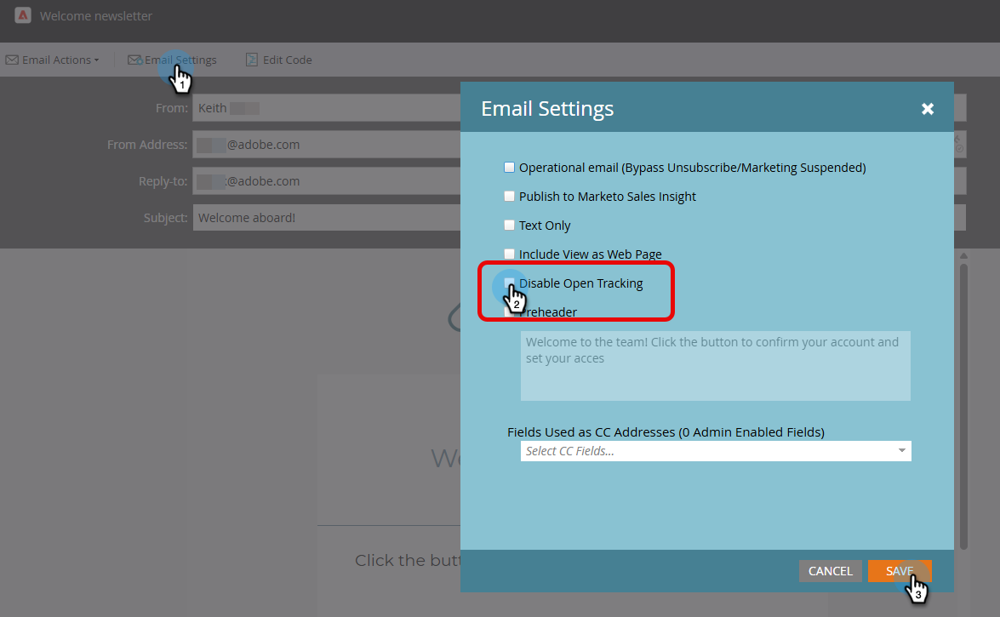

# CNIL guidance compliance: Conditional email open tracking {#cnil}

Learn how to configure Marketo Engage to honor end-user consent for email open (pixel) tracking, in alignment with CNIL guidelines (COMMUNITY LINK). The approach uses a custom boolean field to determine which email variant a person receives, one with open tracking enabled or one with it disabled.

## Step 1: Create a custom boolean field {#custom-field}

1. In the **Admin** area, click **Field Management** and select **New Custom Field**.

   

1. For _Object_, choose **Person**. For _Type_, choose **Boolean**. For _Name_, enter "Email Pixel Tracking" (the API Name autopopulates). Click **Create**.

   

## Step 2: Populate the consent field {#populate}

1. Set the Email Pixel Tracking field value for each person via data import (API sync or [CSV upload](https://experienceleague.adobe.com/en/docs/marketo/using/getting-started/quick-wins/import-a-list-of-people){target="_blank"}).

   

1. Ensure the custom field is mapped correctly.

   

>[!NOTE]
>
>Going forward, you can capture the data directly during a form-fill, allowing the person to opt in or out of email open tracking.

## Step 3: Create email variants {#variants}

Create two emails. Note that email open tracking is enabled by default for both the Email Designer and the legacy email editor.

* **Email One (open tracking enabled)**: After creating the email, no further action is required. Keep open tracking enabled.

* **Email Two (open tracking disabled)**: Clone Email One and disable open tracking.

   

In the Email Designer, the **Disable open tracking** checkbox can be found in the _Details_ tab of the _Summary_ pane to the right of your email. In the legacy email editor, the **Disable open tracking** checkbox can be found in the _Email Settings_ menu.

**Email Designer**

   {width="800" zoomable="yes"}

**Legacy email editor**

   {width="800" zoomable="yes"}

## Step 4: Configure your Smart Campaign {#smart-campaign}

[Create a Smart Campaign](https://experienceleague.adobe.com/en/docs/marketo/using/product-docs/core-marketo-concepts/smart-campaigns/creating-a-smart-campaign/create-a-new-smart-campaign){target="_blank"} to determine which email each person receives.

1. In the _Flow_ tab of your Smart Campaign, insert the **Send Email** flow step.

   {width="800" zoomable="yes"}

1. In the flow step, click **Add Choice**. In Choice 1, set **if** to _EmailPixelTracking_, set the operator to _is_, and set the value to _false_. For **Email**, select _Email Two_.

1. In Default Choice, set the **Email** to _Email One_.

   

This ensures people who have not consented to open tracking receive the non-tracked email, while people who have consented receive the standard tracked email.
