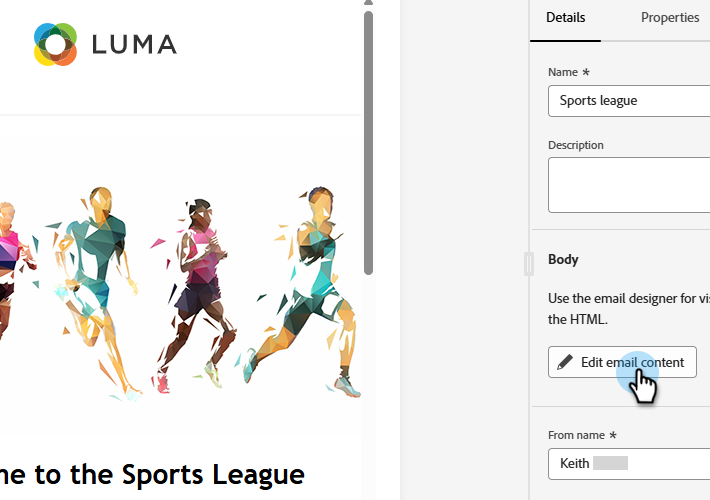
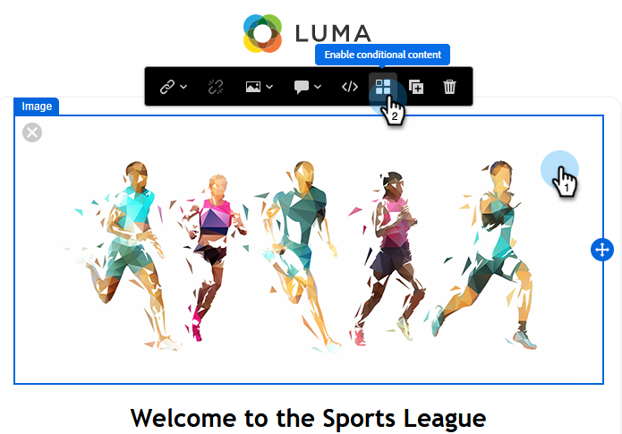
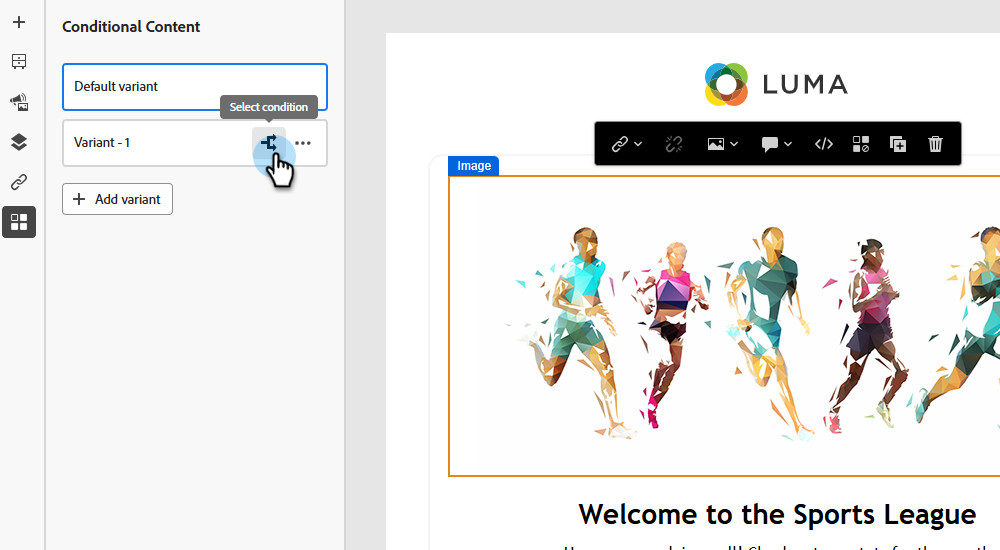
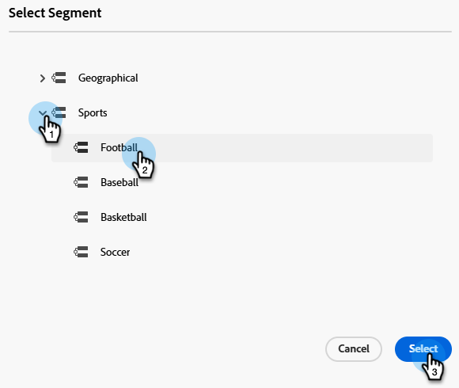
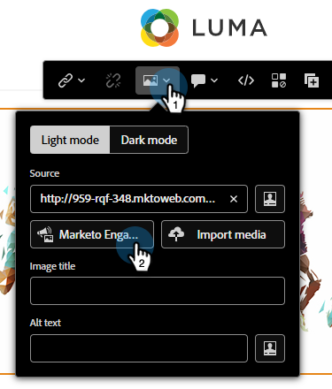
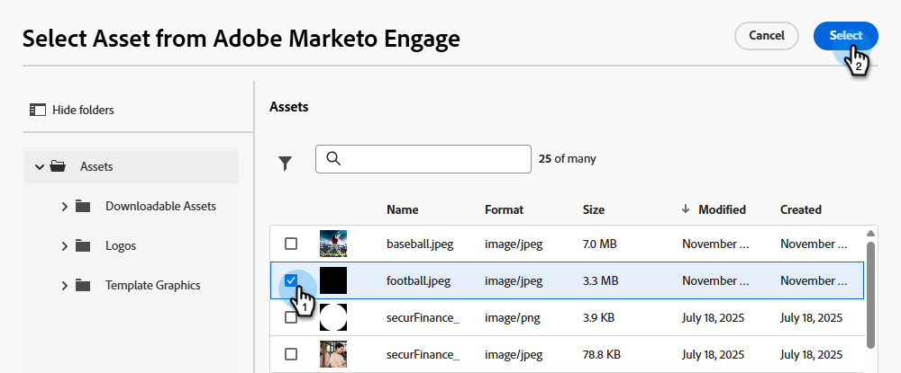
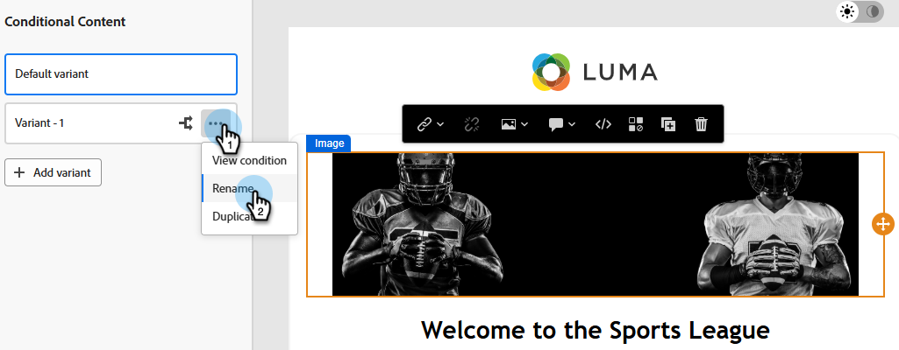
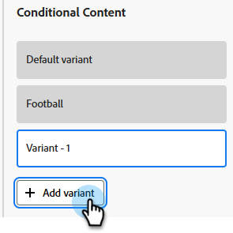
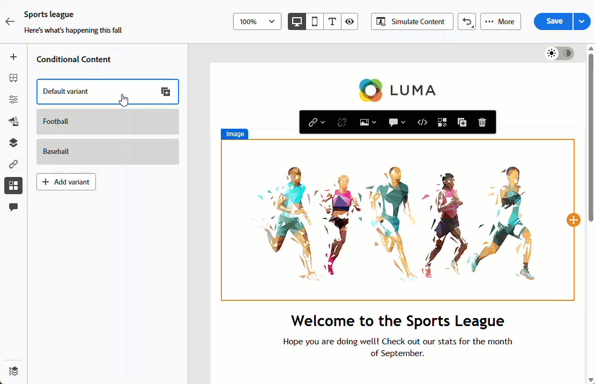

# Conditional content {#conditional-content}

Conditional content allows you dynamically control what content is seen by which audience. Use existing Segmentations to determine what a recipient sees based on predefined criteria.

>[!PREREQUISITES]
>
>Have at least one Segmentation [created](/help/marketo/product-docs/personalization/segmentation-and-snippets/segmentation/create-a-segmentation.md) and [approved](/help/marketo/product-docs/personalization/segmentation-and-snippets/segmentation/approve-a-segmentation.md).

## Add conditional content {#add-conditional-content}

1. Open the desired email and click **Edit email content**.

   

1. Select the content you want to be conditional (in this example, we're choosing the header image). Click the _Enable conditional content_ icon.

   

1. The box becomes orange. On the left, click the _Select condition_ icon to define your variant.

   {width="700" zoomable="yes"}

1. Choose the desired segment and click **Select**.

   

1. Click the _Edit image_ icon to replace the existing image for the variant. Choose the source of your new image. In this example, we're choosing the _Images & Files_ library in our Marketo Engage subscription.

   

1. Choose the applicable image and click **Select**.

   {width="600" zoomable="yes"}

1. The new image appears. It is a good idea to rename your variant to make it easier to identify.

   {width="600" zoomable="yes"}

1. To add additional variants (optional), click **Add variant** and follow the same steps.

   

1. When you're done, each variant displays the content you selected.

   

1. Recipients see content based on the rules defined in each segment. In the example above, everyone who has "football" listed in your Marketo Engage field _Favorite Sport_ will see the football image. 

>[!MORELIKETHIS]
>
>* [Define Segment Rules](/help/marketo/product-docs/personalization/segmentation-and-snippets/segmentation/define-segment-rules.md)
>* [Create a Custom Field in Marketo](/help/marketo/product-docs/administration/field-management/create-a-custom-field-in-marketo.md)
