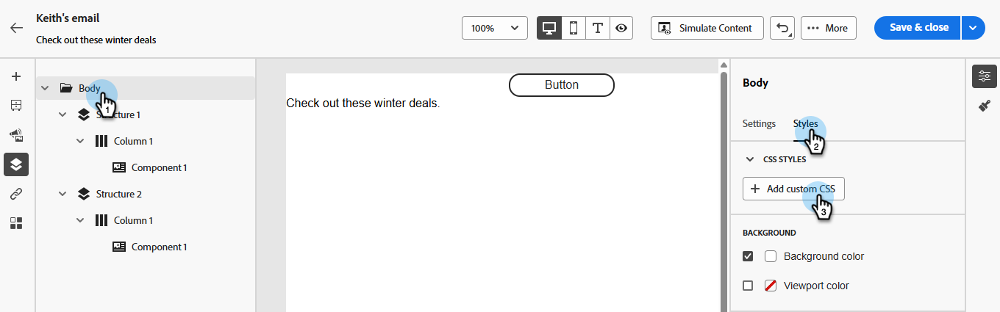
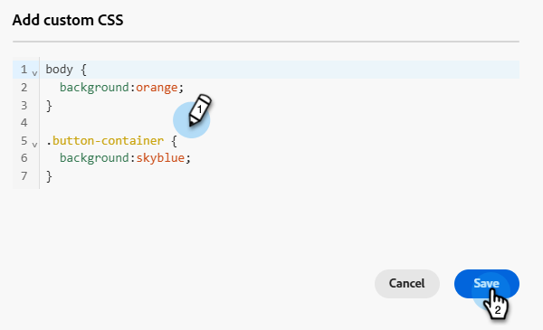
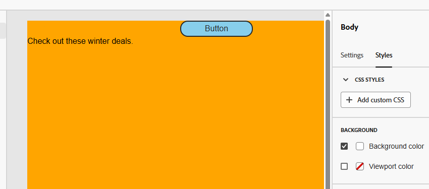

# Add custom CSS to your email content {#custom-css}

Add your own custom CSS directly within the Marketo Engage Email Designer for advanced, specific styling.

## Define custom CSS {#define-custom-css}

1. Ensure there is some content defined in the Email Designer by adding at least one component.

1. Select **[!UICONTROL Body]**, either from the **[!UICONTROL Navigation tree]** on the left, or the right pane. **[!UICONTROL CSS styles]** displays on the right.

   {width="800" zoomable="yes"}

    >[!NOTE]
    >
    >The **[!UICONTROL CSS styles]** section is only available when content is present in the editor.

1. Click the **[!UICONTROL + Add custom CSS]** button.

    >[!NOTE]
    >
    >The **[!UICONTROL Add custom CSS]** button is only available when **[!UICONTROL Body]** is selected. However, you can apply custom CSS styles to all the components inside your content.

1. Enter your CSS code in the dedicated text area that pops up. Make sure the custom CSS [is valid and follows the proper syntax](#use-valid-css). Click **Save** when done.

   

    >[!NOTE]
    >
    >You cannot add custom CSS to your content when using a [template with locked content](/help/marketo/product-docs/email-marketing/email-designer/content-locking.md). The button label changes to **[!UICONTROL View custom CSS]** and any custom CSS shown is read-only.

1. Make sure the CSS applies to your content. If it doesn't, check the [Troubleshooting](#troubleshooting) section.

   

   >[!NOTE]
   >
   >If you remove all content, the section disappears, and the previously defined custom CSS is no longer applied. Add content back to make the **[!UICONTROL CSS styles]** section reappear. The custom CSS is applied again.

## Using valid CSS {#using-valid-css}

You can input any valid CSS string in the **[!UICONTROL Add custom CSS]** text area. Properly formatted CSS is immediately applied to the content.

>[!CAUTION]
>
>You are responsible for the security of your custom CSS. Ensure your CSS does not introduce vulnerabilities or conflicts with the existing content.
>
>Avoid using CSS that could unintentionally break the content's layout or functionality.

+++ Samples of valid CSS

Below are examples of valid CSS.

```css
.acr-component[data-component-id="form"] {
  display: flex;
  justify-content: center;
  background: none;
}

.acr-Form {
  width: 100%;
  padding: 20px 100px;
  border-spacing: 0px 8px;
  box-sizing: border-box;
  margin: 0;
}

.acr-Form .spectrum-FieldLabel {
  width: 20%;
}

.acr-Form.spectrum-Form--labelsAbove .spectrum-FieldLabel,
.acr-Form [data-form-item="checkbox"] .spectrum-FieldLabel {
  width: auto;
}

.acr-Form .spectrum-Textfield {
  width: 100%;
}

#acr-form-error,
#acr-form-confirmation {
  width: 100%;
  padding: var(--spectrum-global-dimension-static-size-500);
  display: flex;
  align-items: center;
  flex-direction: column;
  justify-content: center;
  gap: var(--spectrum-global-dimension-static-size-200);
}

.spectrum-Form-item.is-required .spectrum-FieldLabel:after{
  content: '*';
  font-size: 1.25rem;
  margin-left: 5px;
  position: absolute;
}

/* Error field placeholder */
.spectrum-HelpText {
  display: none !important;
}

.spectrum-HelpText.is-invalid,
.is-invalid ~ .spectrum-HelpText {
  display: flex !important;
}
```

```css
@media only screen and (min-width: 600px) {
  .acr-paragraph-1 {
    width: 100% !important;
  }
}
```

+++

+++ Samples of invalid CSS

If invalid CSS is entered, an error message is displayed, indicating the CSS cannot be saved. Below are examples of invalid CSS.

Using `<style>` tags is not accepted:

```html
<style type="text/css">
  .acr-Form {
    width: 100%;
    padding: 20px 100px;
    border-spacing: 0px 8px;
    box-sizing: border-box;
    margin: 0;
  }
</style>

```

Invalid syntax such as missing braces is not accepted:

```css
body {
  background: red;
```

+++

## Technical implementation {#implementation}

Your custom CSS is added to the end of the `<head>` section as part of a `<style>` tag with the `data-name="global-custom"` attribute, such as in the example below. This ensures the custom styles are applied globally to the content.

+++ See sample

```html
<!DOCTYPE html>
<html>
  <head>
    <meta charset="utf-8">
    <meta name="content-version" content="3.3.31">
    <meta name="x-apple-disable-message-reformatting">
    <meta name="viewport" content="width=device-width,initial-scale=1.0">
    <style data-name="default" type="text/css">
      td { padding: 0; }
      th { font-weight: normal; }
    </style>
    <style data-name="grid" type="text/css">
      .acr-grid-table { width: 100%; }
    </style>
    <style data-name="acr-theme" type="text/css" data-theme="default" data-variant="0">
      body { margin: 0; font-family: Arial; }
    </style>
    <style data-name="media-default-max-width-500px" type="text/css">
      @media screen and (max-width: 500px) {
        body { width: 100% !important; }
      }
    </style>
    <style data-name="global-custom" type="text/css">
      /* Add you custom CSS here */
    </style>
  </head>
  <body>
    <!-- Minimal content -->
  </body>
</html>
```

+++

The custom CSS is not interpreted or validated by the Email Designer's **[!UICONTROL Settings]** pane. It is entirely independent and can only be modified through the **[!UICONTROL Add Custom CSS]** option.

### Guardrails - Imported content {#guardrails}

If you want to use custom CSS with content imported into the Email Designer, consider the following:

* If [importing external HTML](/help/marketo/product-docs/email-marketing/email-designer/email-authoring.md#import-html) content including CSS, unless you convert that content, it will be in **[!UICONTROL Compatibility mode]**, where the **[!UICONTROL CSS styles]** section is not available.

* If importing content created with the Email Designer includes CSS applied through the **[!UICONTROL Add custom CSS]** option, the CSS previously applied will be visible and editable from the same option.

## Troubleshooting {#troubleshooting}

If your custom CSS is not applied, try the suggestions below.

* Ensure your CSS is valid and free of syntax errors (such as missing braces, incorrect property names). [Learn how](#use-valid-css)

* Ensure your CSS is being added to the `<style>` tag with the `data-name="global-custom"` attribute.

* Check if the `global-custom` style tag has the attribute `data-disabled` set to `true`. If so, the custom CSS is not applied.

  +++ For example:

  ```html
  <style data-name="global-custom" type="text/css" data-disabled="true"> body: { color: red; } </style>
  ```

  +++

* Ensure your CSS is not overridden by other CSS rules.

  * Use your browser developer tools to inspect the content and verify your CSS is targeting the correct selectors.

  * Consider adding `!important` to your declarations to ensure they take precedence.

    +++ For example:

    ```css
    .acr-Form {
      background: red !important;
    }
    ```

    +++

>[!NOTE]
>
>Marketo Engage Support is not set up to assist with troubleshooting custom CSS. For CSS assistance, please consult a web developer.
