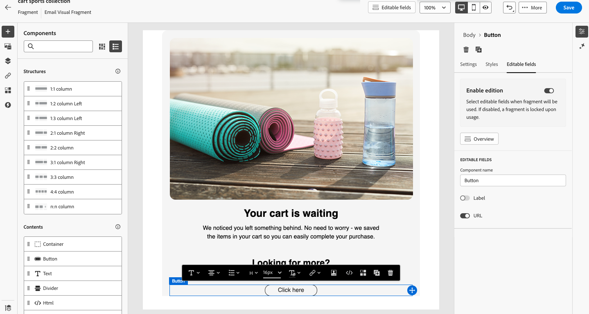
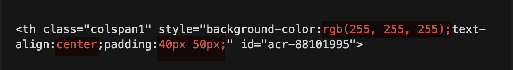

# Customizable fragments {#customizable-fragments}

When fragments are used in an email or email template, they are locked by default due to inheritance, meaning any changes made to a fragment are automatically propagated to all assets where it is used. With customizable fragments, specific fields within a fragment can be defined as editable when the fragment is added to an email or email template. For example, if you have a fragment with a banner, some text, and a button, you can designate certain fields, such as the image or button target URL, as editable.

Customizable fragments let you manage and personalize content without creating entirely new content blocks or disrupting fragment inheritance. Changes made at the fragment level are still propagated, while allowing for customization at the email or email template level.

Both visual and expression fragments can be marked as customizable.

## Add editable fields in visual fragments {#visual}

To make portions of a visual fragment editable, follow these steps:

>[!NOTE]
>
>Editable fields can be added to **image**, **text** and **button** components. For **HTML** components, editable fields are added using the personalization editor, similar to expression fragments. [Learn how to add editable fields in HTML components and expression fragments](#expression)

1. Open the fragment content edition screen.

1. Select the component in your fragment where you want to configure editable fields.

1. The component properties pane opens on the right-hand side. Select the **[!UICONTROL Editable fields]** tab then toggle the **[!UICONTROL Enable edition]** option.

1. All the fields that can be edited for the selected component are listed in the pane. The available fields for editing depend on the selected component type.

    In the example below, the "Click here" button URL is configured as editable.

    {width="800" zoomable="yes"}

1. Click **[!UICONTROL Overview]** to check all the editable fields and their default values.

    In this example, the button URL field displays with the default value defined in the component. Users can customize this value after adding the fragment to their content.

    {width="800" zoomable="yes"}

1. Save your changes when done.

After adding the fragment to an email, users can customize all the editable fields configured in the fragment.

## Add editable fields to HTML components and expression fragments {#expression}

Within an HTML component, the following types of elements can be made editable:

* A portion of **text content** (for example, a headline or a CTA label).
* A complete **URL**, used as a link target or an image source. Partial URLs are not supported; the variable must represent the entire URL value.
* A complete **CSS property value** (for example, a full color value, a full padding value, or a full width value). Partial CSS property values are not supported.

Each parameterized CSS property value must be exactly `{{{varName}}}`: no suffixes, no additional text, no multiple variables, and no concatenation within a single property.

To parameterize multi-side properties such as padding, either:

* declare each side as a separate property _(recommended)_, or
* declare a single variable that contains the full shorthand value.

## How editable fields work in HTML components {#components}

Editable fields in an HTML component are created by declaring inline variables directly inside the source code of the component. Each variable has a unique ID and a default value. The variable is then referenced wherever the editable value should appear in the markup.

Once the fragment is saved and published, every variable declared in the HTML component is automatically surfaced as an editable parameter when the fragment is added to an email.

The email author can then override the default value of any variable from the Email Designer (for example, changing a background color, swapping a CTA URL, or updating a headline) without modifying the underlying HTML.

## Syntax reference {#syntax}

Editable fields are defined and referenced using two patterns:

### Declaring a variable {#declaring}

Use the inline declaration to define a variable with a unique ID and a default value:

```handlebars
{{#inline "variableID"}}default_value{{/inline}}
```

Replace `variableID` with a unique identifier for the editable field. The ID must be unique within the component and must not contain spaces.

Replace `default_value` with the value that should be used if the email author does not override it.

### Referencing a variable {#referencing}

Use triple curly braces to reference the variable wherever its value should appear in the markup:

```handlebars
{{{variableID}}}
```

The same variable ID can be referenced any number of times within the HTML. All references will resolve to whatever value the email author sets (or to the default value if no override is provided).

### Optional parameters {#optional}

The inline declaration supports optional parameters that change how the editable field is presented or processed:

| Action | Parameter | Example |
|---|---|---|
| Declare an editable field with a **default value**. When the fragment is added to an email, this default value is used unless the author overrides it. | Add the default value between the inline tags. | `{{#inline "editableFieldID"}}default_value{{/inline}}` |
| Define a **label** for the editable field. This label is displayed in the Email Designer when the email author edits the fragment's fields. | `name="title"` | `{{#inline "editableFieldID" name="title"}}default_value{{/inline}}` |
| Declare an editable field that contains an **image source**. | `assetType="image"` | `{{#inline "editableFieldID" assetType="image"}}default_value{{/inline}}` |
| Declare an editable field that contains a **URL** that needs to be tracked. | `assetType="url"` | `{{#inline "editableFieldID" assetType="url"}}default_value{{/inline}}` |

## Adding editable fields to an HTML component {#adding-editable-fields}

To make portions of an HTML component within a visual fragment editable, follow these steps:

1. Open the visual fragment for editing in the Email Designer.
1. Add an **HTML component** to the fragment from the Components panel, or select an existing HTML component.
1. With the HTML component selected, click **Show source code** to open the HTML source view in the personalization editor.
1. In the personalization editor, declare each editable variable using the inline declaration syntax. Place all variable declarations at the top of the component for readability, and assign each variable a unique ID.
1. Reference each variable in the HTML markup using the `{{{variableID}}}` syntax wherever the editable value should appear. The same variable can be referenced multiple times in the same component.
1. Save the HTML component, then save the fragment.
1. Publish the fragment to make it available for use in emails.

## Using the fragment in an email {#using-fragment}

After the fragment has been published, all variables declared in its HTML components are surfaced as editable parameters in the Email Designer.

To customize them when using the fragment in an email:

1. Open or create an email in the Marketo Engage Email Designer.
1. Add the published fragment to the email canvas.
1. Select the fragment to open its properties pane. The list of editable fields is displayed under the **Editable fields** section, with each field labeled by its variable ID (or by the friendly label specified through the `name` parameter).
1. Update the value of any editable field directly from the properties pane. The change applies only to the current email; the published fragment and other emails referencing it remain unaffected.
1. Save the email.

The fragment renders with the customized values, while still inheriting any future structural updates made to the published fragment.

### Example: simple fragment with editable text, color, and URL {#example}

The following example creates a small promotional banner with four editable fields:

* a background color
* a headline text
* a CTA label
* a CTA URL

After publishing the fragment, an email author can override any of these values when adding the fragment to an email.

**Simple editable banner**

```html
<!-- Define editable variables -->
{{#inline "bgColor"}}#0057FF{{/inline}}
{{#inline "headlineText"}}Example Headline{{/inline}}
{{#inline "ctaText"}}Learn More{{/inline}}
{{#inline "ctaUrl" assetType="url"}}https://www.example.com{{/inline}}

<!-- Use the variables in the HTML -->
<table width="100%" cellpadding="0" cellspacing="0"
       style="background-color:{{{bgColor}}}; border-radius:8px;" >
  <tr>
    <td style="padding:30px; text-align:center; font-family:Arial,sans-serif;">
      <h2 style="color:#ffffff; font-size:24px; margin:0;">
        {{{headlineText}}}
      </h2>
      <a href="{{{ctaUrl}}}"
         style="display:inline-block; margin-top:16px; padding:12px 28px;
                background:#ffffff; color:{{{bgColor}}};
                font-weight:bold; border-radius:4px; text-decoration:none;">
        {{{ctaText}}}
      </a>
    </td>
  </tr>
</table>
```

In this example:

- `bgColor` is referenced twice: once for the table background color and once for the CTA text color. Both references resolve to the same value, so a single edit propagates to both locations.
- `ctaUrl` is declared with `assetType="url"`, which signals that the value should be processed as a tracked URL.

## Best practices {#best-practices}

* Include units (`px`, `em`, `%`) inside the variable's default value so the variable represents a complete CSS value. This avoids concatenation, which is not supported.
* Prefer per-side longhand CSS properties (`padding-top`, `padding-right`, `padding-bottom`, `padding-left`) over shorthand when each side may need to be edited independently.
* When a URL needs to be tracked, declare it with `assetType="url"`.
* When an editable field carries an image source, declare it with `assetType="image"`.
* Test the fragment by adding it to a draft email and verifying that all editable fields appear in the properties pane and resolve correctly when overridden.

## Things to know {#things-to-know}

* Editable fields in HTML components support full text content, full URLs, and full CSS property values. Partial URLs and partial CSS property values cannot be parameterized.
* A single CSS property value cannot combine a variable with additional static text or with another variable. Each parameterized property value must be exactly one variable reference.
* Variable IDs must be unique within an HTML component and must not contain spaces.
* Out-of-the-box system links such as the unsubscribe link and mirror page URL cannot be turned into editable fields.

<!--
## Add editable fields in HTML components and expression fragments {#expression}

To make portions of an HTML component or an expression fragment editable, you must use a specific syntax in the expression editor. This involves declaring a _variable_ with a default value that users can override after adding the fragment to their content.

For example, suppose you want to create a fragment to add to your emails, and allow users to customize a specific color used in different locations, such as frames or buttons' background colors. When creating your fragment, you need to declare a variable with a _unique ID_ (e.g., "color"), and call it at the desired locations in the fragment content where you want to apply this color. When adding the fragment to their content, users will be able to customize the color used wherever the variable is referenced.

For HTML components, only specific elements can become editable fields. Expand the section below for more information.

+++Editable elements in HTML components:

The elements below can become editable fields in an HTML component:

* A portion of text
* A full URL for link or image (doesn't work with portion of a URL)
* Entire CSS property (doesn't work with partial property)

For example, in the code below, each element highlighted in red can become a property:

{width="500" zoomable="yes"}

+++
-->

>[!MORELIKETHIS]
>
>[Fragments](/help/marketo/product-docs/email-marketing/email-designer/fragments.md){target="_blank"}
