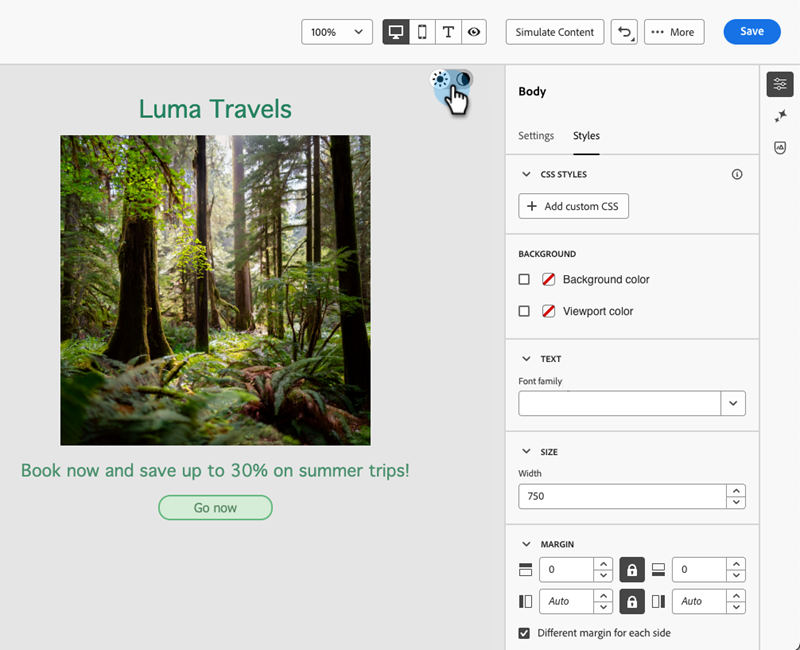
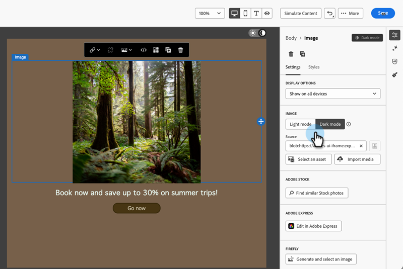
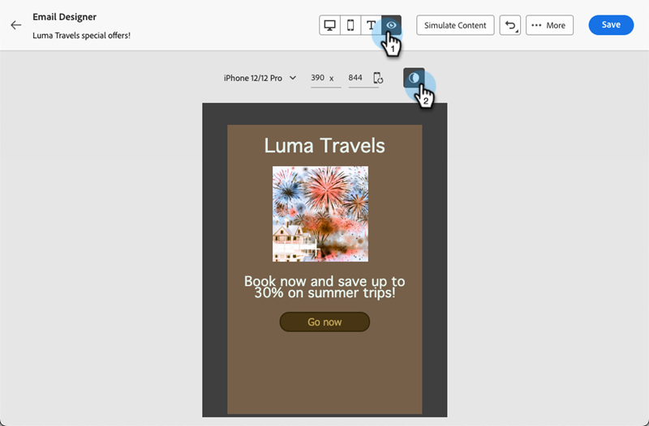

# Dark Mode {#dark-mode}

When designing your emails, the Email Designer allows you to switch to the **[!UICONTROL Dark mode]** view.

In **[!UICONTROL Dark mode]**, you can define specific custom settings to be displayed by supporting email clients when their dark mode is on.

## What is dark mode? {#what-is-dark-mode}

Dark mode allows supporting email clients and apps to display emails with darker backgrounds and lighter colors for text, buttons, and other UI elements. It helps reduce eye strain, save battery life, and improve readability in low-light environments for a more comfortable viewing experience.

## Guardrails {#guardrails}

Dark mode rendering can vary significantly in different email clients.

Before using dark mode, it is important to understand how the main email clients handle it. There are three cases to distinguish:

### Clients not supporting dark mode {#not-supporting}

Some email clients do not support this feature at all, such as:

* Yahoo!Mail
* AOL

Whether you define dark mode custom settings or not, these email clients do not display any dark mode rendering.

### Clients applying their own dark mode {#default-support}

Some email clients systematically apply their own default dark mode for all emails that are received. Colors, backgrounds, images, etc., are automatically adjusted with dark mode settings specific to that email client. No external modification is possible.

Some examples are:

* Gmail (Desktop Webmail, iOS, Android, Mobile Webmail)
* Outlook Windows
* Outlook Windows Mail

In this case, if you define custom dark mode settings in the Email Designer, those settings are overriden by the email client's settings.

So while these email clients do handle dark mode, your specific dark mode design will not be rendered.

### Clients supporting custom dark mode {#custom-dark-mode}

Some email clients offer the option to render custom dark mode with the `@media (prefers-color-scheme: dark)` query, which is the method used by the [!DNL Marketo Engage] Email Designer.

The main clients handling this option are:

* Apple Mail macOS
* Apple Mail iOS
* Outlook macOS
* Outlook.com
* Outlook iOS
* Outlook Android

The settings you define in the Email Designer should be displayed.

>[!NOTE]
>
>Learn how to define [custom dark mode settings](#define-custom-dark-mode) in the Email Designer.

Some restrictions may apply according to each email client. For example, some clients (e.g., Apple Mail 16) will not generate dark mode if images are present.

For optimal results, test your content in the email clients you are targeting. To see a simulation in each client, use the [Email rendering](/help/marketo/product-docs/email-marketing/email-designer/test-email-rendering.md) feature in the Email Designer.

## Dark mode in the Email Designer {#dark-mode-email-designer}

When it comes to dark mode in the Email Designer, there are two aspects to consider:

* You can get a preview of how the default dark mode will render in most supporting email clients. [Learn more](#preview-dark-mode)

* If you want to override the default settings of supporting email clients, you can define custom dark mode settings in the email you are editing. [Learn more](#define-custom-dark-mode)

### Preview default dark mode {#preview-dark-mode}

Learn how to access dark mode in the Email Designer and get a preview of the default dark mode settings.

1. From the Email Designer home page, select the **[!UICONTROL Design from scratch]** option.

1. Add [structures and content](/help/marketo/product-docs/email-marketing/email-designer/email-authoring.md#add-structure-and-content) to your email.

1. On the top right, enable the **[!UICONTROL Dark mode]** toggle.

   

1. The default dark mode preview displays.

   

By default, the Email Designer dark mode preview applies the 'full color invert' color scheme to all elements except images and icons.

That means it detects areas with light and dark elements and inverts them, so that light backgrounds become dark and dark text becomes light, whereas dark backgrounds become light and light text becomes dark.

>[!CAUTION]
>
>The final rendering may vary according to the recipient's email client. To see a simulation for each email client, use the [Email rendering](/help/marketo/product-docs/email-marketing/email-designer/test-email-rendering.md) feature.

### Define custom dark mode {#define-custom-dark-mode}

After switching to **[!UICONTROL Dark mode]**, you can choose to edit specific styling elements of your content that will be displayed only when dark mode is enabled in the recipient's email client (provided it supports that feature).

>[!IMPORTANT]
>
>The dark mode final rendering depends on each email client, so results can vary from one client to another. [Learn more](#guardrails)

To leverage the Email Designer custom dark mode styling, Marketo Engage uses the `@media (prefers-color-scheme: dark)` CSS query, which detects if the user's email client is set to dark mode and applies the dark-themed design that was defined in your email.

To define custom dark mode settings, follow the steps below.

1. Switch to the [Dark mode preview](#preview-dark-mode) in the Email Designer.

1. Edit any styling color attributes such as text, backgrounds, buttons, etc.

1. You can't change the colors of images and icons, but you can define specific assets for dark mode only. To do so, select any image. Switch to **[!UICONTROL Dark mode]** using the dedicated toggle in the **[!UICONTROL Settings]** pane and select a different asset.

   

1. At any time you can **[!UICONTROL Switch to live view]** in order to see how your content might render on various device sizes. From this view, select the Dark mode toggle to preview the dark mode version of your content across different devices.

   

    >[!NOTE]
    >
    >The live view is a generic preview designed to compare how the rendering might look across various device sizes. The final rendering may vary according to the recipient's email client.

1. Once you are satisfied with the changes for dark mode, click **[!UICONTROL Simulate Content]**.

   

1. Select **[!UICONTROL Render email]** and connect to your Litmus account. You can see the final dark mode rendering for various email clients. Learn more about [Email rendering](/help/marketo/product-docs/email-marketing/email-designer/test-email-rendering.md).

    >[!IMPORTANT]
    >
    >While simulation closely approximates how emails will appear in dark mode, actual rendering may differ due to variations in email service providers or device settings.

## Best practices {#best-practices}

As dark mode adoption increases across major email clients, it is essential to consider how your emails render in both light and dark environments, whether you use [custom dark mode](#define-custom-dark-mode) or not.

Dark mode can alter colors, backgrounds, and images&mdash;sometimes overriding design choices. To ensure visual consistency, accessibility, and brand integrity, follow the best practices listed below.

**Optimize your images and logos**

* Save logos and icons as PNGs with transparent backgrounds to avoid visible white boxes in dark mode.

* Avoid images with hardcoded white or light backgrounds.

* If transparency is not an option, place images on a solid background in your design to prevent awkward color inversions.

**Watch your backgrounds**

* Ensure sufficient contrast between text and background colors for readability in both light and dark modes.

* Avoid relying on background colors alone for critical content. Some clients override background colors in dark mode, so ensure key information is still visible.

**Design accessible content in dark mode**

* Use color combinations easy to distinguish for people with color blindness.

* Use a midtone palette to ensure contrast against both light and dark backgrounds.

* Use accessible color combinations with high contrast to improve readability and meet Web Content Accessibility Guidelines (WCAG) standards. Use tools like WebAIM's Contrast Checker to verify color contrast.

* Avoid thin fonts as it can impact readability. If your brand requires a thin font, bold it in dark mode.

* Skip pure white on pure black as it can cause eye strain and might be automatically inverted by some email clients.

* Provide accessible fallback styling if dark mode is not supported.

**Test your emails in dark mode environment**

* Use the Email Designer's [dark mode preview](#preview-dark-mode) which uses inverted color schemes to spot issues early.

* Use the [Email rendering](/help/marketo/product-docs/email-marketing/email-designer/test-email-rendering.md) feature that leverages Litmus to simulate your designs across major email clients and see how colors and images behave in dark mode.
