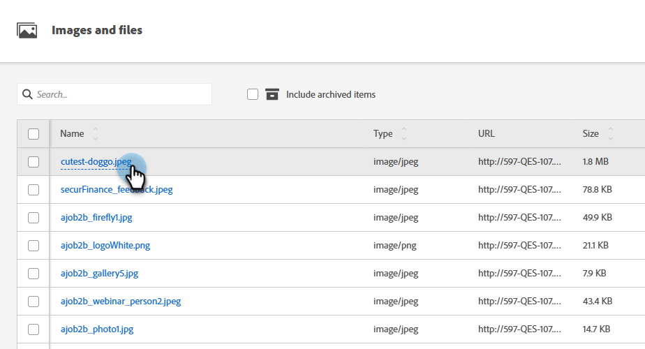
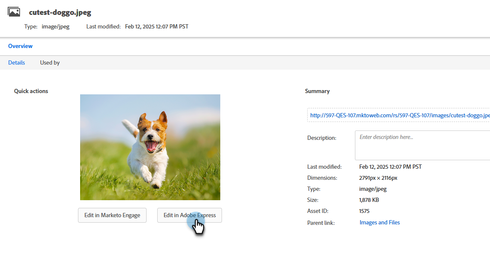
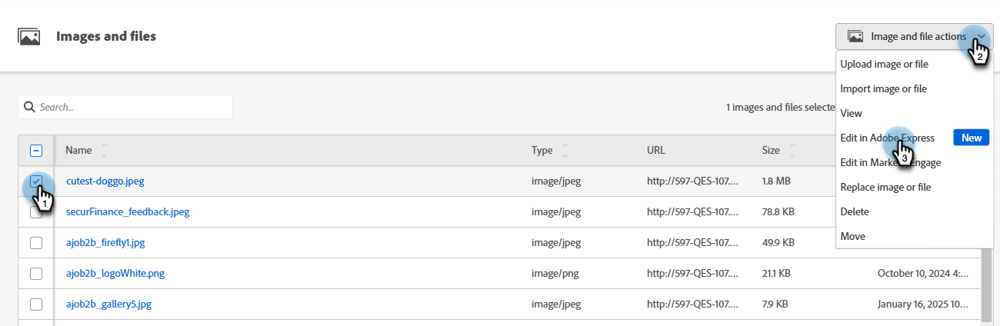
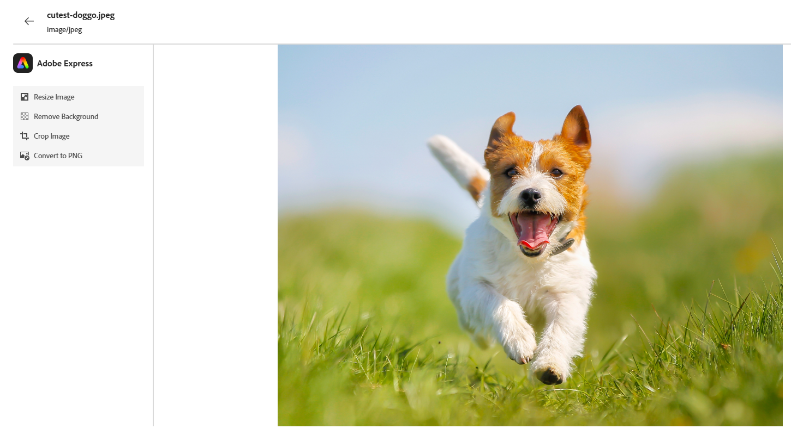
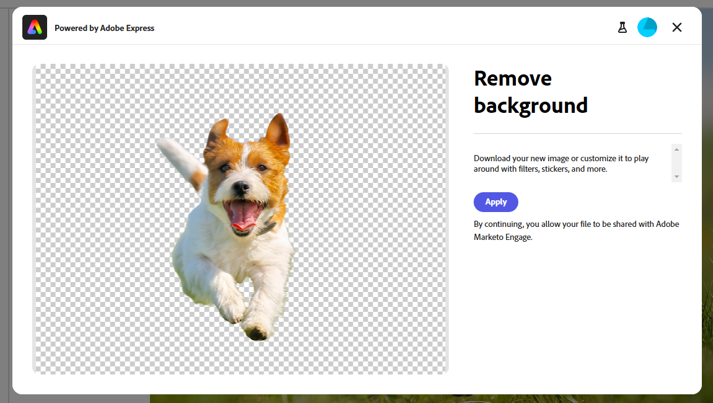
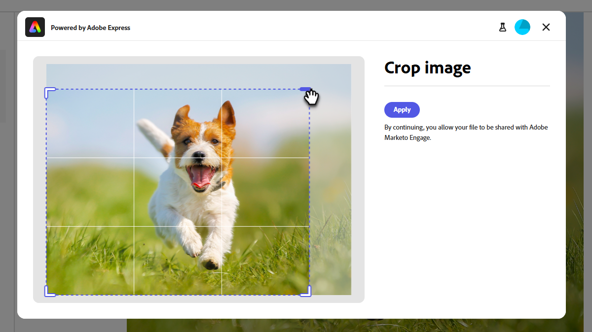
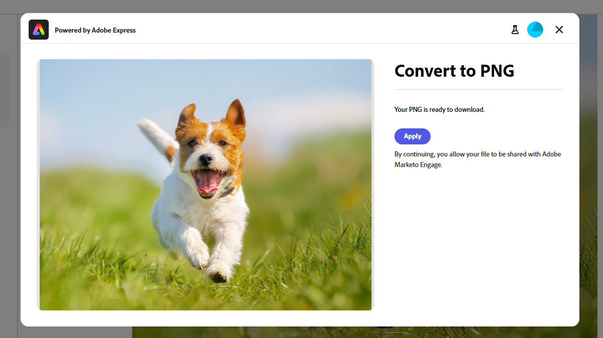
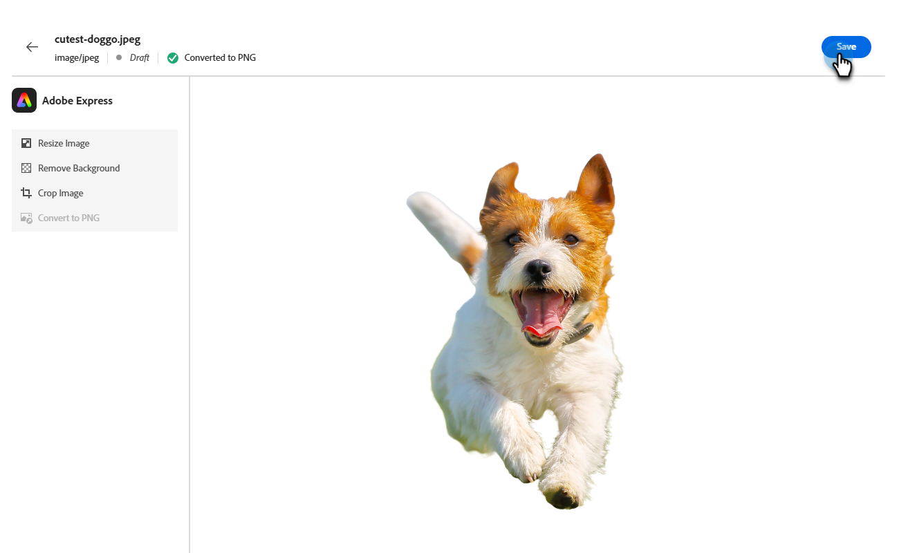

# Edit images with Adobe Express {#edit-images-with-adobe-express}

Adobe Marketo Engage integrates natively with Adobe Express, giving you access to a variety of image editing tools. You can use these tools to modify your images in the Marketo Engage Design Studio. The integration provides the following key benefits:

* Increased content reuse by editing and saving new images in Marketo Engage.

* Reduced time and effort in updating images or creating new versions of existing images.

>[!NOTE]
>
>Adobe Express only supports PNG and JPEG image file formats at this time.

## Access the Adobe Express editor {#access-the-adobe-express-editor}

There are two ways to access the Adobe Express editor:

* Click on the image name
* _Image and files actions_ drop-down menu

>[!BEGINTABS]

>[!TAB Click on the image name]

1. In Marketo Engage, go to the **[!UICONTROL Design Studio]** and select **[!UICONTROL Images and Files]**.

   {width="600" zoomable="yes"}

1. Select the image you want to edit.

   {width="600" zoomable="yes"}

   >[!NOTE]
   >
   >* To view the assets by workspace and folder, open the structure by clicking the **[!UICONTROL Show Folders]** icon at the top left.
   >
   >* To sort the table by any of the columns, click the column title. The arrow in the title row indicates the current sort column and order.

1. In the image _Details_ tab, click **[!UICONTROL Edit in Adobe Express]**.

   {width="600" zoomable="yes"}

   >[!CAUTION]
   >
   >If the image is already referenced in an email or email template, any edits made will update that image everywhere it is currently being used.

>[!TAB Image and file actions]

1. In Marketo Engage, go to the **[!UICONTROL Design Studio]** and select **[!UICONTROL Images and Files]**.

   {width="600" zoomable="yes"}

   >[!NOTE]
   >
   >* To view the assets by workspace and folder, open the structure by clicking the **[!UICONTROL Show Folders]** icon at the top left.
   >
   >* To sort the table by any of the columns, click the column title. The arrow in the title row indicates the current sort column and order.

1. Select the checkbox next to the image you want to edit. In the **[!UICONTROL Image and file actions]** drop-down, select **[!UICONTROL Edit in Adobe Express]**.

   {width="600" zoomable="yes"}

   >[!CAUTION]
   >
   >If the image is already referenced in an email or email template, any edits made will update that image everywhere it is currently being used.

>[!ENDTABS]

## Adobe Express Enterprise license {#adobe-express-enterprise-license}

### Users with an Enterprise license {#users-with-an-enterprise-license}

If you have an Enterprise license for Adobe Express, you have access to the full Express editor. You can adjust image settings like color, brightness, sharpness, contrast, size, and more. The AI Magic option allows you to remove backgrounds, insert and remove objects, and erase parts of an image. Visit the [Adobe Express User Guide](https://helpx.adobe.com/express/user-guide.html){target="_blank"} to learn about each setting.

>[!IMPORTANT]
>
>The license purchased must be under the same IMS Org as your Marketo Engage subscription to access all Adobe Express editing capabilities. Also, each individual user must have a license in Adobe Express. Users [without a license](#users-without-an-enterprise-license) can only access the quick actions in Adobe Express.

### Users without an Enterprise license {#users-without-an-enterprise-license}

For those without an Enterprise license, you still have access to several quick action editing features. Those features are:

* [Resize image](#resize-image)
* [Remove background](#remove-background)
* [Crop image](#crop-image)
* [Convert to PNG/JPEG](#convert-to-png-jpeg)

The features are accessible on the left side of the image page.

{width="800" zoomable="yes"}

#### Resize image {#resize-image}

1. Click **Resize Image**.

1. Make your desired changes and click **Apply** when done.

{width="800" zoomable="yes"}

<table><tbody>
  <tr>
    <td style="width:25%"><b>Aspect ratio</b></td>
    <td>In the <b>Aspect ratio</b> drop-down, choose <b>Standard</b> to choose from pre-calculated common photo sizes, or <b>Custom</b> to set your own width/height. You can also choose a specific social media platform's standard size (Pinterest, Snapchat, etc.).</td>
  </tr>
  <tr>
    <td style="width:25%"><b>Width and Height</b></td>
    <td>By default, the aspect ratio is locked, keeping the image proportions the same when you adjust its size. If desired, you can select the lock button to unlock the aspect ratio.</td>
  </tr>
  <tr>
    <td style="width:25%"><b>Reset</b></td>
    <td>Click <b>Reset</b> to remove any edits done to the image and return it to its original state.</td>
  </tr>
  <tr>
    <td style="width:25%"><b>Zoom and Crop</b></td>
    <td>Click <b>Zoom and Crop</b> to zoom in on specific areas of the image. Clicking <b>Apply</b> after zooming crops the image to what is currently displayed.</td>
  </tr>
</tbody>
</table>

#### Remove background {#remove-background}

1. Click **Remove Background**.

1. Adobe Express displays the image with no background. If it meets your needs, click **Apply**.

{width="800" zoomable="yes"}

>[!TIP]
>
>If you're not satisfied with the result, simply click the **X** to close the window.

#### Crop image {#crop-image}

1. Click **[!UICONTROL Crop Image]**.

1. Drag the corners of the image to create your desired crop.

{width="800" zoomable="yes"}

1. Click **[!UICONTROL Apply]** when done.

#### Convert to PNG/JPEG {#convert-to-png-jpeg}

Convert a PNG file to a JPEG file, or a JPEG file to a PNG file.

1. Click **[!UICONTROL Convert to PNG/JPEG]**.

{width="800" zoomable="yes"}

1. Click **[!UICONTROL Apply]**.

## Save your work {#save-your-work}

When you're done with all your edits, click **Save** to save your work.

{width="800" zoomable="yes"}

The edited image is saved in the same folder as the original image.
