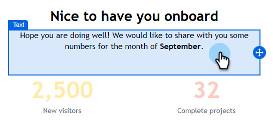
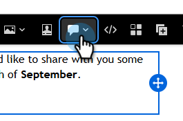
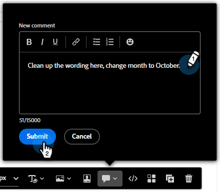
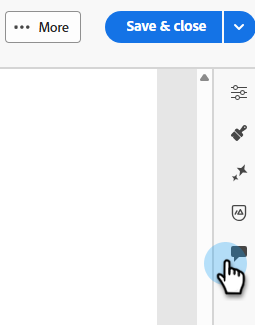
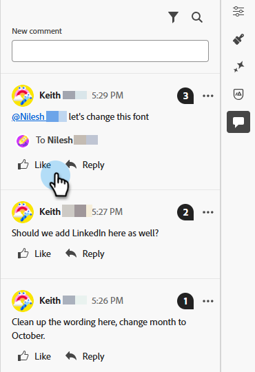
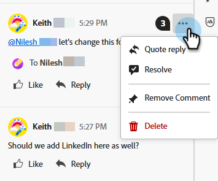

# Email collaboration {#email-collaboration}

Email collaboration and commenting allows marketing teams to seamlessly review, discuss, and finalize email assets within the Adobe Marketo Engage Email Designer. Instead of sharing drafts over external tools (like chat, email threads, spreadsheets, etc.), you can comment, suggest edits, and resolve feedback in real-time. This streamlines the workflow, reduces errors, and ensures stakeholders are aligned before an email campaign is sent.

## Permissions {#permissions}

Users who have edit permissions for an email asset will be able to comment, tag, and view comments. Users with read-only permissions to email assets will **not** be able to add or view comments.

## Add comments {#add-comments}

1. When creating or editing an email in the Email Designer, click on a structure, column, or content (text, image, button, etc.) over any editable section.

   

1. Click the comment icon.

   

1. Enter feedback, questions, or suggestions.

   

>[!NOTE]
>
>Tag teammates using @mentions (e.g., "@John, please update the Winter Newsletter").

## View all comments {#view-all-comments}

1. Click the _Collaboration_ icon on the right side.

   

1. Quickly reply to or like a comment.

   

1. Click the **...** icon for more actions.

   

## Resolve comments {#resolve-comments}

Each comment thread includes:

* Reply: Continue the discussion
* Resolve: Mark the comment as resolved
* Unresolve: If further edits are needed
* Remove: Removes the comment from its design element
* Delete: Permanently deletes the comment

>[!NOTE]
>
>Resolved threads are hidden by default, but can be revisited by selecting the desired thread in the filter.

## Notifications {#notifications}

Team members who are tagged receive notifications via email and/or pulse notifications.

Notifications are triggered for:

* New comments
* Mentions (@username)
* Resolutions

## Best practices {#best-practices}

* Use @mentions to ensure feedback reaches the right team member quickly.

* Group related feedback into a single comment thread instead of multiple scattered notes.

* Always resolve comments once addressed to maintain a clean workflow.

* Save a final approved version for compliance/audit purposes.
