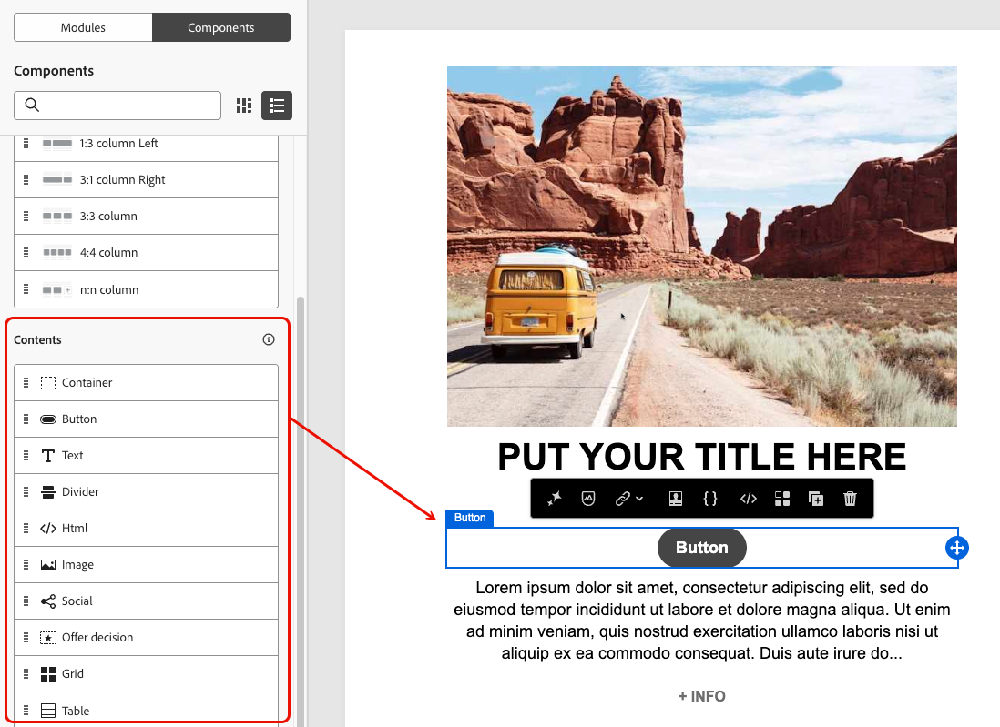

# Use modules in the Email Designer {#email-modules}

The Email Designer includes a library of modules: ready-to-use, fully structured content blocks designed to accelerate email assembly and promote design consistency across your communications.

Unlike [content components](/help/marketo/product-docs/email-marketing/email-designer/email-authoring.md#add-structure-and-content), which are empty placeholders that you configure from scratch, modules are pre-built sections (such as a branded header, a product card grid, or a footer with opt-out links) that you drop directly onto your canvas and customize from there.

>[!NOTE]
>
>Modules are not fragments. They exist within the email you are designing. However, after you have customized a module to your needs, you can save it as a [visual fragment](/help/marketo/product-docs/email-marketing/email-designer/fragments.md#visual-fragments) to reuse it across other emails and messages.

## Access and insert modules {#access-modules}

To display and leverage the available modules in the Email Designer, follow the steps below.

1. Open the desired email.

1. In the left pane, click the **[!UICONTROL Modules]** tab.

   

1. Browse the available module categories, or use the search bar to filter by name.

1. Click the **>** arrow next to a category to expand it and view available layout variants.

1. Locate the module variant you want to use, then drag and drop it directly onto your email canvas.

   

1. The module is inserted with its default content. Click any element on the canvas to start editing content inline. Click any text area to type directly, or click an image to replace it using your asset library.

    >[!NOTE]
    >
    >When email themes are applied to your content, modules automatically inherit the applied theme styles, ensuring brand consistency across your design.

1. Use the **[!UICONTROL Settings]** and **[!UICONTROL Styles]** tabs in the right pane to adjust properties and styling, just as you would for any other email element.

   {width="70%"}

1. You can also add [content components](/help/marketo/product-docs/email-marketing/email-designer/email-authoring.md#add-structure-and-content) directly to the module. Switch to the **[!UICONTROL Components]** tab in the left pane, then drag and drop a component into the module. The component inherits the module's styling by default, but you can override it as needed.

   {width="60%"}

## Available modules {#available-modules}

The following module categories are available out of the box. Multiple layout variants exist for each module, for example, single-column, two-column, and three-column grids. Expand the module categories to select the variant that fits your layout.

| Module | Description |
|---|---|
| **[!UICONTROL Headers]** | Branded email header with your logo, navigation links, and introductory text. |
| **[!UICONTROL Hero]** | Full-width banner section: ideal for promotions, announcements, or campaign openers. |
| **[!UICONTROL Testimonial]** | Customer quotes or social proof in a consistent, styled format. |
| **[!UICONTROL Cards]** | Products, articles, or content items in single- or multi-column grid layouts. |
| **[!UICONTROL Teams]** | Team members, authors, or speakers with a photo, name, and role. |
| **[!UICONTROL Footers]** | Complete email footer with navigation links, social media icons, legal copy, and required opt-out and mirror-page links. |
