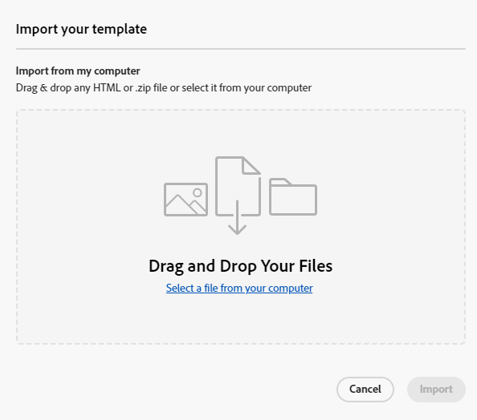
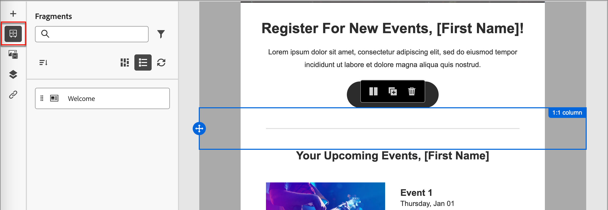
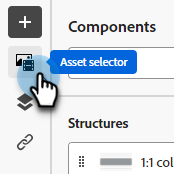

# Email template authoring {#email-template-authoring}

For an accelerated and improved design process, you can create standalone email templates to easily reuse custom content.

>[!PREREQUISITES]
>
>In order to access the new email designer, your Marketo Engage subscription must be migrated to the [Adobe Identity Management System (IMS)](https://experienceleague.adobe.com/en/docs/marketo/using/product-docs/administration/marketo-with-adobe-identity/adobe-identity-management-overview). If yours hasn't been yet and you'd like to request it be expedited, please contact the Adobe Account Team (your account manager), or [Marketo Support](https://nation.marketo.com/t5/support/ct-p/Support).

>[!NOTE]
>
>Email templates in the new email designer can only be used to create emails in the new email designer. They cannot be referenced in the old email editor.

## Create an email template {#create-an-email-template}

1. Log in to Marketo Engage via the [Adobe Experience Cloud](https://experiencecloud.adobe.com/){target="_blank"}.

1. In My Marketo, select **Design Studio**.

   

1. In the tree, select **Email Templates (New Editor)**.

   

1. Click the **Create template** button.

   

1. Enter a template name and an optional description. Click **Create**.

   

## Design your template {#design-your-template}

In the _Design your template_ page, you can choose from a few options. [Design from scratch](#design-from-scratch), [import your own HTML](#import-html), or [select an existing template](#choose-a-template) (one of our samples or one you already saved).

   

### Design from scratch {#design-from-scratch}

Define your content by adding and moving structural elements with simple drag-and-drop actions.

1. In the _Design your template_ page, select **Design from scratch**.

1. Add [structure and content](#add-structure-and-content).

### Import your HTML {#import-your-html}

You can import existing HTML content to design your email templates. The content can be:

* An HTML file with an incorporated style sheet

* A .zip file that includes an HTML file, the style sheet (.css) and images

>[!NOTE]
>
>There are no constraints on the .zip file structure. However, references must be relative and fit with the tree structure of the .zip folder.

1. In the _Design your template_ page, select **Import HTML**.

1. Drag and drop the desired HTML or .zip file (or select a file from your computer) and click **Import**.

   

   >[!NOTE]
   >
   >When the HTML content is uploaded, your content will be in Compatibility mode. In this mode, you can only personalize your text, add links, or add assets to your content.

1. To be able to leverage the Email Designer content components, click the **HTML converter** tab and click **Convert**.

   >[!CAUTION]
   >
   >Using a `<table>` tag as the first layer in an HTML file can cause style loss, including background and width settings in the top layer tag.

You can now personalize your imported file as needed with the visual email editor. 

### Choose a template {#choose-a-template}

There are two types of templates to choose from.

* **Sample templates**: Marketo Engage offers four out-of-the-box email templates.

* **Saved templates**: These are templates you created from scratch using the Templates menu, or an email you created and chose to save as a template.

>[!BEGINTABS]

>[!TAB Sample templates]

Choose one of the out-of-the-box templates for a head start on your email template design.

1. The Sample templates tab is open by default.

1. Select the template you want to use.

   

1. Click **Use this template**.

   

1. Edit the content as desired using the visual content designer.

>[!TAB Saved templates]

1. Click the **Saved templates** tab and select the desired template.

   

1. Click **Use this template**.

   

1. Edit the content as desired using the visual content designer.

>[!ENDTABS]

## Add structure and content {#add-structure-and-content}

1. To start creating or modifying content, drag and drop an item from Structures onto the canvas. Edit its settings in the pane on the right.

   >[!TIP]
   >
   >Select the n:n column component to define the number of columns of your choice (between three and 10). You can also define the width of each column by moving the arrows below the column.

   

   >[!NOTE]
   >
   >Each column size cannot be less than 10% of the total width of the structure component. Only empty columns can be removed.

1. From the Contents section, drag over desired items and drop them into one or more structure components.

   

1. Each component can be customized via the Settings or Style tabs. Change the font, text style, margin, and more.

### Add fragments {#add-fragments}

1. To access your fragments, select the _Fragments_ icon (  ) in the left navigation.

   {width="700" zoomable="yes"}

1. Drag and drop any of the fragments into the structural component placeholder.

The editor renders the fragment within the section/element of the email structure. The content of the fragment is dynamically updated within the structure to show how the content appears in the email.

>[!TIP]
>
>If you want the fragment to occupy the entire horizontal layout within the email, add a 1:1 column structure and then drag and drop the fragment into it.

After the email is saved, it appears in the _[!UICONTROL Used By]_ tab of the fragment details page. Fragments added to an email template are not editable within the template; the source fragment defines the content.

### Add assets {#add-assets}

Add images that are stored in the [Images and Files](/help/marketo/product-docs/demand-generation/images-and-files/add-images-and-files-to-marketo.md){target="_blank"} section of your Marketo Engage instance.

>[!NOTE]
>
>You can only add images in the new designer, no other file types at this time.

1. To access your images, click the Asset selector icon.

   

1. Drag and drop the desired image into a structure component.

   

   >[!NOTE]
   >
   >To replace an existing image, select it, then click **Select an asset** in the Settings tab on the right.

### Layers, settings, and styles {#layers-settings-styles}

Open the navigation tree to access specific structures and their columns/components for more granular editing. To access, click the Navigation tree icon.

   

The example below outlines steps to adjust padding and vertical alignment inside a structure component composed of columns.

1. Select the column in the structure component directly in the canvas or using the _Navigation tree_ displayed at the left.

1. From the column toolbar, click the _[!UICONTROL Select a column]_ tool and choose the one that you want to edit.

   You can also select it from the structure tree. The editable parameters for that column are displayed in the _[!UICONTROL Settings]_ and _[!UICONTROL Styles]_ tabs on the right.

   

1. To edit the column properties, click the _[!UICONTROL Styles]_ tab on the right and change them according to your needs:

   * For **[!UICONTROL Background]**, change the background color as needed.

      Clear the check box for a transparent background. Enable the **[!UICONTROL Background image]** setting to use an image as the background instead of a solid color.

   * For **[!UICONTROL Alignment]**, select the _Top_, _Middle_, or _Bottom_ icon.
   * For **[!UICONTROL Padding]**, define the padding for all sides.

      Select **[!UICONTROL Different padding for each side]** if you want to adjust the padding. Click the _Lock_ icon to break synchronization.

   * Expand the **[!UICONTROL Advanced]** section to define inline styles for the column.

   

1. Repeat these steps as needed to adjust the alignment and padding for the other columns in the component.

1. Save your changes.

### Personalize content {#personalize-content}

Tokens work in the new editor the same way they work in the old, but the icon looks different. The example below outlines adding a first name token with fallback text.

1. Select the text component. Place the cursor where you want the token to appear and click the **Add personalization** icon.

   

1. Click the desired [token type](/help/marketo/product-docs/demand-generation/landing-pages/personalizing-landing-pages/tokens-overview.md){target="_blank"}.

   

1. Find the desired token and click the **...** icon (clicking the + icon instead adds a token with no fallback text).

   

   >[!NOTE]
   >
   >"Fallback text" is the new editor term for default value. Example: ``{{lead.First Name:default=Friend}}``. It is recommended in case there is no value for the person in the field you choose.

1. Set your fallback text and click **Add**.

   

1. Click **Save**.

### Edit URL tracking {#edit-url-tracking}

Sometimes you don't want to enable the Marketo Tracking URL on a link in an email. This is useful when the destination page does not support URL parameters and may result in a broken link.

1. Click the Links icon to display all URLs in your email.

   

1. Click the pencil icon to edit tracking for any desired links.

1. Click the **Tracking Type** drop-down and make your selection.

   

   <table><tbody>
     <tr>
       <td><b>Track without mkt_tok</b></td>
       <td>Activates tracking on the URL without use of the mkt_tok query string parameter in the destination URL</td>
     </tr>
     <tr>
       <td><b>Track with mkt_tok</b></td>
       <td>Activates tracking on the URL with use of the mkt_tok query string parameter in the destination URL</td>
     </tr>
     <tr>
       <td><b>Do not track</b></td>
       <td>Disables tracking of the URL</td>
     </tr>
   </tbody>
   </table>

1. Optionally, you can give the URL a label or add Tags.

1. Click **Save** when done.

### View options {#view-options}

Leverage the view and content validation options that are available in the visual email editor.

* Zoom in/out on the content using preset zoom options.

* View the content across Desktop, Mobile, or Text-only/Plain-text.

  * Click the live view (eye) icon for content preview across devices.

  * Select one of the out-of-the-box devices or enter custom dimensions to preview your content.

### More options {#more-options}

From the **More** options in the content editor, you can take the following actions:

   

* **Reset template**: Select this to clear the visual email designer canvas to a blank slate and restart building content.

* **Change your design**: Return to the _Design your template_ page. From here, you can take any course of action as outlined in the [Design your template](#design-your-template) section.

* **Export HTML**: Download the content in the visual canvas to your local system in HTML format packaged as a zip file.

## View template details {#view-template-details}

In the _Email templates_ listing page, click the name of an email template to view its details.

   , click Alerts to view the information.

>[!NOTE]
>
>While these alerts do not prohibit use of the email template for email creation, the information provides visibility about what might not work and the updates required before the email can be used for delivery.

## View email template used-by references {#email-template-used-by-references}

In the email template summary, click the **Used By** tab to view details of where this email template has been used within Marketo Engage.

   

## Edit email templates {#edit-email-templates}

This action can be taken from:

* The details tab - Click **Edit email template**.

This action takes you to the _Design your template_ page or the visual content editor page based on the last saved status of the email template. From here, you can edit your email template content as needed. See Create email templates for information about the editing options.

## Duplicate email templates {#duplicate-email-templates}

There are two ways to duplicate an email template:

* From the email template details on the right, click **More** and select **Duplicate**.

   

* In the _Email templates_ listing page, click the More actions icon (three dots) of the desired email template and choose **Duplicate**.

In the dialog, enter a unique name and optional description. Click **Duplicate** when done.

The duplicated email template then appears in the _Email templates_ listing page.

## Delete email templates {#delete-email-templates}

There are two ways to delete an email template.

>[!CAUTION]
>
>Deleting an email template cannot be undone. 

* From the email template details on the right, click **More** and select **Delete**.

   

* In the _Email templates_ listing page, click the More actions icon (three dots) of the desired email template and choose **Delete**.

## Bulk actions {#bulk-actions}

From the _Email templates_ listing page, select multiple templates by selecting the checkboxes to the left. A banner appears at the bottom.

**Delete**: You can delete a maximum of 20 templates at one time. A confirmation dialog allows you to abort the action or confirm the deletion.

>[!MORELIKETHIS]
>
>[Email authoring](/help/marketo/product-docs/email-marketing/email-designer/email-authoring.md){target="_blank"}: Learn how to create, design, and reference an email in the new designer.
