# Fragments

A fragment is a reusable component that can be referenced in one or more emails and email templates. It is usually a block of content (text, image, or both) that can be quickly inserted into your project. With this functionality, you can prebuild multiple custom content blocks to assemble email content for an improved design process. Common use cases include header/footer content blocks for email, event invite banners, seasonal messages, and more.

To make the best use of fragments in your workflows:

* _Create fragments_ - Create visual fragments, either from scratch or by saving content as a fragment from the visual content editor.
* _Reuse fragments_ - Use them as many times as needed in your content.

## Visual fragments {#visual-fragments}

Visual fragments are predefined visual blocks built (using the visual content editor) that you can reuse across multiple emails or email templates.

## Access and manage fragments {#access-and-manage-fragments}

To access visual fragments, go to the **Design Studio** in Marketo Engage. In the tree on the left, click **[!UICONTROL Fragments (New)]**.

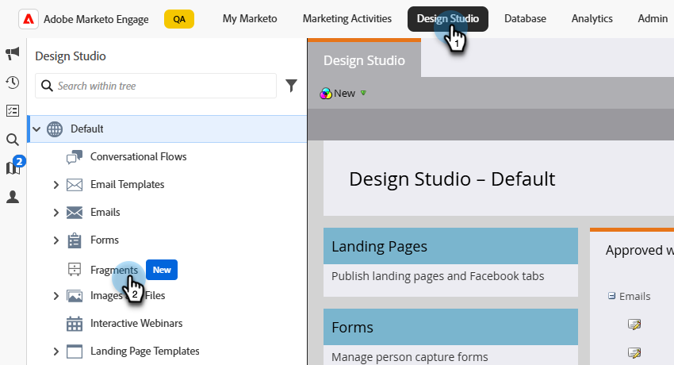{width="600" zoomable="yes"}

By default, the table is sorted by the _[!UICONTROL Modified]_ column. Click other column titles to change what the table gets sorted by. Click the same title again to switch between ascending and descending.

### Find and filter

Use the search bar to find a fragment by name. Click the _Filter_ icon (  ) to show the available filter options and choose the desired settings.

{width="700" zoomable="yes"}

### Customize the columns {#customize-the-column-display}

Customize the columns you want to display in the table by clicking the _Customize table_ icon (  ) at the top right.

Select the columns you want and click **[!UICONTROL Apply]**.

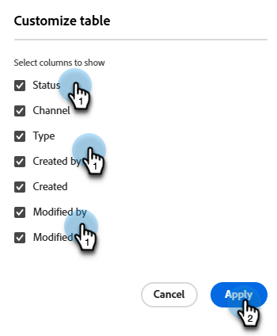{width="400" zoomable="yes"}

### Fragment status {#fragment-status}

The fragment status determines its availability for use in an email or email template and the changes you can make to it. 

<table>
<tbody>
  <tr>
    <td><b>Draft</b></td>
    <td>When you create a fragment, it is in draft status. It remains a draft until you publish it for use in an email or email template.
    
Available actions:
    <li>Edit all details</li>
    <li>Edit in visual designer</li>
    <li>Publish</li>
    <li>Duplicate</li>
    <li>Delete</li>
  </td>
  <tr>
    <td><b>Published</b></td>
    <td>When you publish a fragment, it becomes available for use in an email or email template. Published fragment content cannot be modified in the visual designer.
    
Available actions:
    <li>Edit description</li>
    <li>Add to an email or template</li>
    <li>Create draft version</li>
    <li>Duplicate</li>
    <li>Delete (if not in-use)</li>
    </td>
  </tr>
  <tr>
    <td><b>Published with draft</b></td>
    <td>When you create a draft from a published fragment, the published version remains available for use in an email or email template, and the draft content can be modified in the visual designer. If you publish the draft version, it replaces the current published version and the content is updated in <i>all</i> the emails and email templates where it is in use. 
    
Available actions:
    <li>Edit description</li>
    <li>Add to an email or template</li>
    <li>Edit draft version in visual designer</li>
    <li>Publish draft version</li>
    <li>Duplicate</li>
    <li>Delete (if not in-use)</li>
    </td>
  </tr>
</tbody></table>

## Create fragments {#create-fragments}

1. To create a new visual fragment, click **[!UICONTROL Create fragment]** at the top right of the fragments list page.

   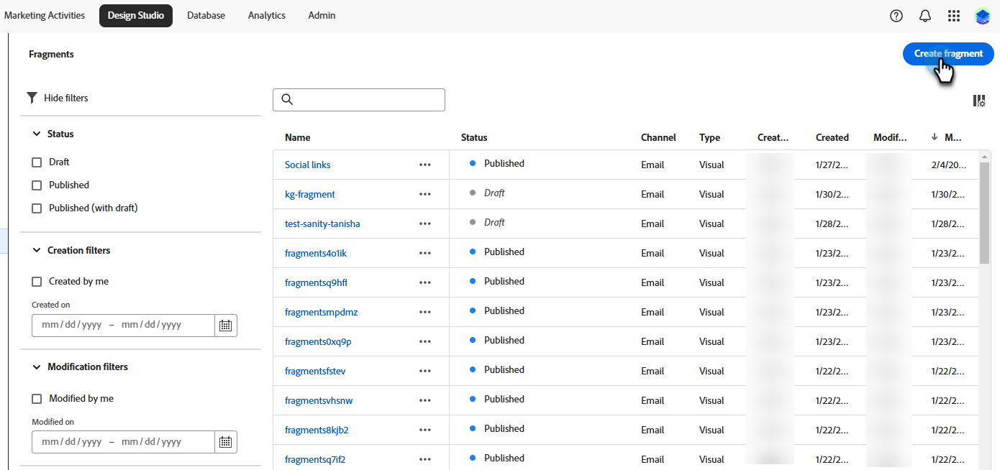{width="700" zoomable="yes"}

1. Give your fragment a **[!UICONTROL Name]** and an optional **[!UICONTROL Description]**.

   _Fragment requirements_

   * Name: 100 characters max, must be unique, not case sensitive
   * Description: 300 characters max
   * Characters: alpha, numeric, and special characters are okay
   * Reserved characters are **_not allowed_**: `\ / : * ? " < > |`

   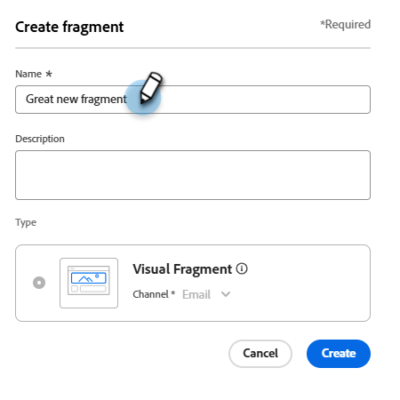{width="400" zoomable="yes"}

1. Click **[!UICONTROL Create]**.

   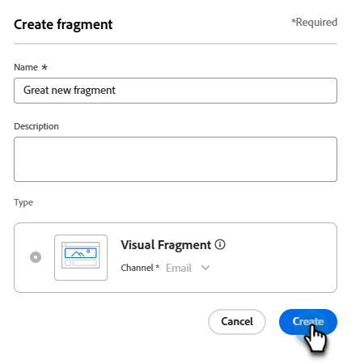{width="400" zoomable="yes"}

   >[!NOTE]
   >
   >A fragment's **Type** cannot be modified at this time.

   The visual designer opens with an empty canvas.

1. Use the content design tools to create the visual fragment content:

   * [Add structure and content](#add-structure-and-content)
   * [Add Assets](#add-assets)
   * [Navigate the layers, settings, and styles](#navigate-the-layers-settings-and-styles)
   * [Personalize content](#personalize-content)
   * [Edit linked URL tracking](#edit-linked-url-tracking)

1. Click **[!UICONTROL Save]** at any time to save the draft fragment.

1. When you are ready to make the fragment available for use in an email or email template, click **[!UICONTROL Publish]**.

### Add structure and content {#add-structure-and-content}

{{$include /help/marketo/_includes/content-design-components.md}}

### Add assets

{{$include /help/_includes/content-design-assets.md}}

### Navigate the layers, settings, and styles

{{$include /help/_includes/content-design-navigation.md}}

### Personalize content

{{$include /help/_includes/content-design-personalization.md}}

### Edit linked URL tracking

{{$include /help/_includes/content-design-links.md}}

## View fragment details {#view-fragment-details}

Click the name of any fragment in the list page to open the fragment details page. You can choose to edit the fragment, rename it, or update its description. Make updates and click outside of the name or description field to save your changes.

>[!NOTE]
>
>If a published fragment is in use by an email or email template, you cannot change its name or edit the content. You can create a draft version if you want to make changes to the fragment.

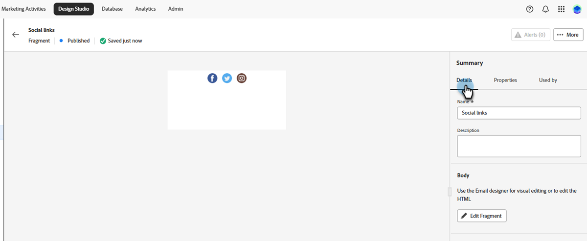{width="600" zoomable="yes"}

Click **[!UICONTROL Edit fragment]** to open the fragment in the visual content editor.

Exit the view at any time by clicking the _Back_ arrow at the top left, which returns you to the _Fragments_ list page.

## View fragment used-by references {#view-fragment-used-by-references}

In the fragment details page, click the **[!UICONTROL Used By]** tab to view details of where the fragment is being used within Marketo Engage.

>[!IMPORTANT]
>
>A fragment that is currently in use by an email or email template cannot be deleted.

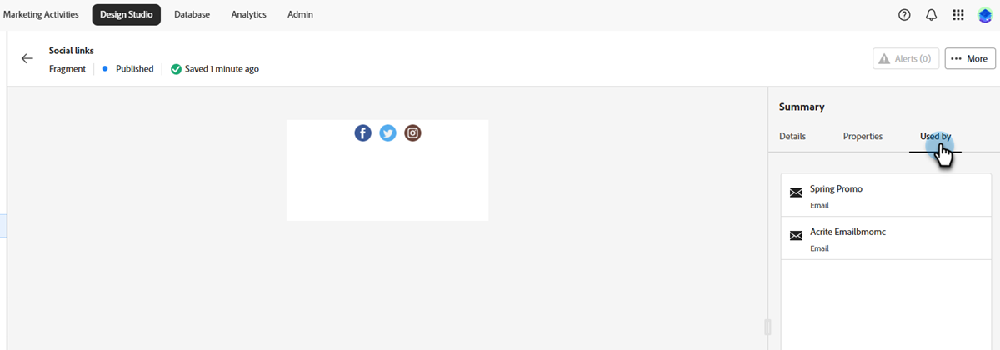{width="600" zoomable="yes"}

Click the link to open the corresponding email or email template where the fragment is used.

## Delete fragments {#delete-fragments}

Because a fragment that is currently in use by an email or email template cannot be deleted, be sure to check the _used-by_ references before initiating a fragment removal. Also, a removal cannot be undone, so check before initiating a delete action.

You can delete a fragment using either of the following methods:

* From the fragment details on the right, click **[!UICONTROL Delete]**.
* From the _[!UICONTROL Fragments]_ listing page, click the ellipsis next to the fragment and choose **[!UICONTROL Delete]**.

This action opens a confirmation dialog. You can abort the process by clicking **[!UICONTROL Cancel]**, or click **[!UICONTROL Delete]** to confirm deletion.

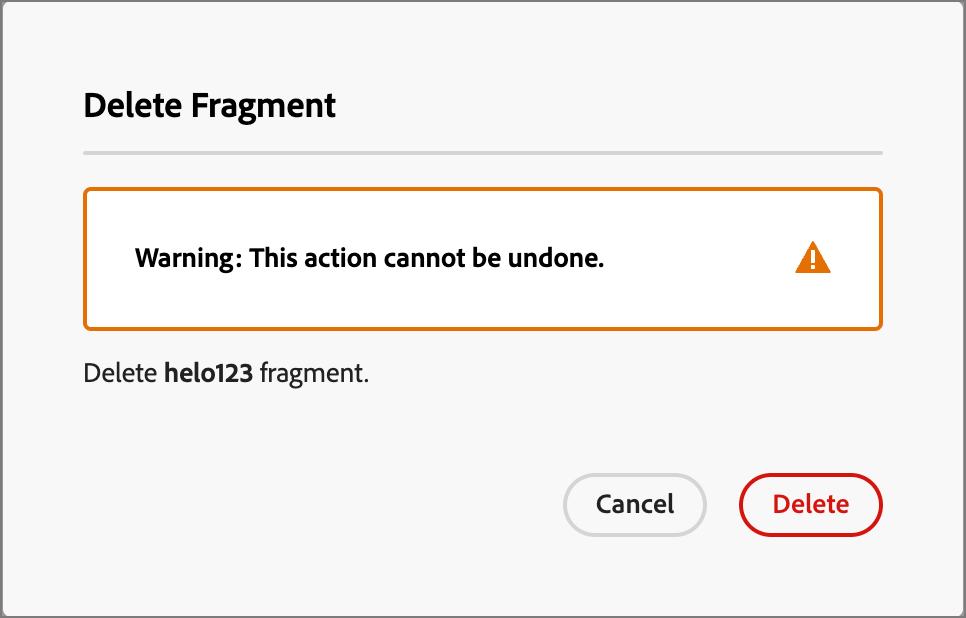{width="400"}

## Edit fragments {#edit-fragments}

Edits to a fragment depend on its current status:

* When a fragment is in _Draft_ status, you can edit any of its details and the visual content.
* When a fragment is in _Published_ status, you can edit the fragment description, but not the name. You cannot edit the visual content.
* When a fragment is in _Published with draft_ status, editing the details is limited to the description. You can also edit the visual content for the draft version.

>[!BEGINTABS]

>[!TAB Draft]

1. From the _[!UICONTROL Fragments]_ listing page, click the fragment name to open it.

   A preview of the visual content is displayed, with the fragment details on the right.

1. Make the desired edits.

   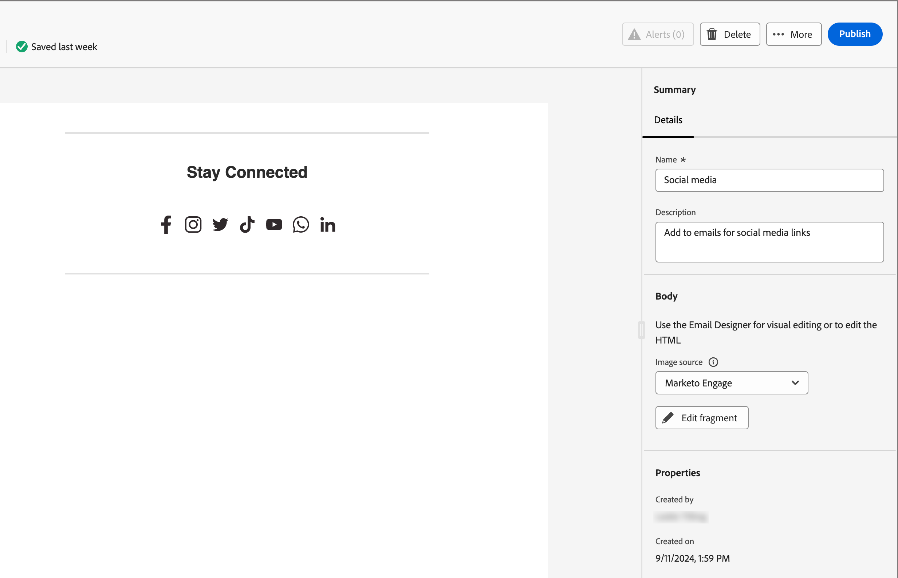{width="600" zoomable="yes"}

1. To make changes to the content in the visual designer, click **[!UICONTROL Edit fragment]**.

   Use the visual designer tools as needed:

   * [Add structure and content](#add-structure-and-content)
   * [Add Assets](#add-assets)
   * [Navigate the layers, settings, and styles](#navigate-the-layers-settings-and-styles)
   * [Personalize content](#personalize-content)
   * [Edit linked URL tracking](#edit-linked-url-tracking)

   Click **[!UICONTROL Save]**, or **[!UICONTROL Save & close]** to return to the fragment details.

1. When the fragment meets your criteria and you want to make it available for use in an email or email template, click **[!UICONTROL Publish]**.

>[!TAB Published]

1. From the _[!UICONTROL Fragments]_ listing page, click the fragment name to open it.

   A preview of the visual content is displayed, with the fragment details on the right.

1. Modify the description, if needed.

   For a published fragment, all other details cannot be changed.

1. If you want to update the content, click **[!UICONTROL Create draft version]** at the top right.

   Click **[!UICONTROL OK]** in the dialog to open the draft version in the visual designer. You can change the `image source` KG - LINK HERE if needed. 

   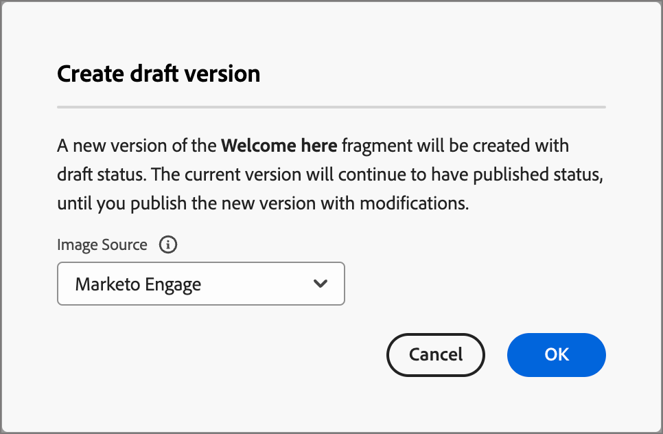{width="300"}

   Use the visual designer tools as needed:

   * [Add structure and content](#add-structure-and-content)
   * [Add Assets](#add-assets)
   * [Navigate the layers, settings, and styles](#navigate-the-layers-settings-and-styles)
   * [Personalize content](#personalize-content)
   * [Edit linked URL tracking](#edit-linked-url-tracking)

   Click **[!UICONTROL Save]**, or **[!UICONTROL Save & close]** to return to the fragment details.

1. When the draft fragment meets your criteria and you want to make the changes available for use in an email or email template, click **[!UICONTROL Publish]**.

   When you publish the draft version, it replaces the current published version and the content is updated in the emails and email templates where it is already in use.

>[!TAB Published with draft]

There are two ways to open the draft version for editing from the _[!UICONTROL Fragments]_ listing page:

* Click the _More_ icon (**...**) next to the fragment name and choose **[!UICONTROL Open draft version]**.

   {width="300"}

* Click the fragment name to open it. Then, click **[!UICONTROL Open draft version]** at the top right.

   A preview of the visual content for the draft version is displayed, with the fragment details on the right.

To update the content:

1. Click **[!UICONTROL Edit fragment]** at the top right. Use the visual designer tools as needed:

   * [Add structure and content](#add-structure-and-content)
   * [Add Assets](#add-assets)
   * [Navigate the layers, settings, and styles](#navigate-the-layers-settings-and-styles)
   * [Personalize content](#personalize-content)
   * [Edit linked URL tracking](#edit-linked-url-tracking)

   Click **[!UICONTROL Save]**, or **[!UICONTROL Save & close]** to return to the fragment details.

1. When the draft fragment meets your criteria and you want to make the changes available for use in an email or email template, click **[!UICONTROL Publish]**.

   When you publish the draft version, it replaces the current published version and the content is updated in the emails and email templates where it is already in use.

>[!ENDTABS]

## Duplicate fragments {#duplicate-fragments}

You can duplicate a fragment using either of the following methods:

* From the _[!UICONTROL Fragments]_ listing page, click the _More_ icon (**...**) next to the fragment name and choose **[!UICONTROL Duplicate]**.
* At the top right of the fragment details page, click **[!UICONTROL ... More]** and choose **[!UICONTROL Duplicate]**.

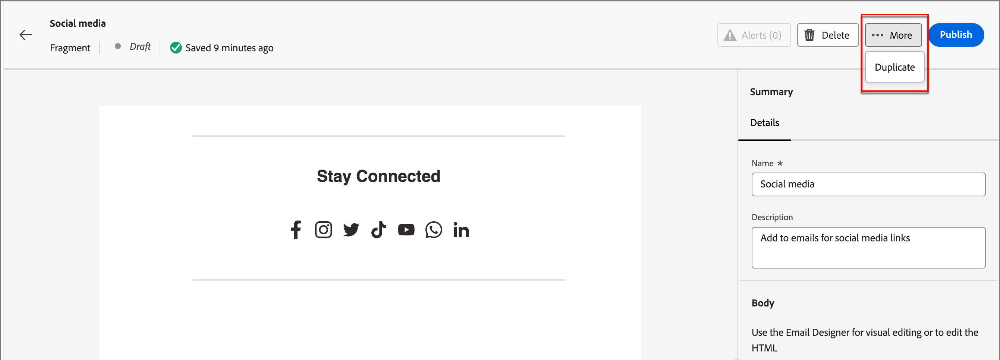{width="600" zoomable="yes"}

In the dialog, enter a unique name and optional description. Click **[!UICONTROL Duplicate]** to complete the action.

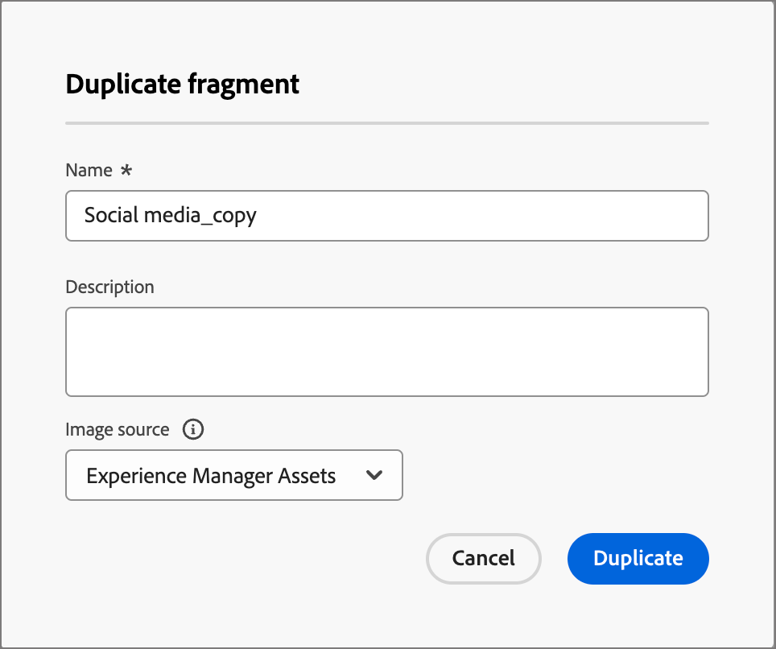{width="400"}

The duplicated fragment then appears in the _Fragments_ listing.

## Save a new fragment from email or template content {#save-a-new-fragment-from-email-or-template-content}

When you are creating/editing an email or email template in the visual content editor, you can save all or part of the content as a fragment so that it is available for reuse.

1. To save content as a fragment, click **[!UICONTROL More]** and choose **[!UICONTROL Save as Fragment]**.

1. Select the different elements to be included in the fragment.

   Select multiple structures by holding the Shift or Control button.

   You can only select structures that are adjacent to each other and the interface does not allow you to select non-adjacent elements.

1. With the content selected, click **[!UICONTROL Create]** at the top right.

1. In the dialog, enter a name and optional description for the fragment and click **[!UICONTROL Create]**.

   The fragment is then displayed in the _Fragments_ listing page and is also available for use within emails and email templates.

## Add visual fragments to your email or template content {#add-visual-fragments-to-your-email-or-template-content}

Fragments are designed for reuse. You can add up to 30 in an email or email template, and they can be nested up to one level only.

* [Add a fragment to an email](/help/marketo/product-docs/email-marketing/email-designer/email-authoring.md#add-fragments)

* [Add a fragment to an email template](/help/marketo/product-docs/email-marketing/email-designer/email-template-authoring.md#add-fragments)

The content of the fragment is dynamically updated within the structure to render a visual of how the content appears in the email.

>[!TIP]
>
>If you want the fragment to occupy the entire horizontal layout within the email, add a [!UICONTROL 1:1 column] structure and then drag and drop the fragment into it.

After the email/email template is saved, it appears in the fragment details page when the _[!UICONTROL Used By]_ tab is selected. Added fragments are not editable within the email or template&mdash;the published source fragment defines the content.

## Fragment actions during email and template authoring {#fragment-actions-during-email-and-template-authoring}

When a fragment is added to an email or email template, its content cannot be edited within the email or template. However, you can apply the following actions:

* **[!UICONTROL Delete]** - This removes the fragment from the current email or email template content (the fragment source is unaffected).
* **[!UICONTROL Refresh]** - This refreshes the content of the fragment in the current email or email template. Refreshing is useful when you want to reflect any recent edits to the fragment after the addition to the email or email template.
* **[!UICONTROL Duplicate]** - This duplicates the fragment in the same email or email template within the editor. The duplicated fragment is added just below the original.
* **[!UICONTROL Open Fragment]** - This opens a new browser tab with the fragment editor page and details.
* **[!UICONTROL Break inheritance]** - This breaks the inheritance of the fragment (and its changes) from the source. Use this action to make the fragment content available as independent and editable content within the email or email template. This action also removes the email or email template from the _Used By_ reference for the original fragment.

When you select the fragment on the editor page, these actions are available from the context toolbar and the properties panel on the right.

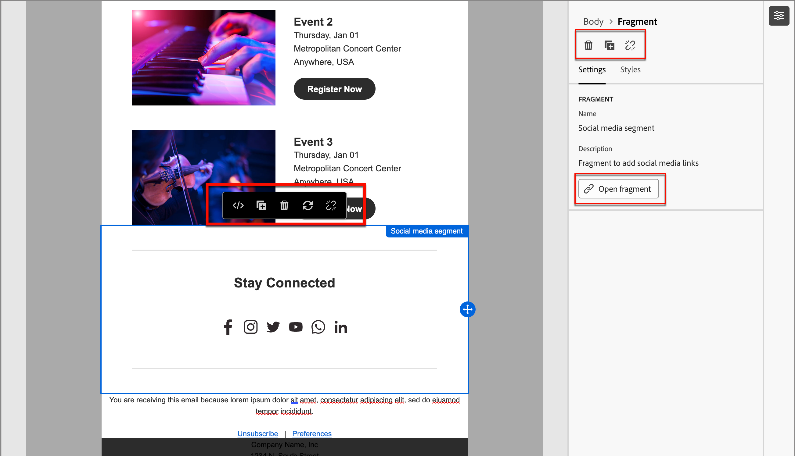{width="600" zoomable="yes"}
