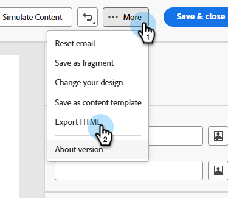
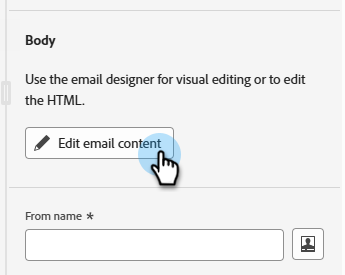
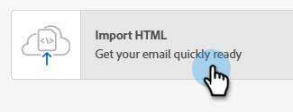
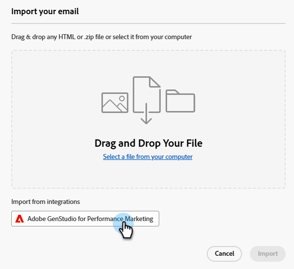
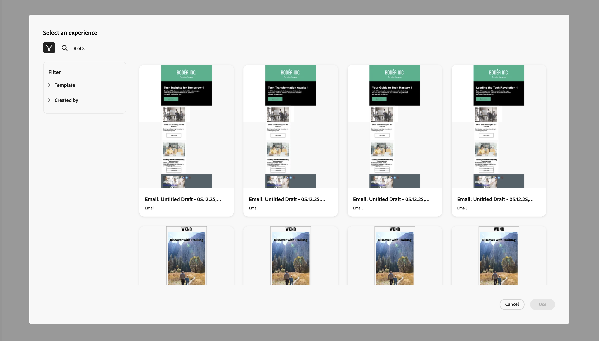
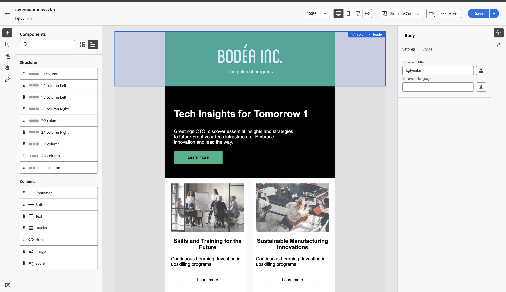

# GenStudio Integration for Marketo Engage {#genstudio-integration-for-marketo-engage}

Adobe GenStudio for Performance Marketing is a generative AI-first application that lets you create your own ads and emails to drive impactful, personalized marketing campaigns that meet your brand standards and comply with your enterprise policies. It offers a host of tools that simplify the complexities of content creation.

>[!INFO]
>
>Learn more about [GenStudio for Performance Marketing](https://experienceleague.adobe.com/en/docs/genstudio-for-performance-marketing/user-guide/home){target="_blank"}.

## Leverage the GenStudio Capabilities in Marketo Engage {#leverage-genstudio-capabilities}

With this integration, a technical marketer who uses Marketo Engage to develop and automate email campaigns can collaborate with a performance marketer who creates content using GenStudio. This allows them to easily integrate on-brand content from GenStudio into Marketo Engage.

## Export an HTML template from Marketo Engage to GenStudio {#export-an-html-template}

Easily export a template including your brand's guidelines to GenStudio for Performance Marketing.

1. In Marketo Engage, access the content of your email.

1. In the Email Designer, click the **More** button and select **Export HTML**.

   

1. [Upload the HTML](https://experienceleague.adobe.com/en/docs/genstudio-for-performance-marketing/user-guide/content/templates/use-templates#templates-from-ajo-and-marketo){target="_blank"} exported template into GenStudio for Performance Marketing.

1. In GenStudio, use this template to [create several email variations](https://experienceleague.adobe.com/en/docs/genstudio-for-performance-marketing/user-guide/create/create-email-experience){target="_blank"} with AI prompts and save them.

## Leverage GenStudio Experiences in Marketo Engage {#leverage-genstudio-experiences}

To leverage the GenStudio email variations you created by importing them into Marketo Engage, follow the steps below.

1. In Marketo Engage, [create an email](/help/marketo/product-docs/email-marketing/email-designer/email-authoring.md#create-an-email).

1. In the Email detail page, click **Edit email content**.

   

1. Select **Import HTML**.

   

1. Click the **Adobe GenStudio for Performance Marketing** button.

   

1. Browse the GenStudio experiences to start building your content. You can filter the experiences on such criteria as products, personas, brands, or even colors.

1. Select an experience and click **Use**.

   {width="800" zoomable="yes"}

1. The selected content displays in the Email Designer.

   {width="800" zoomable="yes"}

>[!NOTE]
>
>GenStudio experiences created from a Marketo Engage template are imported directly into the Email Designer. GenStudio experiences created without a Marketo Engage template are imported in compatibility mode.

Use the [email content editing tools](/help/marketo/product-docs/email-marketing/email-designer/email-authoring.md#add-structure-and-content){target="_blank"} and [personalization fields](/help/marketo/product-docs/email-marketing/email-designer/email-authoring.md#personalize-content){target="_blank"} to edit your email as desired.
