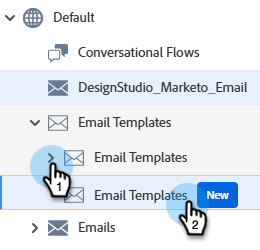
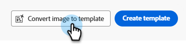
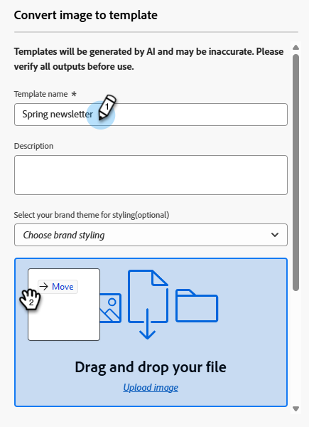
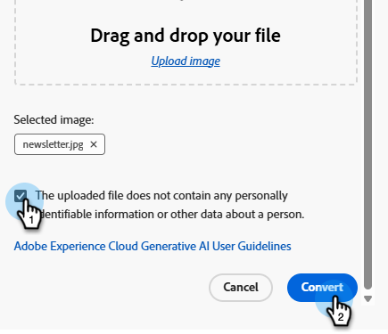
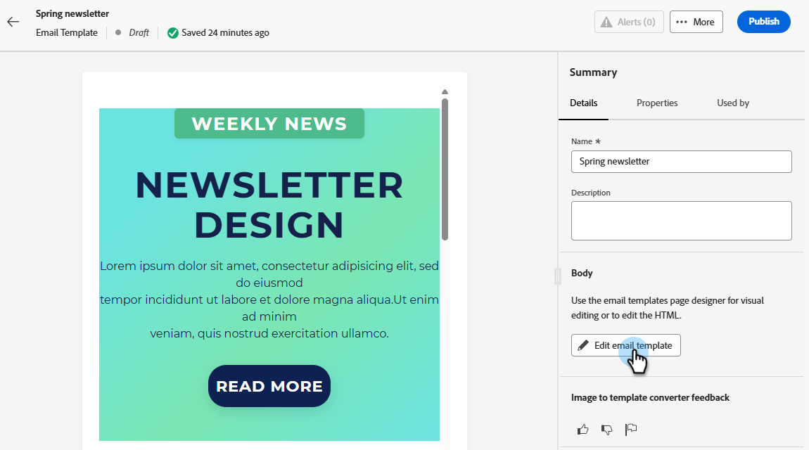

# Convert images to HTML templates {#image-to-html}

## Overview {#overview}

The image to HTML converter significantly speeds up email creation by converting static images into fully customizable, modular HTML email content templates. This no-code tool allows you to transform visual designs from graphic designers or design tools into responsive, editable email templates that can be reused time and again.

Leveraging generative AI technology, the image to HTML converter analyzes the layout, typography, colors, and visual elements in your image and generates clean, modular HTML code that maintains design fidelity while ensuring full editability and compatibility with the Email Designer.

>[!PREREQUISITES]
>
>* You must first agree to the [Core Gen-AI terms and the supplemental terms](https://www.adobe.com/legal/terms/enterprise-licensing/genai-ww.html){target="_blank"} for using the Gen-AI functionality in the Email Designer. Contact the Adobe Account Team (your account manager) for details.
>* You must have _Access Email Template_ as well as _Edit/Generate Email Template_ permissions enabled [in your Marketo role](https://experienceleague.adobe.com/en/docs/marketo/using/product-docs/administration/users-and-roles/managing-user-roles-and-permissions#edit-a-role).

## Convert an image {#convert-an-image}

To convert an image into a fully customizable HTML email template, follow the steps below.

>[!NOTE]
>
>For best results, use high-quality images with clear visual elements and readable text. Images should ideally be between 600-800 pixels wide to match standard email dimensions.

1. In the _Design Studio_, click **Email Templates**, then **Email Templates (New)**.

   

1. Click **[!UICONTROL Convert image to template]**.

   

1. Enter a _Template name_ and optional description. Also optionally, you can choose your brand styling. Upload or drag and drop the desired image.

   

1. Scroll down and select the _The upload file does not contain..._ checkbox. Click **Convert**.

   

    >[!NOTE]
    >
    >The generation process can take up to five minutes depending on the complexity and size of your image design. The AI processing happens in the background, so you can navigate away from this screen and work on other tasks while the conversion is in progress. You may need to refresh the _Email template_ library screen to see the status change.

1. After the conversion is complete, your template is automatically saved as a draft. Select it..

   

1. The converted template opens in the Email Designer with full editing capabilities. You can now:

    * Edit text content and apply personalization
    * Modify images and add links
    * Adjust colors, fonts, and styling
    * Add, remove, or rearrange content components
    * Leverage all Email Designer features as with any other template

   {width="800" zoomable="yes"}

1. You can make any desired adjustments to refine the template and match your brand guidelines.

1. Once satisfied with your template, click **[!UICONTROL Save & close]**, then **Publish**.

Your template is now available in the _Email Templates_ library and can be used when creating emails.

## Common use cases {#use-cases}

The image to HTML converter is ideal for:

* **Platform migration**: Migrating from another email marketing platform? Convert your existing email designs into Marketo Engage-ready HTML templates without rebuilding from scratch
* **Design mockup conversion**: Transform design mockups from tools like Photoshop, Figma, or other design software into functional email templates
* **Quick template creation**: Generate email templates rapidly for time-sensitive campaigns without waiting for developer resources
* **Building template libraries**: Create a comprehensive library of brand-consistent templates that non-technical team members can customize and deploy

## Best practices {#best-practices}

**Before you start**

* **Save existing content**: Converting an image to HTML will replace all existing content in your email. Always save your current work before using this feature.
* **Plan your workflow**: Use the image to HTML converter at the beginning of your email creation process, or ensure you're ready to replace all current content.

**Image preparation**

* **Resolution**: Use high-resolution images for better text recognition and element detection.
* **Clarity**: Ensure text is clearly readable and visual elements are well-defined.
* **Width**: Design images at standard email widths (600-800px) to match typical email client requirements.
* **File format**: Use JPEG or PNG format - avoid compressed or low-quality images.
* **Complete design**: Include the full email design in a single image, from header to footer.

**Design considerations**

* **Simple layouts**: Simple, well-structured layouts convert more accurately than highly complex designs.
* **Standard elements**: Use common email design patterns (header, body sections, CTAs, footer).
* **Text legibility**: Ensure sufficient contrast between text and backgrounds.
* **Web-safe fonts**: Designs using common web-safe fonts will have better fidelity.
* **Avoid overlapping elements**: Keep design elements clearly separated for better structure recognition.

**After conversion**

* **Review your draft**: Once conversion is complete, your template is automatically saved as a draft. Take time to carefully review the generated HTML for accuracy.
* **Test thoroughly**: Test the email across different email clients and devices. For faster results, take advantage of the [Litmus integration](/help/marketo/product-docs/email-marketing/email-designer/test-email-rendering.md).
* **Refine manually**: Make adjustments as needed using the Email Designer's full editing capabilities.
* **Brand alignment**: Verify colors, fonts, and styling match your brand guidelines.
* **Personalization**: Add dynamic content and personalization tokens as desired.
* **Accessibility**: Review and enhance accessibility features if needed.

## Limitations and considerations {#limitations}

Be aware of the following limitations when using the Image to HTML converter.

* **AI interpretation**: The AI generates HTML based on a visual interpretation of your image. Complex or unusual designs may require manual adjustments after conversion.

* **Text accuracy**: While the AI attempts to recognize and reproduce text accurately, always verify text content and make corrections as needed.

* **Dynamic content**: The conversion process creates static HTML based on your image. You'll need to add personalization, dynamic content, and tracking manually after conversion.

* **Complex layouts**: Highly complex designs with intricate layering, unusual shapes, or non-standard elements may not convert perfectly. Simpler designs generally yield better results.

* **Processing time**: The conversion process can take up to five minutes depending on the complexity and size of your image. The AI processing happens in the background, allowing you to work on other tasks without keeping the screen open. The template is automatically saved as a draft after the conversion is complete.

>[!NOTE]
>
>The image to HTML converter is designed to provide a strong starting point for email creation. The generated HTML should be reviewed and refined using the Email Designer to ensure it meets your requirements.

## Frequently asked questions {#faq}

+++What happens to my existing email content when I use the image to HTML converter?

All existing content in your email will be deleted and replaced with the newly generated template when you upload an image for conversion. Make sure to save any important content before using this feature. It's best to use the image to HTML converter at the beginning of your email creation process.

+++

+++What file formats are supported?

The image to HTML converter supports JPEG (.jpg, .jpeg) and PNG (.png) image formats.

+++

+++How long does the conversion process take?

The conversion can take up to five minutes, depending on the complexity and size of your image design. The AI processing happens in the background, so you can navigate away and work on other tasks; you don't need to keep the screen open. After the conversion is complete, your file will automatically be saved as a draft for you to review and edit.

+++

+++Can I edit the generated template?

Yes! The generated HTML template opens in the Email Designer with full editing capabilities. You can modify all aspects of the template, including text, images, styling, layout, and structure.

+++

+++What happens if the conversion doesn't match my design exactly?

The AI does its best to accurately interpret your design, but some manual refinement may be needed. Use the Email Designer to adjust any elements that need fine-tuning.

+++

+++Can I use this feature for landing pages or other content types?

The image to HTML converter is currently designed specifically for email templates. For other content types, use the standard design and import options available in the Email Designer.

+++

+++Can I reuse converted templates across multiple email campaigns?

Yes! Templates created with the image to HTML converter are automatically saved to your _Email Templates_ library. You can access and reuse them in any email going forward.

+++
