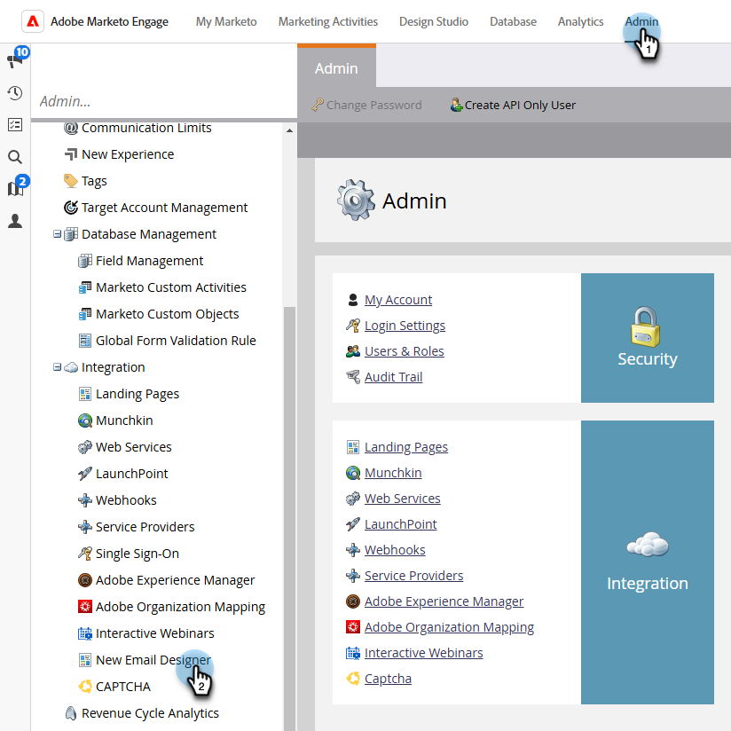
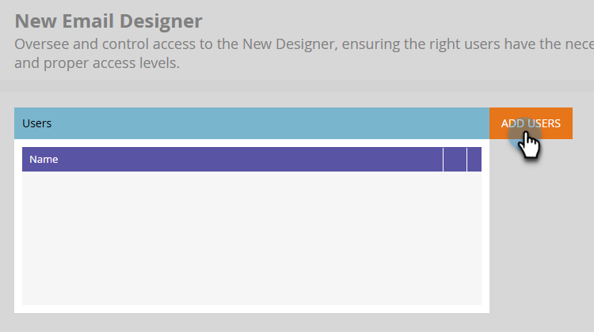
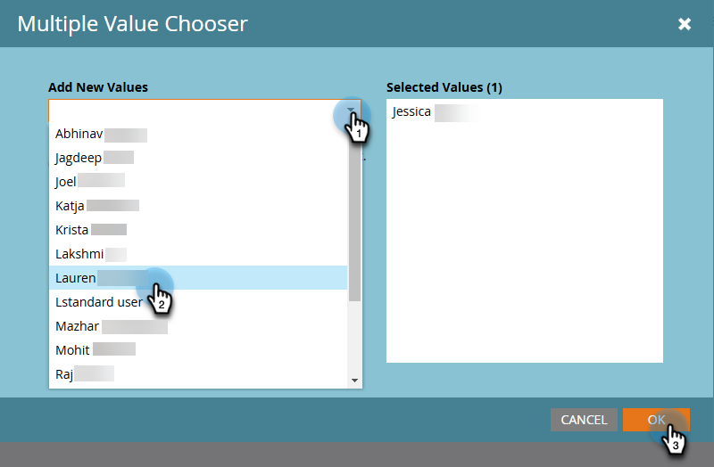

# Email Designer Overview {#overview}

Welcome to the new Adobe Marketo Engage Email Designer.

The email designer is the latest innovation in Marketo Engage intended to provide a revamped email and email template creation experience to improve productivity and efficiency by providing a visual drag-and-drop editor along with standard out-of-the-box templates. Easily create customized email templates without having to spend money on vendors.

>[!NOTE]
>
>While the Email Designer can be accessed in all major browsers, full functionality in Firefox is not supported at this time.

## How to access {#how-to-access}

+++Learn how to access the email designer

In order to access the new email designer, your Marketo Engage subscription must be migrated to the [Adobe Identity Management System (IMS)](https://experienceleague.adobe.com/en/docs/marketo/using/product-docs/administration/marketo-with-adobe-identity/adobe-identity-management-overview). If yours hasn't been yet and you'd like to request it be expedited, please contact the Adobe Account Team (your account manager), or [Marketo Support](https://nation.marketo.com/t5/support/ct-p/Support).

### Add users {#add-users}

1. In Marketo Engage, go to the **[!UICONTROL Admin]** area and select **[!UICONTROL New Email Designer]**.

   {width="600" zoomable="yes"}

1. Click **[!UICONTROL Add Users]**.

   {width="600" zoomable="yes"}

1. In the **[!UICONTROL Add New Values]** drop-down, select the desired users. Click **[!UICONTROL OK]** when done.

   {width="600" zoomable="yes"}

+++

## Available articles {#available-articles}

* [Email authoring](/help/marketo/product-docs/email-marketing/email-designer/email-authoring.md){target="_blank"}: Learn how to create, design, and reference an email in the new editor.

* [Email template authoring](/help/marketo/product-docs/email-marketing/email-designer/email-template-authoring.md){target="_blank"}: Learn how to create, design, and access an email template in the new editor.

* [Fragments](/help/marketo/product-docs/email-marketing/email-designer/fragments.md){target="_blank"}: Learn how to create and use visual content fragments as reusable components for emails and email templates.

* [Customizable fragments](/help/marketo/product-docs/email-marketing/email-designer/customizable-fragments.md){target="_blank"}: Learn how to customize fragments by making some of their fields editable.

* [Work with AEM assets](/help/marketo/product-docs/email-marketing/email-designer/aem-assets.md){target="_blank"}: Learn how to easily access your AEM digital assets for use in Marketo Engage.

* [Edit Images with Adobe Express](/help/marketo/product-docs/email-marketing/email-designer/edit-images-adobe-express.md){target="_blank"}: Learn how to edit images in the Adobe Marketo Engage Email Editor using Adobe Express.

* [Use the AI Assistant](/help/marketo/product-docs/email-marketing/email-designer/ai-assistant.md){target="_blank"}: Leverage Adobe's generative AI technology to add helpful text and/or images to your emails.

* [Lock content in email templates](/help/marketo/product-docs/email-marketing/email-designer/content-locking.md){target="_blank"}: Learn how to lock content in email templates, helping to prevent unintentional edits or deletions.

* [Test Email Rendering with Litmus](/help/marketo/product-docs/email-marketing/email-designer/test-email-rendering.md){target="_blank"}: Leverage your Litmus account in Marketo Engage to instantly see how your email renders in popular email clients.

* [Feature comparison](/help/marketo/product-docs/email-marketing/email-designer/feature-comparison.md){target="_blank"}: Compare the availability of features in the previous email editor (Email Editor 2.0) and the new Email Designer.

## FAQ {#faq}

**Will the old email editor continue to function? If so, for how long?**

Yes, the old (classic) email editor will co-exist with the new email designer. Emails created in the classic editor will remain. There is no date as to when the classic editor will be deprecated at this time, but it will continue to function throughout 2025.

**Which programs can I use the New Email Designer emails in?**

New Email Designer emails are accessible across all programs (with the lone exception of Interactive Webinar Programs). Cloning is available as well.

**Will our existing email templates work in the new designer? If not, do we need to create templates using the new designer so all the sections/modules correspond to how we want our content to look?**

Email templates from the classic editor cannot be referenced in the new designer. You'll need to create new templates in the new designer. However, you _can_ import template HTML into the new designer, then make necessary tweaks. **Note**: Classic editor template compatibility with the new designer is coming soon.

**Can I easily move new designer assets to a different program?**

Not at this time. But, that functionality is coming soon.

**Can assets be edited via API in the new email designer?**

Assets being edited via API is not supported in the new email designer at this time.

**Is there a way to enforce branding (fonts, logos, and colors)?**

Locking content sections are part of the new designer, and locking styling, colors, etc., is coming soon.

**Will making modules for templates be more customizable and scalable?**

Yes, absolutely, more customizable with our WYSIWYG(what-you-see-is-what-you-get) editor.

**How does the email template creation process work in the new designer? Is it WYSIWYG, or does it require HTML knowledge?**

It is WYSIWYG; HTML knowledge is not necessary. You can easily create templates in the designer, reducing the need for external web developers. However, you still have the option to update CSS and edit individual sections via HTML. We are also working on a way to easily migrate templates from the classic editor to the new designer.

**Does the new email designer support AMP language?**

It does not have support for AMP at this time.

**The dynamic content by attribute is great, but does the dynamic content by segment still work?**

Currently, the new designer only supports attributes, but we are working on getting segments added in a future release.

**How can I tell if our Marketo Engage subscription has been migrated to IMS (the Adobe Admin Console)?**

If you log in to Marketo Engage via the [Adobe Experience Cloud](https://experiencecloud.adobe.com/){target="_blank"}, your subscription has been migrated.

**Which browsers can I use with the new Email Designer?**

It is recommended to use Google Chrome, Apple Safari, Microsoft Edge, or Mozilla Firefox at this time.
