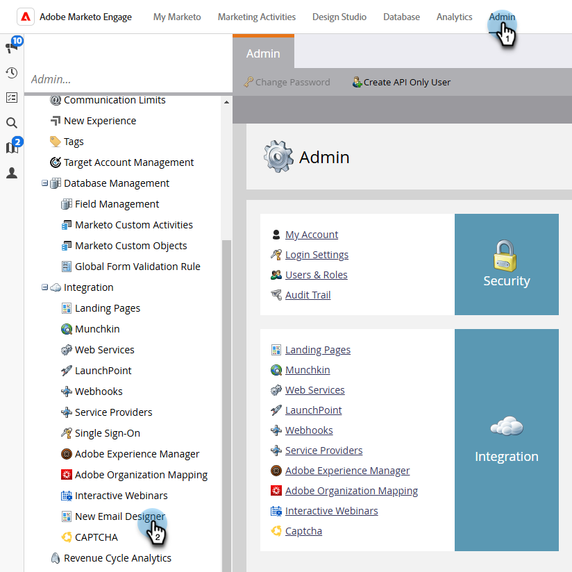
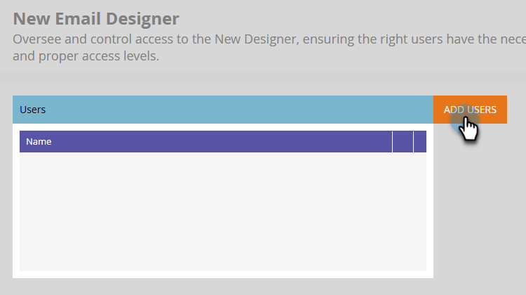

# Email Designer Overview {#overview}

Welcome to the new Adobe Marketo Engage Email Designer.

The Email Designer is the latest innovation in Marketo Engage intended to provide a revamped email and email template creation experience to improve productivity and efficiency by providing a visual drag-and-drop editor along with standard out-of-the-box templates. Easily create customized email templates without having to spend money on vendors.

## How to access {#how-to-access}

+++Learn how to access the Email Designer

In order to access the new Email Designer, your Marketo Engage subscription must be migrated to the [Adobe Identity Management System (IMS)](https://experienceleague.adobe.com/en/docs/marketo/using/product-docs/administration/marketo-with-adobe-identity/adobe-identity-management-overview). If yours hasn't been yet and you'd like to request it be expedited, please contact the Adobe Account Team (your account manager), or [Marketo Support](https://nation.marketo.com/t5/support/ct-p/Support).

### Add users {#add-users}

1. In Marketo Engage, go to the **[!UICONTROL Admin]** area and select **[!UICONTROL New Email Designer]**.

   {width="600" zoomable="yes"}

1. Click **[!UICONTROL Add Users]**.

   {width="600" zoomable="yes"}

1. In the **[!UICONTROL Add New Values]** drop-down, select the desired users. Click **[!UICONTROL OK]** when done.

   {width="600" zoomable="yes"}

+++

## Popular articles {#popular-articles}

### Getting started {#getting-started}

* [Email authoring](/help/marketo/product-docs/email-marketing/email-designer/email-authoring.md){target="_blank"}: Learn how to create, design, and reference an email in the new editor.

* [Email template authoring](/help/marketo/product-docs/email-marketing/email-designer/email-template-authoring.md){target="_blank"}: Learn how to create, design, and access an email template in the new editor.

* [Fragments](/help/marketo/product-docs/email-marketing/email-designer/fragments.md){target="_blank"}: Learn how to create and use visual content fragments as reusable components for emails and email templates.

### New features {#new-features}

* [Image to HTML converter](/help/marketo/product-docs/email-marketing/email-designer/feature-comparison.md){target="_blank"}: Upload a compliant PNG/JPEG image file of an email and it will automatically be converted into HTML for use in the new Email Designer.

* [Brand themes](/help/marketo/product-docs/email-marketing/email-designer/brands/brand-themes.md){target="_blank"}: Define brand themes within Marketo Engage. Styling configurations can be reused and applied across email templates and other email assets for brand consistency.

* [Template importer](/help/marketo/product-docs/email-marketing/email-designer/import-template.md){target="_blank"}: Import email templates from the classic email editor to create templates compatible with the New Email Designer in the Design Studio.

* [Conditional content](/help/marketo/product-docs/email-marketing/email-designer/conditional-content.md){target="_blank"}: Parity feature for the new Email Designer, allowing you to achieve email personalization beyond tokens.

## FAQ {#faq}

**When will the classic email editor be deprecated?**

While the classic editor will eventually be deprecated, there is no specific date at this time. But there will be _several_ months' notice given prior to deprecation.

**Which programs can I use the New Email Designer emails in?**

New Email Designer emails are accessible across all programs (with the lone exception of Interactive Webinar Programs). Cloning is available as well.

**Will our existing email templates work in the new designer?**

Yes, but they [need to be imported](/help/marketo/product-docs/email-marketing/email-designer/import-template.md).

**Can I easily move new designer assets to a different program?**

Yes!

**Can assets be edited via API in the new Email Designer?**

Assets being edited via API is not supported in the new Email Designer at this time.

**Is there a way to enforce branding (fonts, logos, and colors)?**

Yes! Create and manage your brand guidelines with [brand themes](/help/marketo/product-docs/email-marketing/email-designer/brands/brand-themes.md).

**Will making modules for templates be more customizable and scalable?**

Yes, absolutely, more customizable with our WYSIWYG  (what-you-see-is-what-you-get) editor.

**How does the email template creation process work in the new designer? Is it WYSIWYG, or does it require HTML knowledge?**

It is WYSIWYG; HTML knowledge is not necessary. You can easily create templates in the designer, reducing the need for external web developers. However, you still have the option to update CSS and edit individual sections via HTML.

**Does the new Email Designer support AMP language?**

It does not have support for AMP at this time.

**How can I tell if our Marketo Engage subscription has been migrated to IMS (the Adobe Admin Console)?**

If you log in to Marketo Engage via the [Adobe Experience Cloud](https://experiencecloud.adobe.com/){target="_blank"}, your subscription has been migrated.

**Which browsers can I use with the new Email Designer?**

It is recommended to use Google Chrome, Apple Safari, Microsoft Edge, or Mozilla Firefox at this time.
