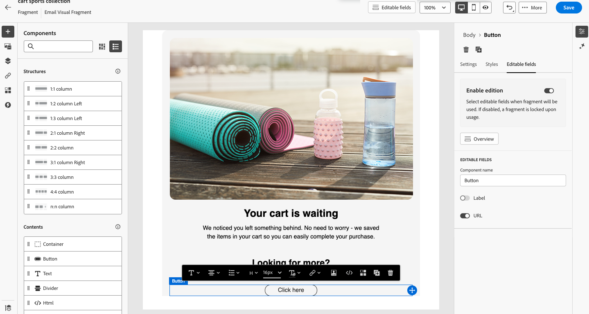
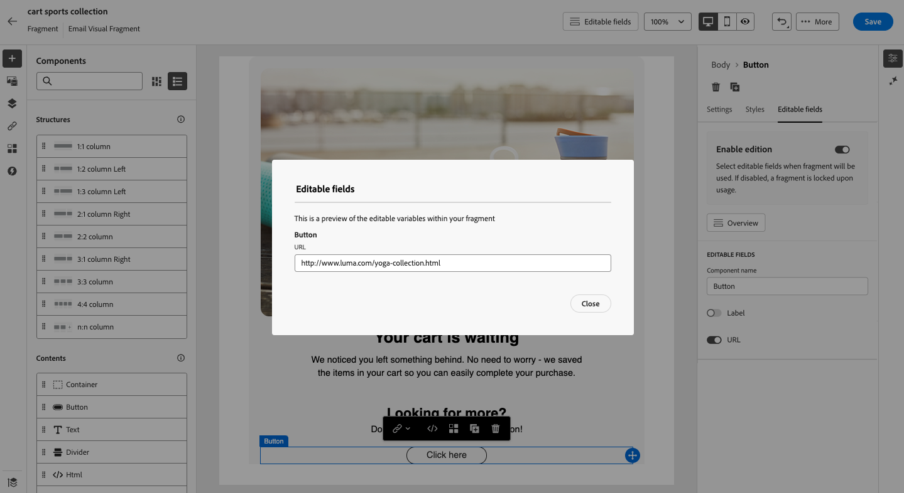
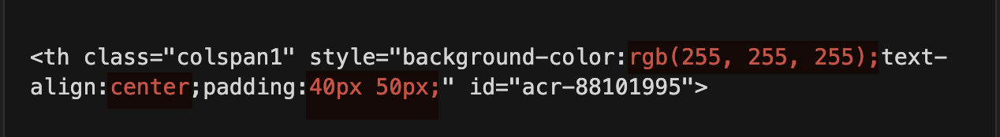

# Parameterized fragments {#parameterized-fragments}

When fragments are used in an email or email template, they are locked by default due to inheritance. This means any changes made to a fragment are automatically propagated to all assets where the fragment is used. With customizable fragments, specific fields within a fragment can be defined as editable when the fragment is added to an email or email template. For example, suppose you have a fragment with a banner, some text, and a button. You can designate certain fields, such as the image or button target URL, as editable. This allows users to modify these elements when they incorporate the fragment into their email/email template, providing a tailored experience without affecting the original fragment.

By leveraging parameterized fragments, you can efficiently manage and personalize your content without creating entirely new content blocks or disrupting the inheritance from the original fragment. This ensures changes made at the fragment level are still propagated, while allowing for necessary customization at the email/email template level.

Both visual and expression fragments can be marked as customizable. For detailed instructions on how to proceed with each type of fragment, refer to the sections below.

## Add editable fields in visual fragments {#visual}

To make portions of a visual fragment editable, follow these steps:

>[!NOTE]
>
>Editable fields can be added to **image**, **text** and **button** components. For **HTML** components, editable fields are added using the personalization editor, similar to expression fragments. [Learn how to add editable field in HTML componenets and expression fragments](#expression)

1. Open the fragment content edition screen.

1. Select the component in your fragment where you want to configure editable fields.

1. The component properties pane opens on the right hand-side. Select the **[!UICONTROL Editable fields]** tab then toggle the **[!UICONTROL Enable edition]** option.

1. All the fields that can be edited for the selected component are listed in the pane. The available fields for editing depend on the selected component type.

    In the example below, we allow the editing of the "Click here" button URL.

    {width="800" zoomable="yes"}

1. Click **[!UICONTROL Overview]** to check all the editable fields and their default values.

    In this example, the button URL field displays with the default value defined in the component. This value will be customizable by users after they have added the fragment to their content.

    {width="800" zoomable="yes"}

1. Save your changes when done.

After adding the fragment into an email, users will be able to customize all the editable fields configured in the fragment.

## Add editable fields in HTML components and expression fragments {#expression}

To make portions of an HTML component or an expression fragment editable, you must use a specific syntax in the expression editor. This involves declaring a _variable_ with a default value that users can override after adding the fragment to their content.

For example, suppose you want to create a fragment to add to your emails, and allow users to customize a specific color used in different locations, such as frames or buttons' background colors. When creating your fragment, you need to declare a variable with a _unique ID_ (e.g., "color"), and call it at the desired locations in the fragment content where you want to apply this color. When adding the fragment to their content, users will be able to customize the color used wherever the variable is referenced.

For HTML components, only specific elements can become editable fields. Expand the section below for more information.

+++Editable elements in HTML components:

The elements below can become editable fields in an HTML component: 

* A portion of text 
* A full URL for link or image (doesn't work with portion of a URL) 
* Entire CSS property (doesn't work with partial property) 

For example, in the code below, each element highlighted in red can become a property:

{width="500" zoomable="yes"}

+++

>[!MORELIKETHIS]
>
>[Fragments](/help/marketo/product-docs/email-marketing/email-designer/fragments.md){target="_blank"}
