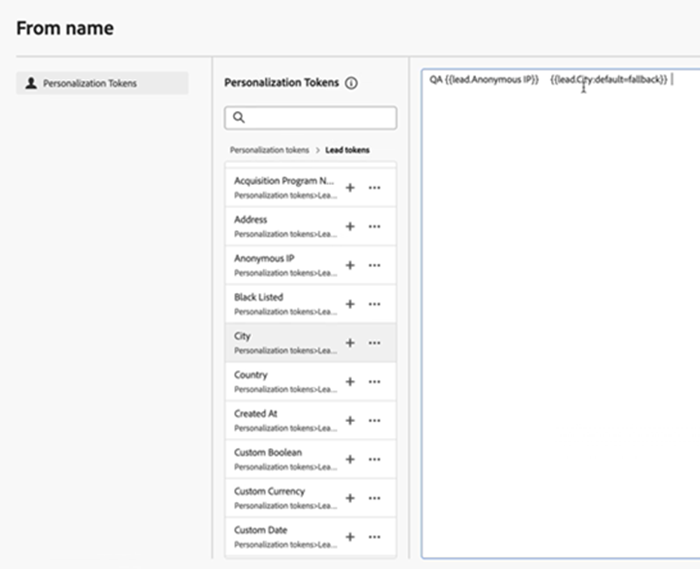
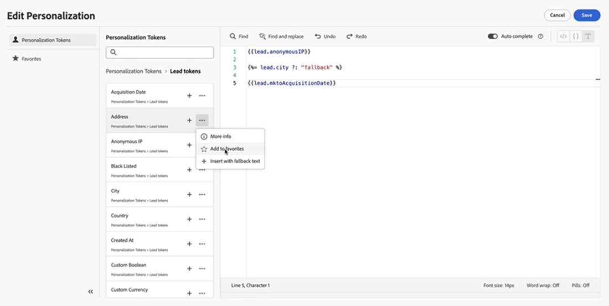

# Personalization Tokens {#personalization-tokens}

The Email Designer has a different format than the classic email editor when it comes to email personalization tokens. The change was implemented to improve compatibility with Handlebar scripting and streamline your email creation process.

>[!AVAILABILITY]
>
>Beginning May 23, 2025, this feature will be provisioned to Marketo Engage users in batches, with one region updated per week. During the rollout, any emails created using the new email designer will automatically migrate existing tokens to the new format. With this update, all tokens will be available in English only.

## Primary Use Case {#primary-use-case} 

This enhancement primarily benefits those transitioning from [Velocity scripting](https://experienceleague.adobe.com/en/docs/marketo-developer/marketo/email-scripting){target="_blank"} to Handlebar scripting. The new Email Designer only supports the new token format. The updated format eliminates spaces and introduces a revised default text structure, ensuring a smoother and more efficient scripting experience. 

## Token Experience {#token-experience}

A look at the token experience, both old and new. 

### Old Format {#old-format} 

In the classic email editor, you could add tokens with spaces, such as `lead.Anonymous IP`, or `member.registration code`. The format for default text was: `{{lead.City:default=fallback}}`

   {width="500" zoomable="yes"}

### New Format {#new-format} 

In the email designer, you must adapt to [camel case](https://developer.mozilla.org/en-US/docs/Glossary/Camel_case), or underscores for tokens (e.g., `lead.anonymousIP` or `member.registration_code`). The format for default text also changes to ``. 

   {width="600" zoomable="yes"}

## Things to Note {#things-to-note}

* The personalization editor also features the following functions for ease of authoring:

  * Undo/redo 
  * Find/Find & replace 
  * Autocomplete 

* **All** tokens previously supported in Marketo Engage are supported in the new personalization editor.
