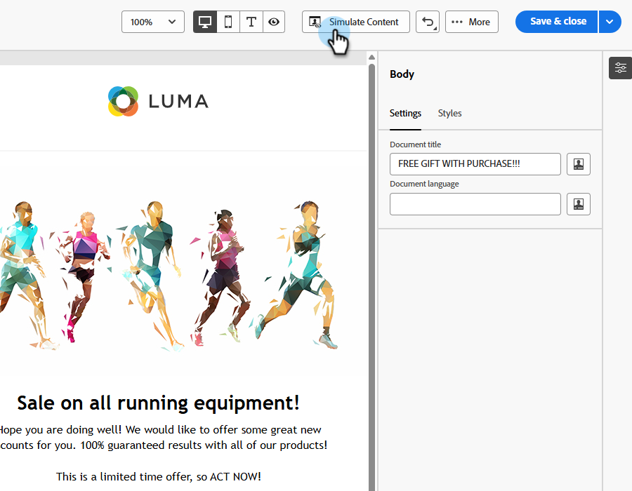
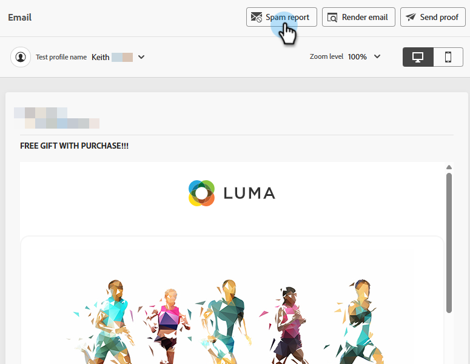
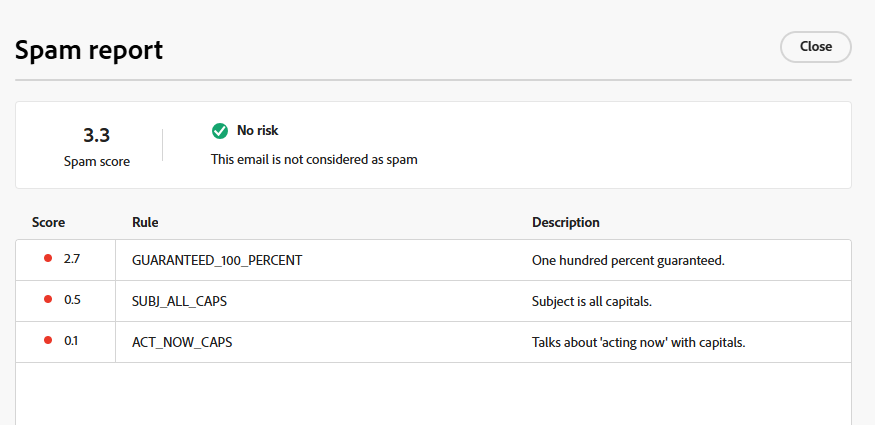
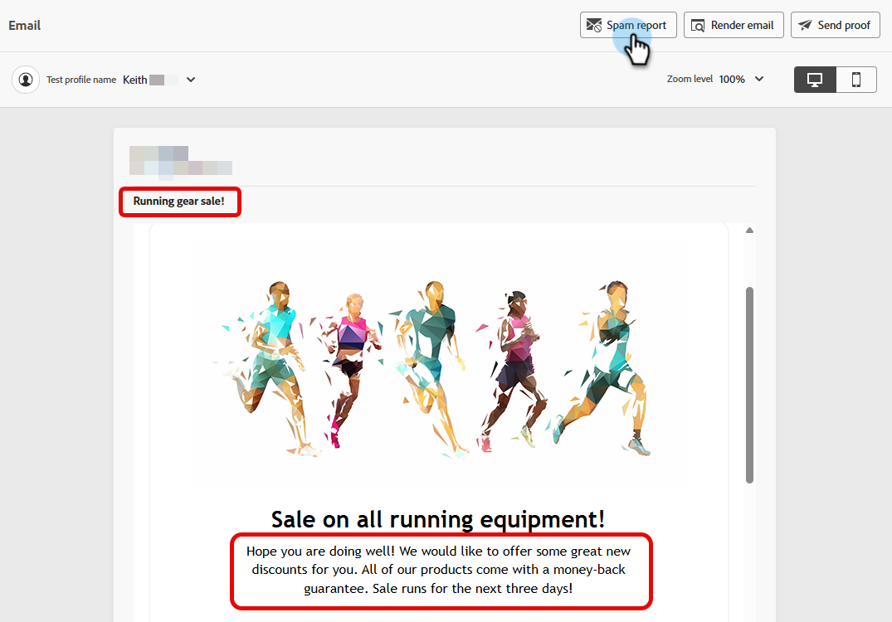
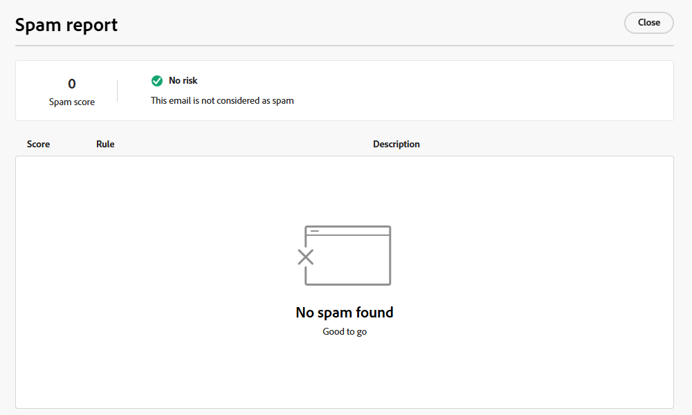

# Email spam report {#email-spam-report}

Using SpamAssassin in Marketo Engage, you can test your email content and see the likelihood of ISPs/Mailbox providers marking it as spam.

SpamAssassin analyzes your content and assigns a score based on various criteria. The lower the score, the better. It's important to maintain a low score as sending emails with a high score can negatively impact your overall deliverability.

## Access the spam report {#access-the-spam-report}

1. In your email, click **Simulate Content**. 

   {width="600" zoomable="yes"}

   >[!NOTE]
   >
   >If you haven't already added a test profile, you'll have to do that right after Step 1.  

1. Click the **Spam report** button.

   

1. A spam report generates.

   {width="600" zoomable="yes"}

1. Check the scores and descriptions for each item.

   >[!IMPORTANT]
   >
   >If the overall score is higher than 5, your email may be blocked by the recipient, or marked as spam upon delivery.

1. If you consider the score to be too high, edit your content in the Email Designer basd on the report's findings and then re-run the **Spam report**.

   {width="800" zoomable="yes"}

When the score is to your liking, it's ready to be sent.

   {width="800" zoomable="yes"}

>[!NOTE]
>
>Spam score is derived via SpamAssassin, and **rules are not owned by Adobe**. More details about these rules can be found in the [SpamAssassin documentation](https://spamassassin.apache.org/#_blank){target="_blank"}. A full list of errors [can be seen here](https://spamassassin.apache.org/old/tests_3_0_x.html){target="_blank"}.
