# Test Email Rendering with Litmus {#test-email-rendering-with-litmus}

Leverage your [Litmus](https://www.litmus.com/email-testing) account in Marketo Engage to instantly see how your email renders in popular email clients.

>[!AVAILABILITY]
>
>This feature is available to all Marketo Engage users who have an active Litmus account.

## Litmus Enterprise Users {#litmus-enterprise}

The following steps are for users on the [Litmus Enterprise Plan](https://www.litmus.com/pricing/enterprise){target="_blank"}.

1. On the _Edit email content_ screen, click the **Simulate Content** button.

    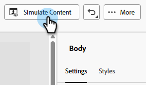

1. Select your testing recipient and click the **Render email** button.

    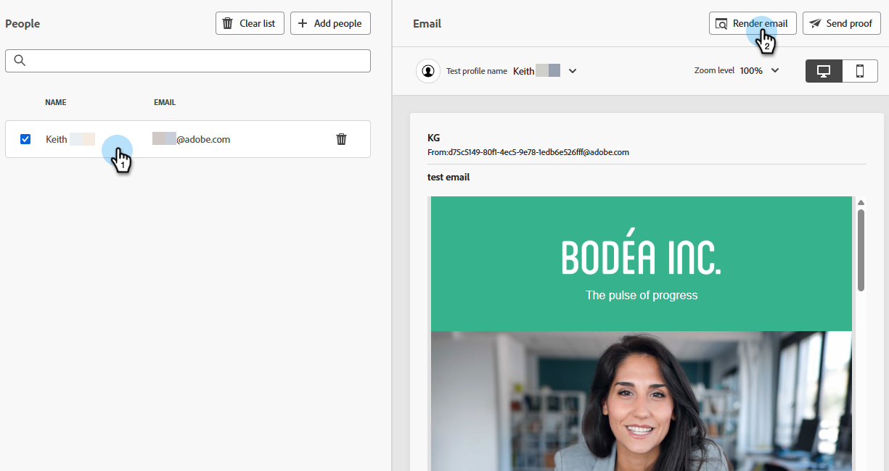{width="800" zoomable="yes"}

1. If you haven't already, **connect your Litmus account**. If you've already done this, skip to Step 6.

    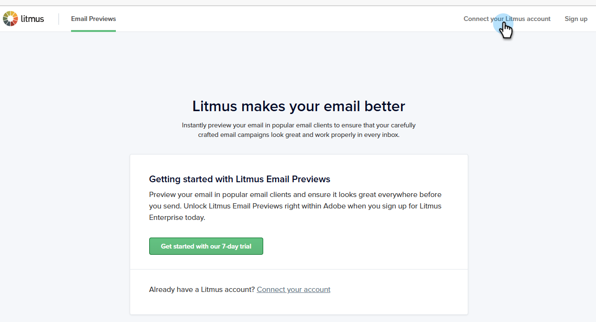{width="800" zoomable="yes"}

1. Enter your Litmus credentials and click **Sign in**.

   >[!IMPORTANT]
   >
   >When connecting your Litmus account to Marketo Engage, you agree that test emails are sent to Litmus. After sending, those test emails are no longer managed by Adobe. As such, Litmus data retention email policy applies to those emails, including personalization data that may be included in them.

1. Click **Connect** to complete the integration.

    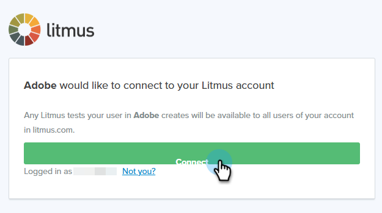

1. Click the **Run test** button to generate email previews.

1. See how your content looks in popular desktop, mobile, and web-based email clients. Click as many thumbnails as you'd like to preview.

    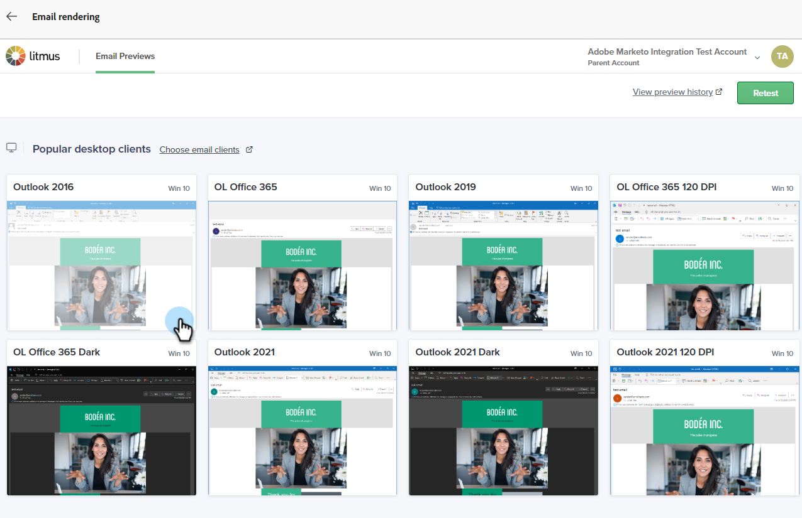{width="800" zoomable="yes"}

    >[!NOTE]
    >
    >Learn how to [customize your default email client list](https://help.litmus.com/article/227-change-your-default-email-clients-list).

1. When you're done testing, click the back arrow on the upper-left to return to the _Simulate Content_ screen.

    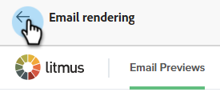

**OPTIONAL STEP**: If you decide to make changes to your email, after you click **Render email** to view them, be sure to also click the **Retest** button on the upper-right of the Litmus _Email Previews_ screen.

   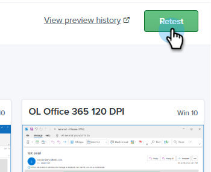

## Litmus Core Users {#litmus-core}

The following steps are for users on the [Litmus Core Plan](https://www.litmus.com/pricing/){target="_blank"}.

1. In your Litmus account, retrieve the test email address by clicking the **Copy test address** button in the _Test_ screen.

   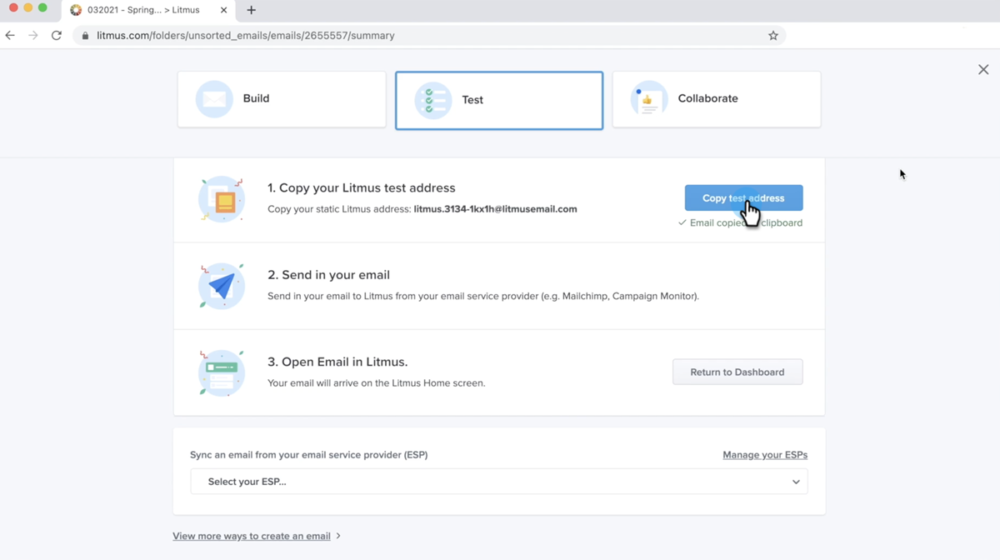{width="800" zoomable="yes"}

1. In Marketo Engage, navigate to the _Edit email content_ screen of the desired email and click the **Simulate Content** button.

   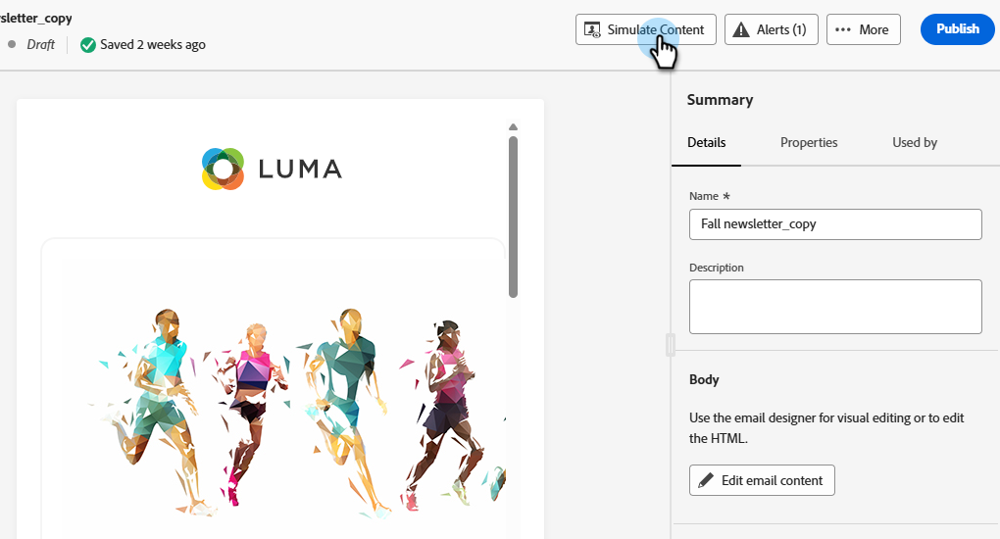{width="600" zoomable="yes"}

1. Select your testing recipients and click the **Send proof** button.

   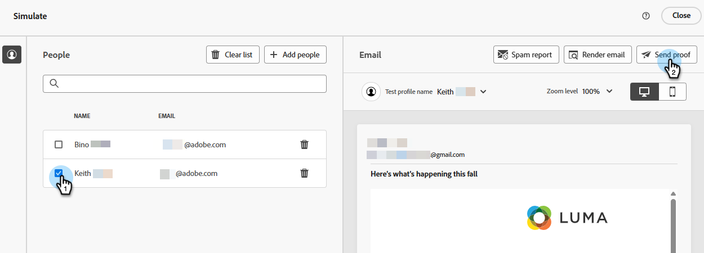{width="800" zoomable="yes"}

1. Enter the Litmus Email address you copied in Step 1 and click **Send Proof** again.

   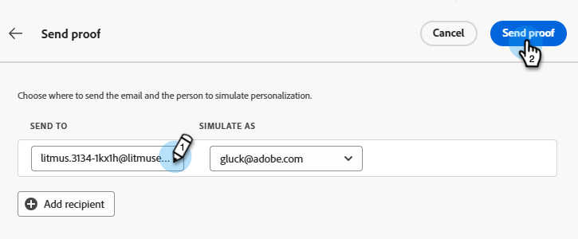

1. Review the email inside your Litmus account (in the folder corresponding to the email address you copied from Litmus).

   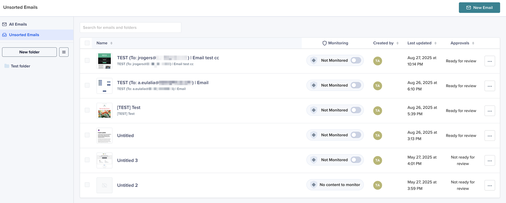{width="800" zoomable="yes"}
