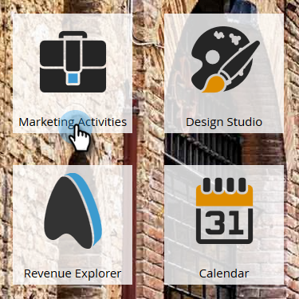
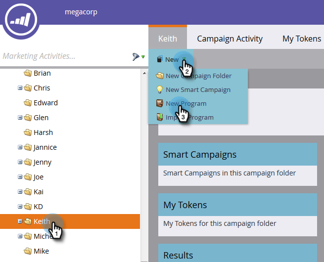
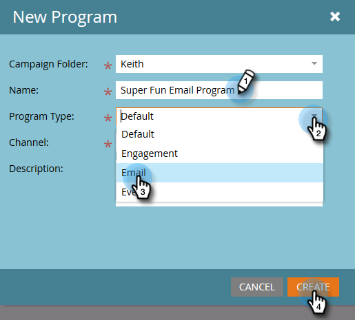
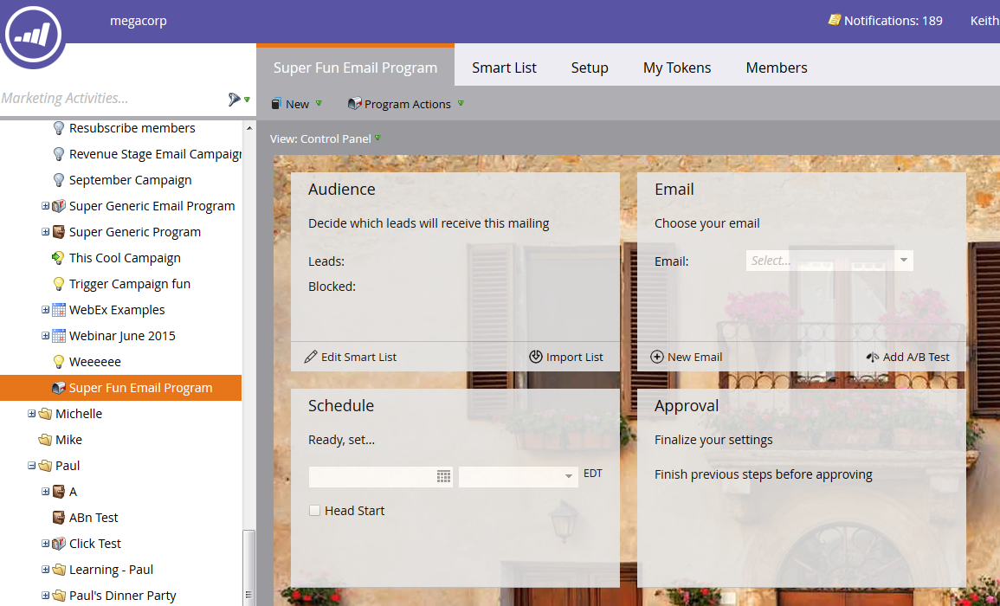

# Create an Email Program {#create-an-email-program}

Use email programs to quickly and easily send an email to group of people.

1. Go to **[!UICONTROL Marketing Activities]**.

   

1. Select the folder you want to create the program in, click the **[!UICONTROL New]** drop-down, and select **[!UICONTROL New Program]**.

   

1. Enter a Name, select **[!UICONTROL Email]** as the [!UICONTROL Program Type], and click **[!UICONTROL Create]**.

   

   >[!NOTE]
   >
   >When selecting **[!UICONTROL Email]** as Program Type, the Channel will automatically be set to **[!UICONTROL Email Send]**. You can change it if you want.

   

Nice! Notice the program is now in the tree and ready to be used. The next step will be to define your audience. See the Marketo Related Articles below.

>[!MORELIKETHIS]
>
>* [Define an Audience with a Smart List](/help/marketo/product-docs/email-marketing/email-programs/managing-people-in-email-programs/define-an-audience-with-a-smart-list.md)
>* [Define an Audience by Importing a List](/help/marketo/product-docs/email-marketing/email-programs/managing-people-in-email-programs/define-an-audience-by-importing-a-list.md)
