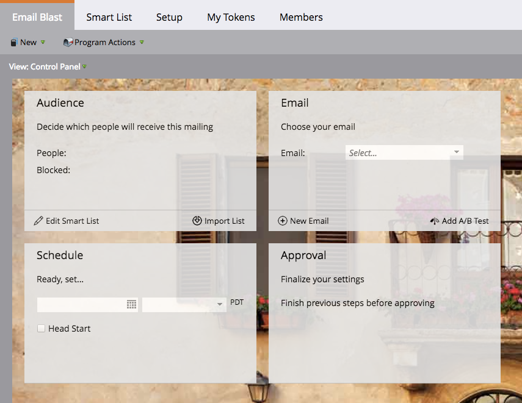
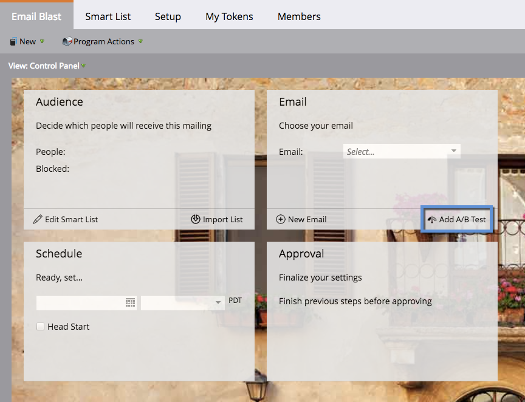
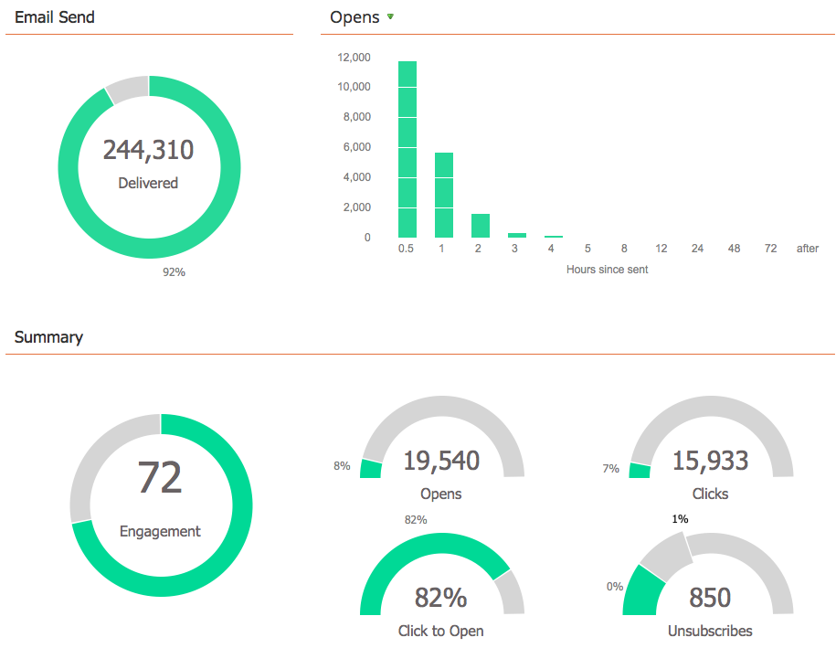
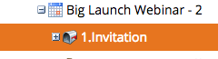
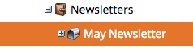

# Understanding Email Programs {#understanding-email-programs}

Say hello to your new Marketo friend, the email program. Send out emails, create A/B tests, and track your results all in one place.

## Control Panel {#control-panel}

Four boxes keep you focused. **Audience** defines the "who," **Email** provides the "what," **Schedule** defines "when," and **Approval** makes it ready to go.

## A/B Testing {#a-b-testing}

A/B testing allows you to prove which email is best.

Learn about the following A/B tests:

* ["Subject Line" A/B Testing](../../../../product-docs/email-marketing/email-programs/email-program-actions/email-test-a-b-test/use-subject-line-a-b-testing.md)
* ["Whole Email" A/B Testing](../../../../product-docs/email-marketing/email-programs/email-program-actions/email-test-a-b-test/use-whole-email-a-b-testing.md)
* ["From Address" A/B Testing](../../../../product-docs/email-marketing/email-programs/email-program-actions/email-test-a-b-test/use-from-address-a-b-testing.md)
* ["Date/Time" A/B Testing](../../../../product-docs/email-marketing/email-programs/email-program-actions/email-test-a-b-test/use-date-time-a-b-testing.md)

## Dashboards {#dashboards}

>[!TIP]
>
>Some prefer using email programs over sending an email via a smart campaign because of the program's detailed reporting dashboard.

Enjoy the fruits of your labor. Dashboards show you email program and A/B test performance at a glance.   

## Nesting {#nesting}

Email programs play well with other programs.

Use an email program to send out a webinar invitation, for example.

Use an email program inside a default program to keep things organized.

>[!TIP]
>
>In order to get an existing email program into another program, you have to clone it.

>[!NOTE]
>
>Email programs cannot be nested in [engagement programs](../../../../getting-started/quick-wins/drip-drip-nurture.md). They also can't be re-sent, and can only run one test at a time.

##  Schedule Settings {#schedule-settings}

Now that you understand Email Programs, get started with one of the related articles below!

>[!NOTE]
>
>**Related Articles**
>
>* [Create an Email Program](create-an-email-program.md)
>
>* [Define an Audience with a Smart List](../../../../product-docs/email-marketing/email-programs/managing-people-in-email-programs/define-an-audience-with-a-smart-list.md)
>* [Create an Email for an Email Program](../../../../product-docs/email-marketing/email-programs/email-program-actions/create-an-email-for-an-email-program.md)
>* [Schedule Your Email Program](../../../../product-docs/email-marketing/email-programs/email-program-actions/schedule-your-email-program.md)
>

