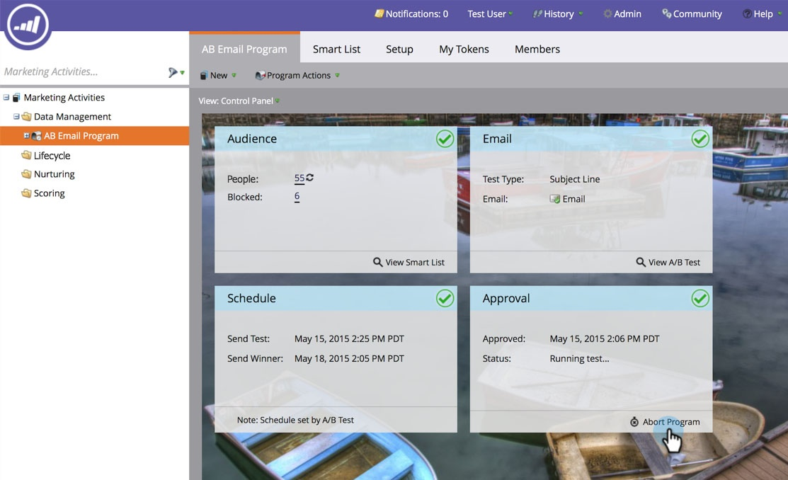
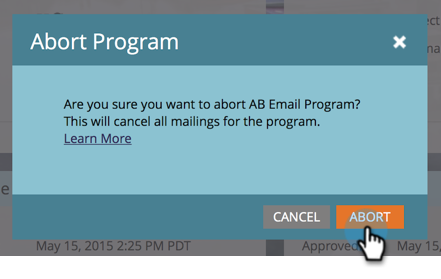
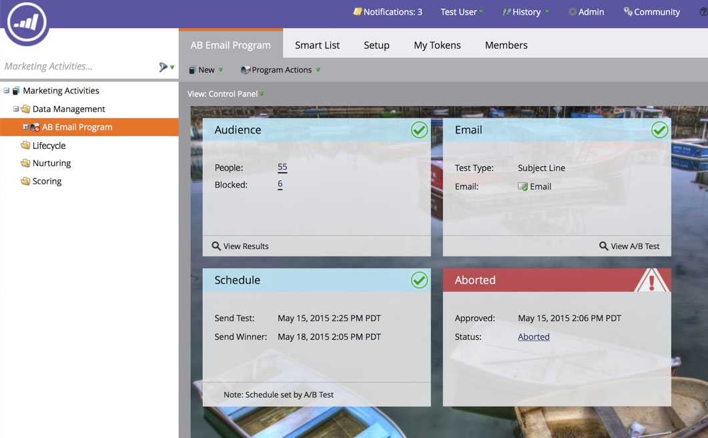

# Abort Email Program {#abort-email-program}

Oops! Hit the brakes! This email program should not go out.

>[!NOTE]
>
>This article is meant to help you prevent emails from going out before they send. There is no way to recall sent emails.

1. In an email program, click **[!UICONTROL Abort Program]**.

   

1. Click **[!UICONTROL Abort]** for full confirmation.

   

1. An alert header will be displayed saying that this email program has been aborted.

   

   >[!CAUTION]
   >
   >Once the email program is aborted, it cannot be rescheduled.

Whew! Aren't you glad you can avoid those costly mistakes?
