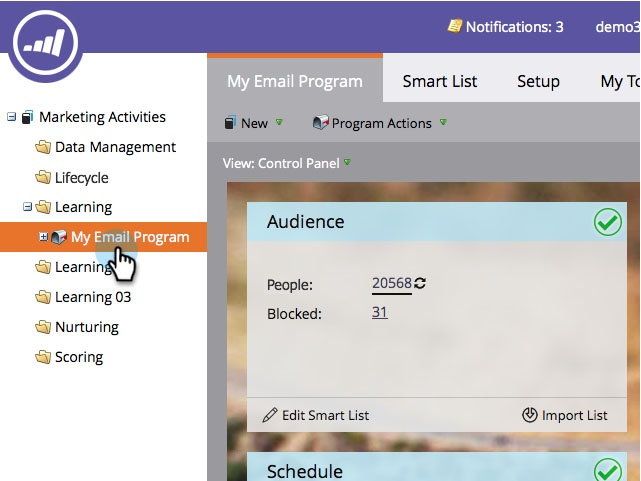
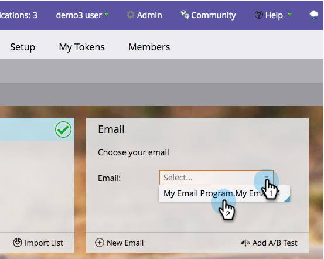

# Choose an Existing Email {#choose-an-existing-email}

>[!PREREQUISITES]
>
>* [Create an Email Program](../../../../product-docs/email-marketing/email-programs/creating-an-email-program/create-an-email-program.md)
>* [Define an Audience with a Smart List](../../../../product-docs/email-marketing/email-programs/managing-people-in-email-programs/define-an-audience-with-a-smart-list.md) or [Define an Audience by Importing a List](../../../../product-docs/email-marketing/email-programs/managing-people-in-email-programs/define-an-audience-by-importing-a-list.md)
>

Once you've [created an email program](../../../../product-docs/email-marketing/email-programs/creating-an-email-program/create-an-email-program.md) and defined your audience, you will want to decide what email you're sending. You can  [create an email for an email program](create-an-email-for-an-email-program.md) from scratch or pick one that already exists. Here's how to pick one that already exists.

1. Go to **Marketing Activities**.

   

1. Find and select your email program.

   

1. Under the **Email** tile, select the one you want to send.

   ` 

   `

   >[!NOTE]
   >
   >Only local emails can be selected. Need to move an email from one program to another? [Learn how here](move-an-email.md).

   Sweet!   

Now that we've decided what email to send, we can set up an A/B Test, or skip that and schedule the email program.

>[!MORELIKETHIS]
>
>* [Add an A/B Test](email-test-a-b-test/add-an-a-b-test.md)
>* [Schedule Your Email Program](schedule-your-email-program.md)
>

