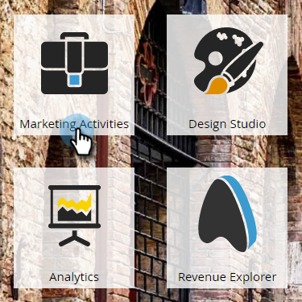
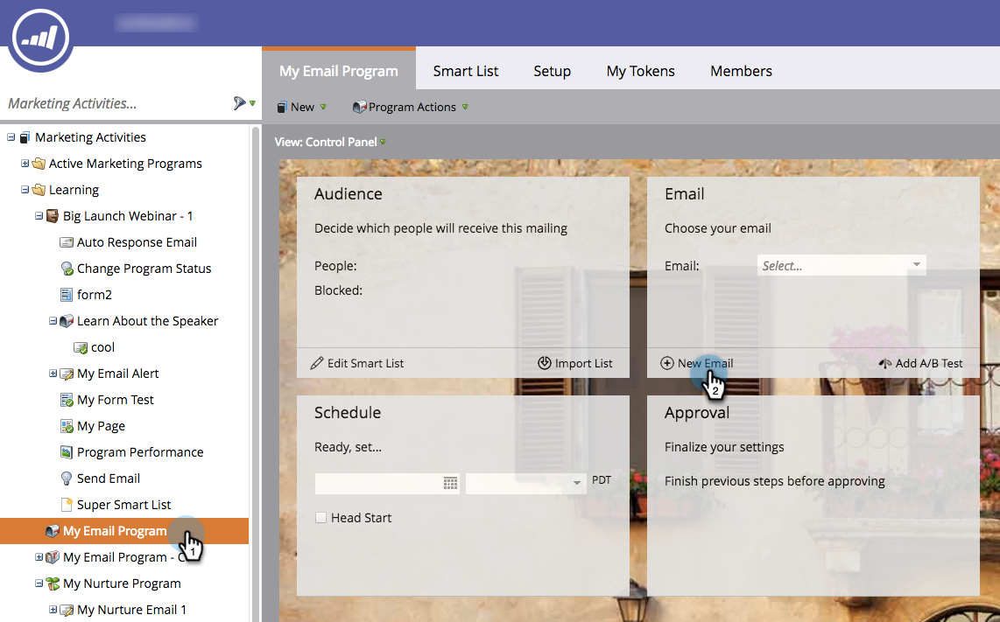
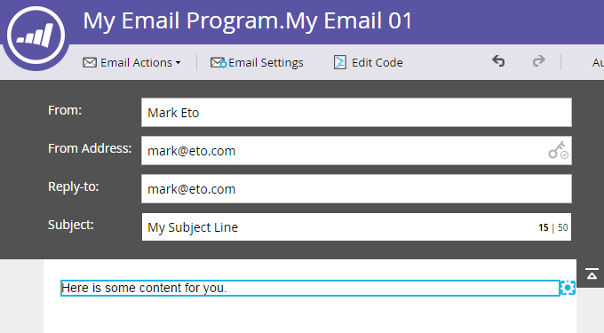

# Create an Email for an Email Program {#create-an-email-for-an-email-program}

>[!NOTE]
>
>**Prerequisites**
>
>* [Create an Email Program](../../../../product-docs/email-marketing/email-programs/creating-an-email-program/create-an-email-program.md)
>* [Define an Audience with a Smart List](../../../../product-docs/email-marketing/email-programs/managing-people-in-email-programs/define-an-audience-with-a-smart-list.md) or [Define an Audience by Importing a List](../../../../product-docs/email-marketing/email-programs/managing-people-in-email-programs/define-an-audience-by-importing-a-list.md)
>

Once you have created your email program and defined your audience, you'll want to decide what email you're sending. You can&nbsp; [choose an existing email](choose-an-existing-email.md)&nbsp;or create one from scratch. Here's how to create a new email.

1. Go to **Marketing Activities**.

   

1. Select your email program. Under the **Email** tile, click **New Email**.

   

1. Enter a **Name**, select the template of your choice and click **Create**.

   

1. Make all the changes you want and close out of the editor.

   

   >[!NOTE]
   >
   >**Deep Dive**
   >
   >
   >Learn how to [edit elements in an email](../../../../product-docs/email-marketing/general/email-editor-2.0/edit-elements-in-an-email.md).

1. Don't forget to approve your email.

   

Great! Now that we've created an email we want to send, let's&nbsp; [add an A/B test](email-test-a-b-test/add-an-a-b-test.md)&nbsp;or skip straight to&nbsp; [scheduling your email program](schedule-your-email-program.md).

>[!NOTE]
>
>**Related Articles**
>
>* [Add an A/B Test](email-test-a-b-test/add-an-a-b-test.md)
>* [Schedule Your Email Program](schedule-your-email-program.md)
>

