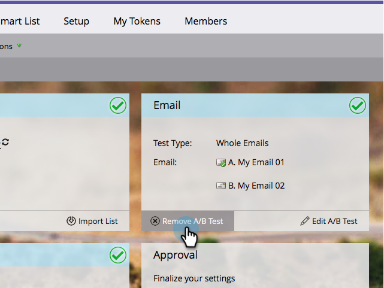

# Cancel the A/B Test {#cancel-the-a-b-test}

If you've  [added an A/B testing](/help/marketo/product-docs/email-marketing/email-programs/email-program-actions/email-test-a-b-test/add-an-a-b-test.md) to your email program and have decided you no longer want it, it is easily undone. Here's how.

1. Go to **Marketing Activities**.

   

1. Select your email program.

   

1. Under the **Email** tile, click **Remove A/B Test**.

   

   >[!NOTE]
   >
   >Your email program must be unapproved before you can remove the A/B test. See [Approve/Unapprove an Email Program](/help/marketo/product-docs/email-marketing/email-programs/email-program-actions/approve-unapprove-an-email-program.md) for details.

Easy peasy!
