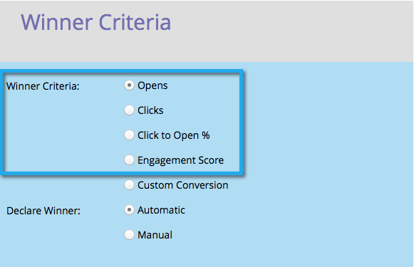
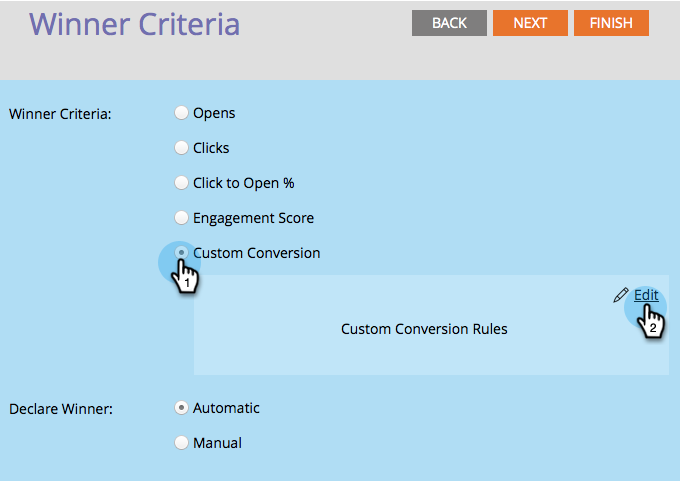
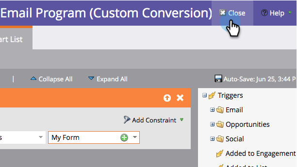

# Define the A/B Test Winner Criteria {#define-the-a-b-test-winner-criteria}

When [adding an A/B test](add-an-a-b-test.md) to your email program, you will need to pick a test type, [schedule the A/B test](schedule-the-a-b-test.md), then define the winner criteria. Here's how to decide which email wins.

>[!NOTE]
>
>**Prerequisites**
>
>* [Add an A/B Test](add-an-a-b-test.md)
>

## Winner Criteria {#winner-criteria}

1. The default **Winner Criteria** options are listed first.

   

   | **Opens** |An open registers when images are downloaded into an email. Even if you don't include an image, by default Marketo inserts a single tracking pixel into all HTML emails.  |
   |---|---|
   | **Clicks** |By default, links in emails have tracking embedded in them allowing you to see who clicked which link, how many total links were clicked, etc. |
   | **Click to Open %** |Percentage of emails that were opened and had a link clicked in the email. This measures the relevancy and context of an email by taking the number of unique clicks divided by the number of unique opens, and then multiplying by 100 to show it as a percentage. |
   | **Engagement Score** |The [engagement score](http://docs.marketo.com/display/DOCS/Understanding+the+Engagement+Score) helps you determine the effectiveness of your content. |

   >[!TIP]
   >
   >If you pick&nbsp;Engagement Score&nbsp;the test will need to run for at least 24 hours. Learn more about&nbsp; [understanding the engagement score](../../../../../product-docs/email-marketing/drip-nurturing/reports-and-notifications/understanding-the-engagement-score.md).

   You can also customize your criteria by selecting Custom Conversion and clicking Edit.
   

   >[!NOTE]
   >
   >Custom Conversion allows you to pick any event as a conversion by using triggers and filters.

   A window will pop open. Find the trigger of your choice and drag it into the canvas.
   

   >[!NOTE]
   >
   >**Deep Dive**
   >
   >
   >Learn more about [smart lists and static lists](http://docs.marketo.com/display/docs/smart+lists+and+static+lists).

   Define the trigger.
   

   >[!NOTE]
   >
   >Marketo will only allow triggers for people who have been sent the email from this email program. No need to add a "Was Sent Email" filter.

   Click Close.
   

   Great! Now it's time to decide how the winner is determined.

   ## Declare Winner {#declare-winner}

1. Pick one of the two available options.

   

   >[!NOTE]
   >
   >**Reminder**
   >
   >
   >If you are doing a&nbsp;**Date/Time**&nbsp;A/B test, you can only choose&nbsp;**Manual**.

   Once the A/B test is over, Marketo can automatically send the winning email at the scheduled time, or you can review the results and decide which email goes out when.  

1. Automatic is awesome and is the default option. Just click **Next**.

   

   >[!TIP]
   >
   >Choosing&nbsp;**Manual**&nbsp;will send the test out and wait for you to declare a winner. You will receive a report of the results.

   [schedule the A/B test](schedule-the-a-b-test.md)

Perfect! Now let's . 