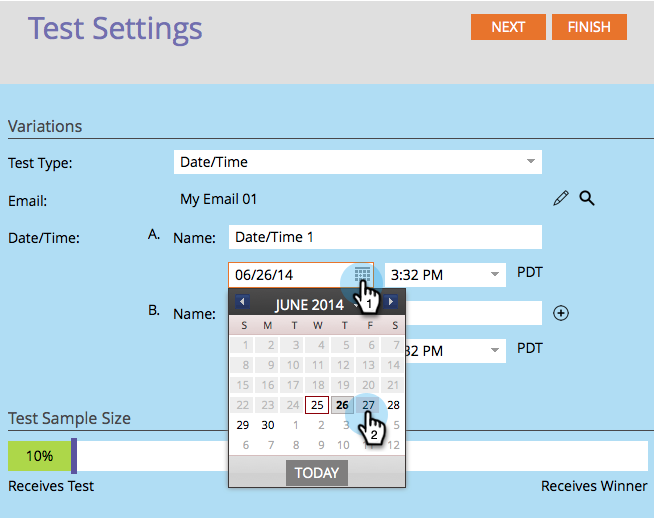

# Use "Date/Time" A/B Testing {#use-date-time-a-b-testing}

You can easily A/B test your emails. One test is the **Date/Time** test. This tests what time of day or day of week is best to send emails. Here's how to set it up.

>[!PREREQUISITES]
>
>[Add an A/B Test](/help/marketo/product-docs/email-marketing/email-programs/email-program-actions/email-test-a-b-test/add-an-a-b-test.md)
>

1. Under the **Email** tile, click **Add A/B Test**.

   

1. A new window opens. Select **Date/Time** for **Test Type**.

   

1. If you have previous test information (like a subject test), you can safely click **Reset Test**.

   

1. Select the date for your first date/time.

   

1. Select the time for your first date/time.

   

1. Do the same for your second date/time.

   

1. Use the slider to choose what percentage of the audience you want in your A/B test and click **Next**.

   

   >[!NOTE]
   >
   >The different variations will apply to equal portions of the chosen Test Sample Size.

   >[!CAUTION]
   >
   >**We recommend you avoid setting the sample size to 100%**. If you're using a static list, setting the sample size to 100% sends the email to everyone in the audience and the winner goes to no one. If you're using a **smart** list, setting the sample size to 100% sends the email to everyone in the audience _at that time_. When the email program runs again at a later date, any new people who qualify for the smart list will also receive the email since they're now included in the audience.

   Okay, we're one step closer. Now we need to [define the A/B test winner criteria](/help/marketo/product-docs/email-marketing/email-programs/email-program-actions/email-test-a-b-test/define-the-a-b-test-winner-criteria.md).
