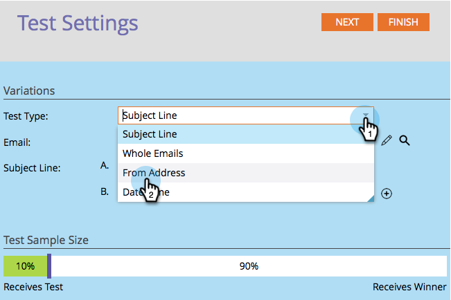
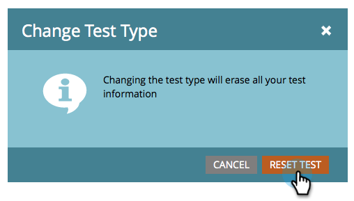
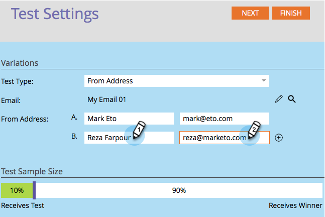

# Use "From Address" A/B Testing {#use-from-address-a-b-testing}

You can easily A/B test your emails. One interesting test is the **From Address** test. Here's how to set it up.

>[!NOTE]
>
>**Prerequisites**
>
>* [Add an A/B Test](add-an-a-b-test.md)
>

1. Under the **Email** tile, with your email selected, click on **Add A/B Test**.

   

1. A new window opens, select **From Address** for **Test Type**.

   

1. If you have previous test information (like a subject test), you can safely click **Reset Test**.

   

1. Enter the second **From Address** information you want to test.

   >[!NOTE]
   >
   >Choice A will pre-populate with the information contained in the selected email.

   

   >[!TIP]
   >
   >You can click on the **plus sign** to add as many From Addresses as you'd like. 

1. Use the slider to choose what percentage of the audience you want in your A/B test and click **Next**.

   

   >[!NOTE]
   >
   >The different variations will send to equal portions of the chosen Test Sample Size.

   >[!CAUTION]
   >
   >**We recommend you avoid setting the sample size to 100%**. If you're using a static list, setting the sample size to 100% sends the email to everyone in the audience and the winner goes to no one. If you're using a **smart** list, setting the sample size to 100% sends the email to everyone in the audience *at that time. *When the email program runs again at a later date, any new people who qualify for the smart list will also receive the email since they're now included in the audience.

   OK, we're almost there. Now we need to [define the A/B test winner criteria](define-the-a-b-test-winner-criteria.md). 

   >[!NOTE]
   >
   >**Related Articles**
   >
   >    
   >    
   >    * [Define the A/B Test Winner Criteria](define-the-a-b-test-winner-criteria.md)
   >    
   >

