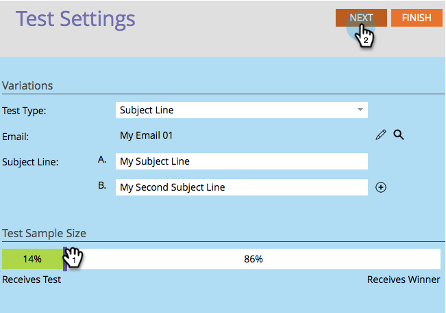

# Use "Subject Line" A/B Testing {#use-subject-line-a-b-testing}

You can easily A/B test your emails. One of the most common tests is the **Subject Line** test.

>[!NOTE]
>
>**Prerequisites**
>
>* [Add an A/B Test](add-an-a-b-test.md)
>

1. Under the Email tile, with your email selected, click Add A/B Test.

1. The test editor window will open. Enter one or more new subject lines.

   >[!NOTE]
   >
   >Choice** A**** **will pre-populate with the information contained in the selected email.

   

   >[!TIP]
   >
   >You can click on the **plus**** sign** to add more subject lines.

1. Use the slider to choose what percentage of the audience you want to receive your A/B test and click **Next**.

   

   >[!CAUTION]
   >
   >**We recommend you avoid setting the sample size to 100%**. If you're using a static list, setting the sample size to 100% would send the email to everyone in the audience and the winner would go to no one. If you're using a smart list, setting the sample size to 100% would send the email to everyone in the audience *at that time. *And when the email program runs again at a later date, any new people who qualify for the smart list would also receive the email since they are now included in the audience.

   >[!NOTE]
   >
   >The different subject variations will take even parts of the Test Sample Size selected.

   Okay, we're almost there. Now we need to [define the A/B test winner criteria](define-the-a-b-test-winner-criteria.md).

   >[!NOTE]
   >
   >**Related Articles**
   >
   >    
   >    
   >    * [Define the A/B Test Winner Criteria](define-the-a-b-test-winner-criteria.md)
   >    
   >

